# Python 시큐어코딩 가이드 (2023년 개정본)

> KISA 한국인터넷진흥원 발행

> authorkit.juice 변환본

---

### PART 제1장

# 개 요

### 제1절 배경

### 제2절 가이드 목적 및 구성

# 1개요

**제1절 배경**

인공지능, 블록체인 등 혁신적인 기술을 기반으로 하는 기업들이 기존 비즈니스 시장을 흔들고 새로운 트렌드를
만들어 가고 있다. 스마트폰은 전 국민의 일상이 되었으며 비대면 시장의 폭발적인 성장으로 모든 정보의 흐름이
IT 기반 시스템으로 모이고 있다. 정보가 모이는 곳에는 항상 보안 위협이 뒤따르며, 다양한 IT 서비스를 개발
하는 기업들 또한 이러한 위협에 노출될 수 밖에 없다. 잘 만들어진 소프트웨어는 안정적인 수입과 성장을 견인
하지만 그렇지 못한 경우 기업의 생존에 위협을 줄 수 있다.
Ponemon Institute의 보고서에 따르면, 60%의 침해사고가 패치되지 않은 알려진 취약점으로 인한 것이
라고 밝혀졌다1). 특히 사용자 정보를 처리하는 웹 애플리케이션 취약점으로 인해 중요정보가 유출되는 침해사고가
빈번하게 발생되고 있다. 또한 침해사고 발생 전 까지 취약점이 있다는 사실을 인지하지 못한 기업이 전체의
62%에 달한다는 분석 결과가 나왔다. 보안 사고의 위험성과 중요성을 인지한 많은 기업들이 침입차단 시스템,
안티 바이러스 제품들을 도입해 보안 수준을 강화하고 있지만, 단순 제품 도입만으로는 소프트웨어에 내재된
보안 취약점을 악용하는 공격에 대응할 수 없다.
현실적으로 보안 관점에서 완벽한 소프트웨어를 개발하는 것은 불가능하다. 하지만 제품을 설계하고 개발하는
단계에서부터 보안 위협을 고려하고 분석해 나간다면 소프트웨어에서 발생 가능한 많은 위협을 사전에 차단하거나
문제 발생 시 빠르게 대응할 수 있다. 간단한 개발 실수도 대형 보안 사고로 이어질 수 있으며, 개발 프로세스
상에서 보안 취약점을 탐색하고 발견하는 작업이 늦어질수록 수정 비용이 기하급수적으로 증가한다는 연구 결과도
공개된 바 있다.
1) https://www.servicenow.com/lpayr/ponemon-vulnerability-survey.html

**탐지시간을 기준으로 한 상대적 수정비용**

**RELATIVE COST TO FIX, BASED ON TIME OF DETECTION**

* 출처 : VERACODE – Secure Development Survey: Developer’s Respond To Application Security Trends (2021)
‘소프트웨어 개발보안’은 소프트웨어 개발과정에서 개발자의 실수, 논리적 오류 등으로 인한 보안취약점 및
약점들을 최소화해 사이버 보안 위협으로부터 안전한 소프트웨어를 개발하기 위한 일련의 보안활동을 의미한다.
구체적으로 소프트웨어 개발 생명주기(SDLC, Software Development Life Cycle)의 각 단계별로 요구되는
보안활동을 통해 안전한 소프트웨어를 만들 수 있도록 해 준다. 개발보안을 적용하면 소프트웨어에 내재하는
보안약점(weakness)을 초기 단계에서 발견 및 수정할 수 있으며, 이를 통해 소프트웨어 운영 중 발생 가능한
잠재적인 보안취약점(vulnerability)을 예방할 수 있다.
소프트웨어 개발보안의 중요성을 이해하고 체계화한 미국의 경우 국토안보부(DHS)를 중심으로 시큐어코딩을
포함한 소프트웨어(SW) 개발 전 과정(설계, 구현, 시험 등)에 대한 보안활동 연구를 활발히 진행하고 있으며,
이는 2011년 발표한 “안전한 사이버 미래를 위한 청사진(Blueprint for a Secure Cyber Future)”에 자세히
언급되어 있다.
국내의 경우 2009년도부터 전자정부 서비스를 중심으로 공공영역에서의 소프트웨어 개발 보안 연구 및 정책이
본격적으로 추진되기 시작했다. 2019년 6월에는 소프트웨어 개발 보안의 법적 근거를 담은 소프트웨어진흥법
개정안이 발의되었고 2020년 12월 10일에 시행됨에 따라 민간분야까지 소프트웨어 개발보안 영역이 확대되었다.
과학기술정보통신부는 정보보호 패러다임 변화에 대응하고 안전하고 신뢰할 수 있는 디지털 안심 국가 실현을
목표로 2021년부터 중소기업 SW 보안약점 진단, 민간 특화 개발보안 가이드 보급, 개발보안 교육 등을 통해
민간 분야의 안전한 디지털 전환을 지원하고 있다.

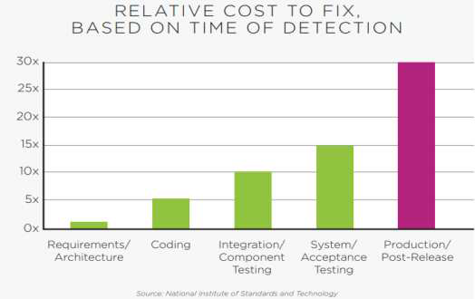

**제2절 가이드 목적 및 구성**

빠르게 변화하는 ICT 기술 환경에 발맞추어 민간분야 또한 다양한 분야에 걸쳐 사용되는 언어에 대한 보안
가이드의 필요성이 높아졌다. 이에 민간에서 가장 많이 활용되고 있는 언어를 조사하여 그 중 선호도가 가장
높은 파이썬 언어에 대한 시큐어코딩 가이드를 제작하게 되었다.
파이썬은 1991년에 발표된 고급언어로 플랫폼에 독립적이며 인터프리터식, 객체지향적, 동적 타입
(dynamically typing) 대화형 언어이다. 다양한 플랫폼을 지원하며 라이브러리(모듈)가 풍부하여 대학을 비롯한
여러 교육 기관, 연구기관 및 산업계에서 활용도가 높아지고 있는 추세다. 최근에는 웹 개발 이외에도 그래픽,
머신러닝 업계에서 선호하는 언어로 C, JAVA를 제치고 선호도 1위에 오르기도 했다.

**TIOBE Programming Community Index**

* 출처 : TIOBE - 파이썬 Programming Language of the Year (2021.11.)
본 가이드는 파이썬 소프트웨어 개발 시 발생 가능한 보안 위협 최소화를 위해 구현 단계에서 검증해야 하는
보안약점들에 대한 설명과 안전한 코딩 기법, 관련 코드 예제를 제공해 안전한 소프트웨어 개발에 도움을 주는
것을 목표로 한다. 파이썬 3.X 버전을 기준으로 작성되었으며, 구현단계 보안약점 제거 기준 항목 중 언어
특성에 따라 일부 항목은 제외했다.

구성

**⦁(1장) 파이썬 개발보안 가이드 개발 배경 및 목적**

**⦁(2장) 파이썬 언어 기반 구현단계 보안약점 제거 기준 설명**

- 구현단계 보안약점 제거 기준 항목(49개) 중 46개에 대해 소개
유형
주요 내용
입력데이터
검증 및 표현
⦁SQL 삽입, 코드 삽입, 경로 조작 및 자원 삽입 등 16개 항목
※ (1개 항목 제외) 메모리 버퍼 오버플로우
보안기능
⦁적절한 인증 없는 중요 기능 허용, 부적절한 인가 등 16개 항목
시간 및 상태
⦁경쟁조건, 종료되지 않는 반복문 또는 재귀함수 2개 항목
에러처리
⦁오류 메시지 정보노출, 오류상황 대응 부재 등 3개 항목
코드오류
⦁Null Pointer 역참조, 부적절한 자원 해제 등 3개 항목
※ (2개 항목 제외) 해제된 자원 사용, 초기화되지 않은 변수 사용
캡슐화
⦁잘못된 세션에 의한 데이터 정보노출 등 4개 항목
API 오용
⦁DNS lookup에 의한 보안결정 2개 항목

**⦁(3장) 구현단계 보안약점 제거 기준 및 용어 설명**

---

# 시큐어코딩

# 가이드

**제1절 입력데이터 검증 및 표현**

프로그램 입력값에 대한 검증 누락 또는 부적절한 검증, 데이터의 잘못된 형식지정, 일관되지 않은 언어셋
사용 등으로 인해 발생되는 보안약점으로 SQL 삽입, 크로스사이트 스크립트(XSS) 등의 공격을 유발할 수 있다.
1. SQL 삽입
가. 개요
데이터베이스(DB)와 연동된 웹 응용프로그램에서 입력된 데이터에 대한 유효성 검증을 하지 않을 경우 공격자가
입력 폼 및 URL 입력란에 SQL 문을 삽입하여 DB로부터 정보를 열람하거나 조작할 수 있는 보안약점을 말한다.
취약한 웹 응용프로그램에서는 사용자로부터 입력된 값을 검증 없이 넘겨받아 동적쿼리(Dynamic Query)를
생성하기 때문에 개발자가 의도하지 않은 쿼리가 실행되어 정보유출에 악용될 수 있다.

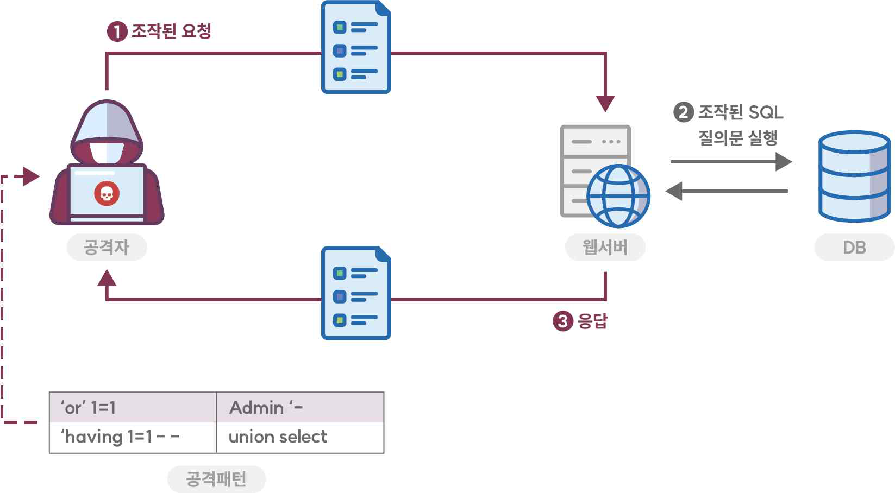

파이썬에서는 데이터베이스에 엑세스에 사용되는 다양한 파이썬 모듈간의 일관성을 장려하기 위해 DB-API를
정의하고 있고 각 데이터베이스마다 별도의 DB 모듈을 이용해 데이터베이스에 엑세스하게 된다. DB-API 외에도
파이썬에서는 Django, SQLAlchemy, Storm등의 ORM(Object Relational Mapping)을 사용하여 데이터
베이스에 엑세스할 수 있다.
파이썬에서 지원하는 다양한 ORM을 이용하여 보다 안전하게 DB를 사용할 수 있지만 일부 복잡한 조건의
쿼리문 생성 어려움, 성능저하 등의 이유로 직접 원시 SQL 실행이 필요한 경우가 있다. ORM 대신 원시 쿼리를
사용하는 경우 검증되지 않은 외부 입력값으로 인해 SQL 삽입 공격이 발생할 수 있다.
나. 안전한 코딩기법
DB API 사용 시 인자화된 쿼리2)를 통해 외부 입력값을 바인딩해서 사용하면 SQL 삽입 공격으로부터 안전하게
보호할 수 있다.
파이썬에서 많이 사용되는 ORM 프레임워크로는 Django의 querySets, SQLAlchemy, Storm등이 있다.
ORM 프레임워크는 기본적으로 모든 쿼리문에 인자화된 쿼리문을 사용하므로 SQL 삽입 공격으로부터 안전하다.
ORM 프레임워크 내에서 원시 SQL을 사용할 경우에도 외부 입력값을 인자화된 쿼리문의 바인딩 변수로 사용
하면 안전한 코드를 작성할 수 있다.
다. 코드 예제
가) DB API 사용 예제
다음은 MySQL, PostgreSQL의 DB API를 사용해 입력값을 받아 처리 하는 안전하지 않은 코드 예시다.
외부 입력값을 입력 받아 변수 name과 content_id에 할당하고(line 8-9), 이 name과 content_id 값에 대한
별도의 검증 없이 쿼리문의 인자 값으로 사용하는 단순 문자열 결합을 통해 쿼리를 생성하고 있다(line 12-15).
이 경우 content_id 값으로 ‘a’ or ‘a’ = ‘a와 같은 공격 문자열을 입력하면 조건절이 content_id = ‘a’ or
‘a’ = ‘a’로 바뀌고, 그 결과 board 테이블 전체 레코드의 name 컬럼의 내용이 공격자가 전달한 name의
값으로 변경된다.
2) 사용자가 전달한 입력값을 그대로 쿼리 문자열로 만들지 않고, DB API에서 제공하는 기능을 사용해 쿼리
내에 사용자 입력값을 구성하는 방법을 의미

**안전하지 않은 코드 예시**

1:
2:
3:
4:
5:
6:
7:
8:
9:
10:
11:
12:
13:
14:
15:
16:
17:
18:
19:
20:
from django.shortcuts import render
from django.db import connection
def update_board(request):
......
dbconn = connection
with dbconn.cursor() as curs:
# 외부로부터 입력받은 값을 검증 없이 사용할 경우 안전하지 않다
name = request.POST.get('name', '')
content_id = request.POST.get('content_id', '')
# 사용자의 검증되지 않은 입력값을 사용해 동적 쿼리문 생성
sql_query = "update board set name='" + name + "' where content_id='“ + content_id + "'"
# 외부 입력값이 검증 없이 쿼리로 포함되어 안전하지 않다
curs.execute(sql_query)
dbconn.commit()
return render(request, '/success.html')
다음은 이를 안전한 코드로 변환한 예시를 보여준다. 앞선 예제와 달리 입력 받은 외부 입력값을 그대로
사용하지 않고 인자화된 쿼리 생성 후(line 11) execute() 메서드의 두 번째 인자 값으로 이 값을 바인딩 해서
쿼리문을 실행한다(line 15). 이렇게 매개변수 바인딩을 통해 execute() 함수를 호출하면 공격자가 쿼리를 변조
하는 값을 삽입하더라도 해당 값이 바인딩된 매개변수의 값으로만 사용되기 때문에 안전하다.

**안전한 코드 예시**

1:
2:
3:
4:
5:
6:
7:
8:
9:
10:
11:
12:
13:
14:
15:
16:
17:
18:
19:
from django.shortcuts import render
from django.db import connection
def update_board(request):
......
dbconn = connection
with dbconn.cursor() as curs:
name = request.POST.get('name', '')
content_id = request.POST.get('content_id', '')
# 외부 입력값 조작으로부터 안전한 인자화된 쿼리를 생성한다.
sql_query = 'update board set name=%s where content_id=%s'
# 사용자의 입력값이 인자화된 쿼리에 바인딩 후 실행되므로 안전하다.
curs.execute(sql_query, (name, content_id))
dbconn.commit()
return render(request, '/success.html')
SQLite DB API 사용 시에도 동일하게 정적인 쿼리문을 사전에 생성하고 사용자 입력을 바인딩하는 방법을
적용해야 한다. SQLite에서는 인자화된 쿼리를 만들기 위해 “?”를 Placeholder로 사용하거나 “:name”처럼
Named Placeholder를 사용하는 방법 2가지를 적용 가능하다.
나) ORM 사용 예제
Django의 querysets는 쿼리 인자화를 사용해 쿼리를 구성하기 때문에 SQL 삽입 공격으로부터 안전하다.
부득이하게 원시 SQL 또는 사용자 정의 SQL을 사용할 경우에도 외부 입력값을 인자화된 쿼리의 바인딩 변수로
사용하면 된다.
아래는 Django의 원시 SQL을 사용하는 예시를 보여 준다. Django의 ORM 프레임워크는 원시 SQL 쿼리를
수행하기 위해 Manager.raw() 기능을 제공한다. 외부로부터 입력받은 외부 입력값(line 6)을 쿼리문 생성에
문자열 조합으로 사용해 쿼리문을 구성하고 있다(line 11).

**안전하지 않은 코드 예시**

1:
2:
3:
4:
5:
6:
7:
8:
9:
10:
11:
12:
from django.shortcuts import render
from app.models import Member
def member_search(request):
name = request.POST.get('name', '')
# 입력값을 검증 없이 쿼리문 생성에 사용해 안전하지 않다
query=“select * from member where name=‘” + name + “’”
# 외부 입력값을 검증 없이 사용한 쿼리문을 raw()함수로 실행하면 안전하지 않다
data = Member.objects.raw(query)
return render(request, '/member_list.html', {'member_list':data})
다음 코드에서는 Django에서 원시 코드 실행 시에도 인자화된 쿼리와 params 인수를 raw() 함수의 바인딩
변수로 사용하는 안전한 예시를 보여 준다. 외부 입력값을 포함하는 쿼리문 생성 자체를 인자화된 쿼리 형식으로
생성하고(line 10), raw() 메소드에서 두 번째 인자의 바인딩 변수로 사용했다.

**안전한 코드 예시**

1:
2:
3:
4:
5:
6:
7:
8:
9:
10:
11:
12:
13:
from django.shortcuts import render
from app.models import Member
def member_search(request):
name = request.POST.get('name', '')
# 외부 입력값을 raw() 함수 실행 시 바인딩 변수로 사용하여 쿼리 구조가
# 변경되지 않도록 한다.(list 형은 %s, dictionary 형은 %(key)s를 사용)
query='select * from member where name=%s'
# 인자화된 쿼리문을 사용하여 raw() 함수를 호출해 안전하다
data = Member.objects.raw(query, [name])
return render(request, '/member_list.html', {'member_list':data})

라. 참고자료
① CWE-89: Improper Neutralization of Special Elements used in an SQL Command ('SQL Injection'), MITRE,
https://cwe.mitre.org/data/definitions/89.html
② SQL Injection Prevention Cheat Sheet, OWASP
https://cheatsheetseries.owasp.org/cheatsheets/SQL_Injection_Prevention_Cheat_Sheet.html
③ Sqlite3 DB-API, Python, Python Software Foundation,
https://docs.python.org/ko/3/library/sqlite3.html
④ MySQL, Python Coding Examples, Oracle Corporation
https://dev.mysql.com/doc/connector-python/en/connector-python-examples.html
⑤ Django QuerySet API reference, Django Software Foundation,
https://docs.djangoproject.com/en/3.2/ref/models/querysets/
⑥ Django Performing raw SQL queries, Django Software Foundation,
https://docs.djangoproject.com/en/3.2/topics/db/sql/
⑦ SQL Expression Language Tutorial, SQLAlchemy,
https://docs.sqlalchemy.org/en/14/core/tutorial.html#using-textual-sql
2. 코드 삽입
가. 개요
공격자가 소프트웨어의 의도된 동작을 변경하도록 임의 코드를 삽입해 소프트웨어가 비정상적으로 동작하도록
하는 보안약점을 말한다. 코드 삽입은 프로그래밍 언어 자체의 기능에 한해 이뤄진다는 점에서 운영체제 명령어
삽입과 다르다. 프로그램에서 사용자의 입력값 내에 코드가 포함되는 것을 허용할 경우 공격자는 개발자가 의도
하지 않은 코드를 실행해 권한을 탈취하거나 인증 우회, 시스템 명령어 실행 등을 할 수 있다.
파이썬에서 코드 삽입 공격을 유발할 수 있는 함수로는 eval(), exec() 등이 있다. 해당 함수의 인자를 면밀히
검증하지 않는 경우 공격자가 전달한 코드가 그대로 실행될 수 있다.
나. 안전한 코딩기법
동적코드를 실행할 수 있는 함수를 사용하지 않는다. 필요 시, 실행 가능한 동적 코드를 입력값으로 받지
않도록 외부 입력값에 대해 화이트리스트 기반 검증을 수행해야 한다. 유효한 문자만 포함하도록 동적 코드에
사용되는 사용자 입력값을 필터링 하는 방법도 있다.
다. 코드예제
가) eval()함수 사용 예제
다음은 안전하지 않은 코드로 eval()을 사용해 사용자로부터 입력받은 값을 실행하여 결과를 반환 하는 예제다.
외부로부터 입력 받은 값을 아무런 검증 없이 eval() 함수의 인자로 사용하고 있다(line 10).

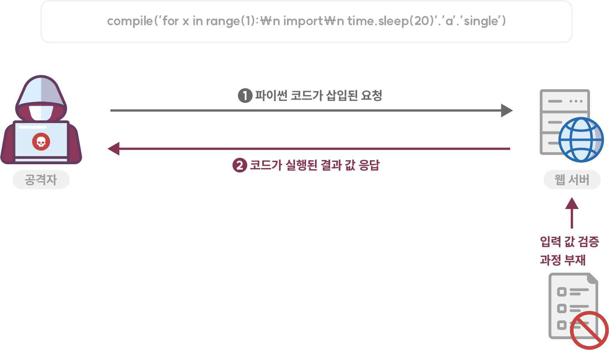

외부 입력값을 검증 없이 사용할 경우 공격자는 파이썬 코드를 통해 악성 기능 실행을 위한 라이브러리 로드
및 원격 대화형 쉘 등을 실행할 수도 있다. 예를 들어 공격자가 다음과 같은 코드를 입력할 경우 20초 동안
응용 프로그램이 sleep 상태에 빠질 수 있다.
예시) “compile(‘for x in range(1):\n import time\n time.sleep(20)’,’a’,’single’)”

**안전하지 않은 코드 예시**

1:
2:
3:
4:
5:
6:
7:
8:
9:
10:
11:
from django.shortcuts import render
def route(request):
# 외부에서 입력받은 값을 검증 없이 사용하면 안전하지 않다
message = request.POST.get('message', '')
# 외부 입력값을 검증 없이 eval 함수에 전달할 경우 의도하지 않은 코드가
# 실행될 수 있어 위험하다
ret = eval(message)
return render(request, '/success.html', {'data':ret})
다음은 안전한 코드로 변환한 예제를 보여 준다. 외부 입력값 내에 포함된 (파이썬 코드를 실행할 수 있는)
특수 문자 등을 필터링 하는 사전 검증 코드를 추가하면 코드 삽입 공격 위험을 완화할 수 있다. 아래 코드는
입력 받은 외부 입력값(line 4)을 eval() 함수의 인자 값으로 사용하기 전에 입력값이 영문과 숫자만으로 입력
되었는지 검증 후(line 9) 사용하도록 하고 있다.

**안전한 코드 예시**

1:
2:
3:
4:
5:
6:
7:
8:
9:
10:
11:
12:
from django.shortcuts import render
def route(request):
message = request.POST.get('message', '')
# 사용자 입력을 영문, 숫자로 제한하며, 만약 입력값 내에 특수문자가 포함되어
# 있을 경우 에러 메시지를 반환 한다
if message.isalnum():
ret = eval(message)
return render(request, '/success.html', {'data':ret})
return render(request, '/error.html')

파이썬은 다양한 String 메소드를 제공하고 있다. 필요한 경우 적절한 메소드를 사용해 외부 입력값에 대한
검증을 수행해야 한다. 아래는 파이썬에서 제공하는 입력값 검증용 String 메소드 예시를 보여 준다.
⦁str.isalpha() : 문자열 내의 모든 문자가 알파벳이고, 적어도 하나의 문자가 존재하는 경우 True를 반환
⦁str.isdecimal() : 문자열 내의 모든 문자가 십진수 문자이고, 적어도 하나의 문자가 존재하는 경우 True를 반환
⦁str.isdigit() : 문자열 내의 모든 문자가 숫자이고, 적어도 하나의 문자가 존재하는 경우 True를 반환,
십진수 문자와 호환되는 위 첨자 숫자와 같은 숫자도 포함. ex) ‘52’ 는 True를 반환
입력값 검증 시 외부 입력값이 특정 형식을 따라야 하는 경우 정규 표현식을 이용해 검증을 할 수 있다.
파이썬에서는 re 라이브러리를 사용해 정규식 기반 검증이 가능하다. 예를 들어 이메일 형식의 입력만 허용하고
싶은 경우 다음과 같은 정규식을 사용하면 된다.
ex) prog = re.compile(r'([A-Za-z0-9]+[.-_])*[A-Za-z0-9]+@[A-Za-z0-9-]+(\.[A-Z|a-z]{2,})+')
나) exec()함수 사용 예제
다음은 exec() 함수를 사용한 안전하지 않은 코드 예제를 보여 준다. 외부 입력값을 검증 없이 exec 함수의
인자로 사용하고 있다(line 9). 이렇게 되면 중요 데이터 탈취 및 서버의 권한 탈취, 액세스 거부, 심지어 완전한
호스트 탈취로도 이어질 수 있다.

**안전하지 않은 코드 예시**

1:
2:
3:
4:
5:
6:
7:
8:
9:
10:
11:
from django.shortcuts import render
def request_rest_api(request):
function_name = request.POST.get('function_name', '')
# 사용자에게 전달받은 함수명을 검증하지 않고 실행
# 입력값으로 “__import__(‘platform’).system()” 등을 입력 시
# 시스템 정보 노출 위험이 있다
exec('{}()'.format(function_name))
return render(request, '/success.html')

다음은 위 코드를 안전하게 변환한 예제다. 우선 외부로부터 입력 받은 문자열 내부에서 발견된 라이브러리
이름이 사전에 정의한 화이트리스트에 포함되는지 확인하고 리스트에 없는 경우엔 에러 페이지를 반환한다.

**안전한 코드 예시**

1:
2:
3:
4:
5:
6:
7:
8:
9:
10:
11:
12:
13:
from django.shortcuts import render
WHITE_LIST = ['get_friends_list', 'get_address', 'get_phone_number']
def request_rest_api(request):
function_name = request.POST.get('function_name', '')
# 사용 가능한 함수를 화이트리스트 목록 내의 함수로 제한
if function_name in WHITE_LIST:
exec('{}()'.format(function_name))
return render(request, '/success.html')
return render(request, '/error.html', {'error':'허용되지 않은 함수입니다.'})
라. 참고자료
① CWE-94: Improper Control of Generation of Code ('Code Injection'), MITRE,
https://cwe.mitre.org/data/definitions/94.html
② CWE-95: Improper Neutralization of Directives in Dynamically Evaluated Code ('Eval Injection'), MITRE,
https://cwe.mitre.org/data/definitions/95.html
③ Code Injection, OWASP,
https://owasp.org/www-community/attacks/Code_Injection
④ Python Built-in Functions - eval(), exec(), compile(), Python Software Foundation,
https://docs.python.org/3/library/functions.html#eval
https://docs.python.org/3/library/functions.html#exec
https://docs.python.org/3/library/functions.html#compile
⑤ Python Built-in Types – isalnum(), Python Software Foundation,
https://docs.python.org/3/library/stdtypes.html
⑥ Reqular expression operations, Python Software Foundation,
https://docs.python.org/3/library/re.html#module-re

3. 경로 조작 및 자원 삽입
가. 개요
검증되지 않은 외부 입력값을 통해 파일 및 서버 등 시스템 자원(파일, 소켓의 포트 등)에 대한 접근 혹은
식별을 허용할 경우 입력값 조작으로 시스템이 보호하는 자원에 임의로 접근할 수 있는 보안약점이다. 경로조작
및 자원삽입 약점을 이용해 공격자는 자원 수정·삭제, 시스템 정보누출, 시스템 자원 간 충돌로 인한 서비스
장애 등을 유발시킬 수 있다. 또한 경로 조작 및 자원 삽입을 통해서 공격자가 허용되지 않은 권한을 획득해
설정 파일을 변경하거나 실행시킬 수 있다.
파이썬에서는 subprocess.popen()과 같이 프로세스를 여는 함수, os.pipe()처럼 파이프를 여는 함수,
socket 연결 등에서 외부 입력값을 검증 없이 사용할 경우 경로 조작 및 자원 삽입의 취약점이 발생할 수 있다.
나. 안전한 코딩기법
외부로부터 받은 입력값을 자원(파일, 소켓의 포트 등)의 식별자로 사용하는 경우 적절한 검증을 거치도록
하거나 사전에 정의된 리스트에 포함된 식별자만 사용하도록 해야 한다. 특히 외부의 입력이 파일명인 경우에는
필터를 적용해 경로순회(directory traversal) 공격의 위험이 있는 문자( /, \, .. 등)를 제거해야 한다.
다. 코드예제
가) 경로 조작 예제
다음은 외부 입력값으로 파일 경로 등을 입력받아 파일을 여는 예시를 보여 준다. 만약 공격자가
‘../../../../etc/passwd’ 와 같은 값을 전달하면 사용자 계정 및 패스워드 정보가 담긴 파일의 내용이 클라이언트
측에 표시되어 의도치 않은 시스템 정보노출 문제가 발생한다.

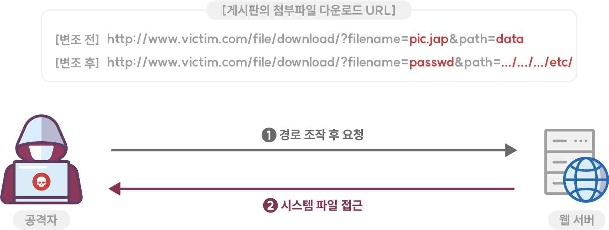

**안전하지 않은 코드 예시**

1:
2:
3:
4:
5:
6:
7:
8:
9:
10:
11:
12:
13:
14:
15:
16:
17:
import os
from django.shortcuts import render
def get_info(request):
# 외부 입력값으로부터 파일명을 입력 받는다
request_file = request.POST.get('request_file')
(filename, file_ext) = os.path.splitext(request_file)
file_ext = file_ext.lower()
if file_ext not in ['.txt', '.csv']:
return render(request, '/error.html', {'error':'파일을 열 수 없습니다.'})
# 입력값을 검증 없이 파일 처리에 사용했다
with open(request_file) as f:
data = f.read()
return render(request, '/success.html', {'data':data})
외부 입력값에서 경로 조작 문자열 ( /, \, .. 등)을 제거한 후 파일의 경로 설정에 사용하면 코드를 안전하게
만들 수 있다. replace 함수 외에도 re.sub, filter 함수를 사용해 특수문자를 필터링 하는 것도 가능하다.

**안전한 코드 예시**

1:
2:
3:
4:
5:
6:
7:
8:
9:
10:
11:
12:
13:
14:
15:
16:
import os
from django.shortcuts import render
def get_info(request):
request_file = request.POST.get('request_file')
(filename, file_ext) = os.path.splitext(request_file)
file_ext = file_ext.lower()
# 외부 입력값으로 받은 파일 이름은 검증하여 사용한다.
if file_ext not in ['.txt', '.csv']:
return render(request, '/error.html', {'error':'파일을 열수 없습니다.'})
# 파일 명에서 경로 조작 문자열을 필터링 한다.
filename = filename.replace('.', '')
filename = filename.replace('/', '')
filename = filename.replace('\\', '')

**안전한 코드 예시**

17:
18:
19:
21:
22:
23:
24:
25:
26:
27:
try:
with open(filename + file_ext) as f:
data = f.read()
except:
return render(
request, "/error.html", {"error": "파일이 존재하지 않거나 열 수 없는 파일입니다."}
)
return render(request, '/success.html', {'data':data})
나) 자원 삽입 예제
다음은 안전하지 않은 코드 예시로, 외부 입력을 소켓 포트 번호로 그대로 사용하고 있다. 외부 입력값을
검증 없이 사용할 경우 기존 자원과의 충돌로 의도치 않은 에러가 발생할 수 있다.

**안전하지 않은 코드 예시**

1:
2:
3:
4:
5:
6:
7:
8:
9:
10:
11:
12:
13:
import socket
from django.shortcuts import render
def get_info(request):
port = int(request.POST.get('port'))
with socket.socket(socket.AF_INET, socket.SOCK_STREAM) as s:
# 외부로부터 입력받은 검증되지 않은 포트 번호를 이용하여
# 소켓을 바인딩하여 사용하고 있어 안전하지 않다
s.bind(('127.0.0.1', port))
...
return render(request, '/success.html')
return render(request, '/error.html', {'error':'소켓연결 실패'})
다음은 안전한 예제를 보여 준다. 내부 자원에 접근 시 외부에서 입력 받은 값을 포트 번호와 같은 식별자로
그대로 사용하는 것은 바람직하지 않으며, 꼭 필요한 경우엔 허용 가능한 목록을 설정한 후 목록 내에 포함된
포트만 할당되도록 코드를 작성해야 한다.

**안전한 코드 예시**

1:
2:
3:
4:
5:
6:
7:
8:
9:
10:
11:
12:
13:
14:
15:
16:
import socket
from django.shortcuts import render
ALLOW_PORT = [4000, 6000, 9000]
def get_info(request):
port = int(request.POST.get('port'))
# 사용 가능한 포트 번호를 화이트리스트 내의 포트로 제한
if port not in ALLOW_PORT:
return render(request, '/error.html', {'error':'소켓연결 실패'})
with socket.socket(socket.AF_INET, socket.SOCK_STREAM) as s:
s.bind(('127.0.0.1', port))
......
return render(request, '/success.html')
라. 참고자료
① CWE-22: Improper Limitation of a Pathname to a Restricted Directory ('Path Traversal'), MITRE,
https://cwe.mitre.org/data/definitions/22.html
② CWE-99: Improper Control of Resource Identifiers ('Resource Injection'), MITRE,
https://cwe.mitre.org/data/definitions/99.html
③ Path Traversal, OWASP,
https://owasp.org/www-community/attacks/Path_Traversal
④ Resource Injection, OWASP,
https://owasp.org/www-community/attacks/Resource_Injection
⑤ File Uploads, Django Software Foundation,
https://docs.djangoproject.com/en/3.2/topics/http/file-uploads/
⑥ HTML Helpers, Werkzeug,
https://werkzeug.palletsprojects.com/en/2.0.x/utils/#module-werkzeug.utils

4. 크로스사이트 스크립트(XSS)
가. 개요
크로스사이트 스크립트 공격(Cross-site scripting Attacks)은 웹사이트에 악성 코드를 삽입하는 공격 방법
이다. 공격자는 대상 웹 응용프로그램의 결함을 이용해 악성코드(일반적으로 클라이언트 측 JavaScript 사용)를
사용자에게 보낸다. XSS공격은 일반적으로 애플리케이션 호스트 자체보다 사용자를 목표로 삼는다.
XSS는 공격자가 웹 응용프로그램을 속여 브라우저에서 실행될 수 있는 형식의 데이터(코드)를 다른 사용자
에게 전달할 때 발생한다. 공격자가 임의로 구성한 기본 웹 코드 외에도 악성코드 다운로드, 플러그인 또는
미디어 콘텐츠를 이용할 수도 있다. 사용자가 폼 양식에 입력한 데이터 또는 서버에서 클라이언트 단말(브라우저)
전달된 데이터가 적절한 검증 없이 사용자에게 표시되도록 허용되는 경우 발생한다.
XSS공격에는 크게 세 가지 유형의 공격방법이 있다.
⦁유형 1 : Reflective XSS (or Non-persistent XSS)

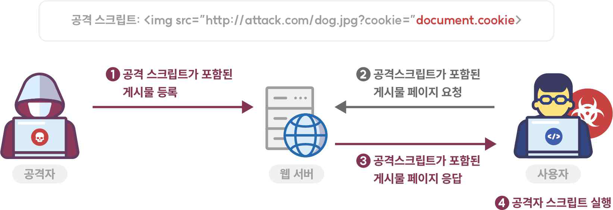

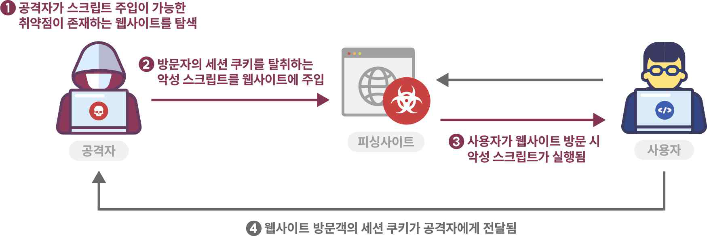

- Reflective XSS는 공격 코드를 사용자의 HTTP 요청에 삽입한 후, 해당 공격 코드를 서버 응답 내용에
그대로 반사 (Reflected)시켜 브라우저에서 실행하는 공격기법이다. Reflective XSS 공격을 수행하려면
사용자로 하여금 공격자가 만든 서버로 데이터를 보내도록 해야 한다. 이 방법은 보통 악의적으로 제작된
링크를 사용자가 클릭하도록 유도하는 방식을 수반한다. 공격자는 피해자가 취약한 사이트를 참조하는
URL을 방문하도록 유도하고, 피해자가 링크를 방문하면 스크립트가 피해자의 브라우저에서 자동으로 실행
된다. 대부분의 경우 Reflective XSS 공격 메커니즘은 공개 게시판, 피싱(Phishing) 이메일, 단축 URL
또는 실제와 유사한 URL을 사용한다.
⦁유형 2 : Persistent XSS (or Stored XSS)
- Persistent XSS는 신뢰할 수 없거나 확인되지 않은 사용자 입력(코드)이 서버에 저장되고, 이 데이터가
다른 사용자들에게 전달될 때 발생한다. Persistent XSS는 게시글 및 댓글 또는 방문자 로그 기능에서
발생할 수 있다. 해당 기능을 통해 공격자의 악성 콘텐츠를 다른 사용자들이 열람할 수 있다. 소셜 미디어
사이트 및 회원 그룹에서 흔히 볼 수 있는 것과 같이 공개적으로 표시되는 프로필 페이지는 Persistent
XSS의 대표적인 공격 대상 중 하나다. 공격자는 프로필 입력 폼에 악성 스크립트를 주입해 다른 사용자가
프로필을 방문하면 브라우저에서 자동으로 코드가 실행되도록 할 수 있다.
⦁유형 3 : DOM XSS (or Client-Side XSS)
- DOM XSS은 웹 페이지에 있는 사용자 입력값을 적절하게 처리하기 위한 JavaScript의 검증 로직을 무효화
하는 것을 목표로 한다. 공격 스크립트가 포함된 악성 URL을 통해 전달된다는 관점에서 Reflective XSS와
유사하다고 볼 수 있다. 그러나 신뢰할 수 있는 사이트의 HTTP 응답에 페이로드를 포함하는 대신 DOM
또는 문서 개체 모델을 수정해 브라우저와 독립적인 공격을 실행한다는 점에서 차이가 있다.

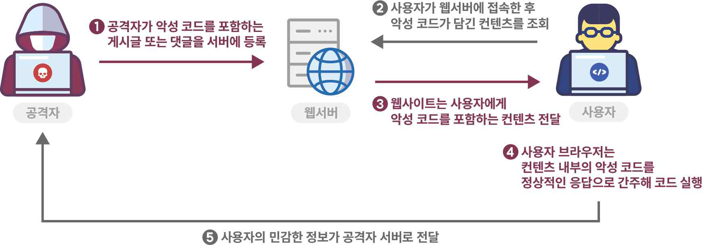

- 공격자는 DOM XSS 공격을 통해 세션 및 개인 정보를 포함한 쿠키 데이터를 피해자의 컴퓨터에서 공격자
시스템으로 전송할 수 있다. 이 정보를 사용해 특정 웹사이트에 악의적인 요청을 보낼 수 있으며, 피해자가
해당 사이트를 관리 할 수 있는 관리자 권한이 있는 경우 심각한 위협을 초래할 수도 있다. 또한 신뢰할
수 있는 웹 사이트를 모방하고 피해자가 암호를 입력하도록 속여 공격자가 해당 웹 사이트에서 피해자의
계정을 손상시키는 피싱(Phishing) 공격으로도 이어질 수 있다.
- 파이썬에서 가장 많이 사용하고 있는 Django 프레임워크와 Flask 프레임워크에서는 각각 Django 템플릿과
Jinja2 템플릿을 사용할 시 XSS 공격에 악용될 수 있는 위험한 HTML 문자들을 HTML 특수문자 (HTML
Entities)로 치환하는 기능을 제공하고 있어 프레임워크에서 제공하는 템플릿을 사용하는 경우 위협을 최소화
할 수 있다.
나. 안전한 코딩기법
외부 입력값 또는 출력값에 스크립트가 삽입되지 못하도록 문자열 치환 함수를 사용하여 &<>*‘/() 등을
&amp; &lt; &gt; &quot; &#x27; &#x2F; &#x28; &#x29;로 치환하거나, html라이브러리의 escape()를
사용해 문자열을 변환해야 한다. HTML 태그를 허용해야 하는 게시판에서는 허용할 HTML 태그들을 화이트
리스트로 만들어 해당 태그만 지원하도록 한다.
파이썬에서 가장 많이 사용하는 프레임워크인 Django, Flask 등을 사용하는 경우 외부 입력값에 악의적인
스크립트가 삽입되지 못하도록 프레임워크 자체에서 XSS 공격에 사용될 수 있는 문자를 HTML 특수문자
(HTML Entities)로 치환하여 응답 페이지를 생성하므로 XSS 공격으로부터 안전하다.

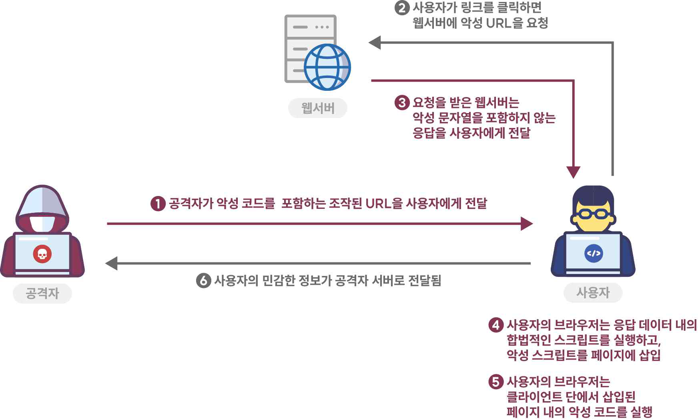

프레임워크 자체에서 XSS 공격으로부터 보호해 주는 기능이 있더라도 완전하지 않은 경우도 있고 개발자의
실수로 보호기능이 무효화 되는 경우가 있으므로 주의를 기울여야 한다.
다. 코드예제
가) Django 예제
Django 프레임워크는 XSS 공격에 대한 보안기능을 내장하고 있지만 유의해야 할 사항이 몇 가지 있다.
Django의 “safestring(django.utils.safestring)”의 기능을 오용할 경우 Django의 XSS 공격에 대한 보호
정책이 무력화 될 수 있다.

**안전하지 않은 코드 예시**

1:
2:
3:
4:
5:
6:
7:
8:
9:
10:
11:
12:
13:
from django.shortcuts import render
from django.utils.safestring import mark_safe
def profile_link(request):
# 외부 입력값을 검증 없이 HTML 태그 생성의 인자로 사용
profile_url = request.POST.get('profile_url')
profile_name = requst.POST.get('profile_name')
object_link = '<a href="{}">{}</a>'.format(profile_url, profile_name)
# mark_safe함수는 Django의 XSS escape 정책을 따르지 않는다
object_link = mark_safe(object_link)
return render(request, 'my_profile.html',{'object_link':object_link})
Django 프레임워크는 템플릿 생성 시 HTML에서 위험한 것으로 간주되는 특수 문자(“<”, “>”, “‘”, “””,
“&”)를 모두 HTML 엔티티로 치환 하지만 mark_safe를 사용할 경우 이 정책을 따르지 않는다. 따라서
mark_safe 함수를 사용할 경우에는 각별한 주의가 필요하고 신뢰할 수 없는 데이터에 대해서는 mark_safe
함수를 사용하지 않아야 한다.

**안전한 코드 예시**

1:
2:
3:
4:
5:
6:
7:
8:
9:
10:
11:
from django.shortcuts import render
def profile_link(request):
# 외부 입력값을 검증 없이 HTML 태그 생성의 인자로 사용
profile_url = request.POST.get('profile_url')
profile_name = requst.POST.get('profile_name')
object_link = '<a href="{}">{}</a>'.format(profile_url, profile_name)
# 신뢰할 수 없는 데이터에 대해서는 mark_safe 함수를 사용해선 안 된다
return render(request, 'my_profile.html',{'object_link':object_link})
다음은 또 다른 Django 프레임워크 템플릿 예제를 보여 준다. autoescape 블록 사용 시 설정값을 off로
할 경우와 개별 변수에 대해서 safe 필터를 사용할 경우 크로스사이트 스크립트 공격에 노출될 수 있다.

**안전하지 않은 코드 예시**

1:
2:
3:
4:
5:
6:
7:
8:
9:
10:
11:
12:
13:
14:
15:
16:
<!doctype html>
<html>
<body>


<!-- autoescape off로 설정하면 해당 블록내의 데이터는 XSS 공격에
노출될 수 있다 -->
{{ content }}


<!-- safe 필터 사용으로 XSS 공격에 노출될 수 있다 -->
{{ content | safe }}

</body>
</html>
신뢰할 수 없는 입력값 또는 동적 데이터에 대해서는 autoescape 옵션 값을 on으로 설정해야 하며, safe
필터를 부득이 하게 사용할 경우에는 추가적인 보안대책이 필요하다.

**안전한 코드 예시**

1:
2:
3:
4:
5:
6:
7:
8:
9:
10:
11:
12:
13:
14:
15:
<!doctype html>
<html>
<body>


<!--autoescape on으로 해당 블록내의 데이터는 XSS 공격에 노출되지 않음. -->
{{ content }}


<!-- 검증되지 않은 데이터에는 safe 필터를 사용하지 않는다. -->
{{ content }}

</body>
</html>
autoescape 블록을 사용할 경우 많은 주의를 기울여야 한다. autoescape 옵션값을 off로 설정한 템플릿
페이지를 include 또는 extends하는 템플릿까지 영향이 확장된다. 공통적으로 사용하는 템플릿페이지에 off로
설정할 경우 템플릿 페이지가 XSS 공격에 노출될 수 있다.
나) Flask에서의 예제
사용자의 요청에 포함된 값, DB에 저장된 값 또는 내부의 연산을 통해서 생성된 값을 포함한 데이터를 동적
웹페이지 생성에 사용하는 경우 XSS 공격이 발생할 가능성이 있어 위험하다. 아래 예제는 Flask 프레임워크를
사용한 안전하지 않은 사례를 보여 준다.

**안전하지 않은 코드 예시**

1:
2:
3:
4:
5:
6:
7:
8:
from flask import Flask, request, render_template
@app.route('/search', methods=['POST'])
def search():
search_keyword = request.form.get('search_keyword')
# 사용자의 입력을 아무런 검증 또는 치환 없이 동적 웹페이지에 사용하고 있어
# XSS 공격이 발생할 수 있다
return render_template('search.html', search_keyword=search_keyword)

동적 웹 페이지 생성에 사용하는 데이터를 HTML 엔티티 코드 (Entity Code)로 치환하여 안전하게 표현해야
한다. html.escape 메소드는 문자열의 &, < 및 > 특수문자를 HTML에서 안전한 값으로 변환한다. quote
옵션 값이 True이면 문자 (“)와 (‘)도 변환된다. <a href=”…“>에서처럼 따옴표로 구분된 HTML 속성
(attribute) 값이 들어간 문자열을 포함할 경우에도 사용할 수 있다.

**안전한 코드 예시**

1:
2:
3:
4:
5:
6:
7:
8:
9:
10:
11:
import html
from flask import Flask, request, render_template
@app.route('/search', methods=['POST'])
def search():
search_keyword = request.form.get('search_keyword')
# 동적 웹페이지 생성에 사용되는 데이터는
# HTML 엔티티코드로 치환하여 표현해야 한다
escape_keyword = html.escape(search_keyword)
return render_template('search.html', search_keyword=escape_keyword)
라. 참고자료
① CWE-79: Improper Neutralization of Input During Web Page Generation ('Cross-site Scripting'), MITRE,
https://cwe.mitre.org/data/definitions/79.html
② Cross Site Scripting (XSS), OWASP,
https://owasp.org/www-community/attacks/xss/
③ html - HyperText Markup Language support, Python Software Foundation,
https://docs.python.org/3/library/html.html
④ Flask Security Considerations Cross-Site Scripting (XSS), Flask docs,
https://flask-docs-kr.readthedocs.io/ko/latest/security.html
⑤ Django Security in Django Cross site scripting (XSS) protection, Django Software Foundation,
https://docs.djangoproject.com/en/3.2/topics/security/

5. 운영체제 명령어 삽입
가. 개요
적절한 검증 절차를 거치지 않은 사용자 입력값이 운영체제 명령어의 일부 또는 전부로 구성되어 실행되는
경우 의도하지 않은 시스템 명령어가 실행돼 부적절하게 권한이 변경되거나 시스템 동작 및 운영에 악영향을
미칠 수 있다.
명령어 라인의 파라미터나 스트림 입력 등 외부 입력을 사용해 시스템 명령어를 생성 하는 프로그램을 많이
찾아볼 수 있다. 이 경우 프로그램 외부로부터 받은 입력 문자열은 기본적으로 신뢰할 수 없기 때문에 적절한
처리를 해주지 않으면 공격으로 이어질 수 있다.
파이썬에서 eval() 함수와 exec() 함수는 내부에서 문자열을 실행하기에 편리하지만, String 형식의 표현된
식을 인수로 받아 반환하는 eval() 함수와 인수로 받은 문자열을 실행하는 exec()를 같이 사용하면 여러 변수들에
동적으로 값을 할당해 사용할 수 있어 명령어 삽입(Command Injection) 공격에 취약하다.
나. 안전한 코딩기법
외부 입력값 내에 시스템 명령어를 포함하는 경우 |, ;, &, :, >, <, `(backtick), \, ! 과 같이 멀티라인 및
리다이렉트 문자 등을 필터링 하고 명령을 수행할 파일명과 옵션을 제한해 인자로만 사용될 수 있도록 해야
한다. 외부 입력에 따라 명령어를 생성하거나 선택이 필요한 경우에는 명령어 생성에 필요한 값들을 미리 지정해
놓고 사용해야 한다.

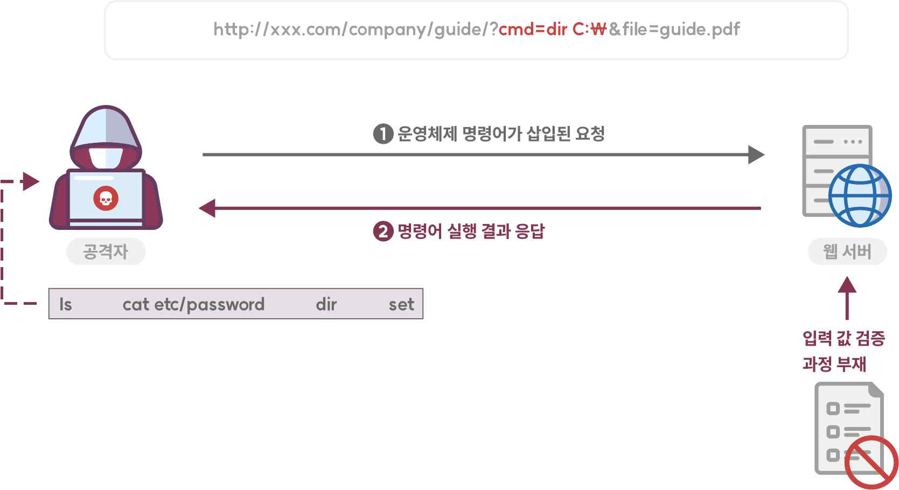

다. 코드예제
다음 예제는 os.system을 이용해 외부로부터 받은 입력값을 통해 프로그램을 실행하며, 외부에서 전달되는
인자값은 명령어의 생성에 사용된다. 하지만 해당 프로그램에서 실행할 프로그램을 제한하지 않고 있기 때문에
외부의 공격자는 원하는 모든 프로그램을 실행할 수 있다.

**안전하지 않은 코드 예시**

1:
2:
3:
4:
5:
6:
7:
8:
9:
import os
from django.shortcuts import render
def execute_command(request):
app_name_string = request.POST.get('app_name','')
# 입력 파라미터를 제한하지 않아 외부 입력값으로 전달된
# 모든 프로그램이 실행될 수 있음
os.system(app_name_string)
return render(request, '/success.html')
외부에서 입력받은 값이 명령어의 인자로 사용되지 않고 명령어 그 자체로 사용될 경우에는 사전에 화이트
리스트 파라미터 배열을 정의한 후 외부의 입력에 따라 적절한 파라미터를 선택하도록 하여 외부의 부적절한
입력이 명령어로 사용되는 것을 금지해야 한다.

**안전한 코드 예시**

1:
2:
3:
4:
5:
6:
7:
8:
9:
10:
11:
12:
13:
14:
import os
from django.shortcuts import render
ALLOW_PROGRAM = ['notepad', 'calc']
def execute_command(request):
app_name_string = request.POST.get('app_name','')
# 입력받은 파라미터가 허용된 시스템 명령어 목록에 포함되는지 검사
if app_name_string not in ALLOW_PROGRAM:
return render(request, '/error.html', {'error':'허용되지 않은 프로그램입니다.'})
os.system(app_name_string)
return render(request, '/success.html')

다음은 subprocess() 함수를 사용해 별도의 프로세스로 응용 프로그램을 실행하는 안전하지 않은 예제다.
외부 입력값으로 받은 파라미터를 별도의 검증 없이 subprocess의 인자 값으로 사용하고 있다.

**안전하지 않은 코드 예시**

1:
2:
3:
4:
5:
6:
7:
8:
9:
import subprocess
from django.shortcuts import render
def execute_command(request):
date = request.POST.get('date','')
# 입력받은 파라미터를 제한하지 않아 전달된 모든 프로그램이 실행될 수 있음
cmd_str = “cmd /c backuplog.bat ” + date
subprocess.run(cmd_str, shell=True)
return render(request, '/success.html')
운영체제 명령어 실행 시에는 외부에서 들어오는 값에 의하여 멀티라인을 지원하는 특수문자(|, ;, &, :, `,
\, !)나 파일 리다이렉트 특수문자( >, >> )등을 제거하여 원하지 않는 운영체제 명령어가 실행될 수 없도록
필터링을 수행한다.
명령어 라인을 구문 분석하고 escape 하는 기능을 제공하는 모듈인 shlex 모듈을 사용해 필터링을 수행할
수 있다. subprocess의 옵션 값 중 shell를 True로 설정할 경우 중간 프로세스에 의해 명령이 실행되고 파일
이름, 와일드카드(*), 환경변수 확장 등의 쉘 기능을 검증 없이 실행하게 되므로 shell의 옵션은 삭제해야 한다
(기본값은 False).

**안전한 코드 예시**

1:
2:
3:
4:
5:
6:
7:
8:
9:
10:
11:
12:
13:
14:
15:
16:
import subprocess
from django.shortcuts import render
def execute_command(request):
date = request.POST.get('date','')
# 명령어를 추가로 실행 또는 또 다른 명령이 실행될 수 있는 키워드에
# 대한 예외처리
for word in ['|', ';', '&', ':', '>', '<', '`', '\\', '!']:
date = date.replace(word, “”)
# re.sub 함수를 사용해 특수문자를 제거하는 방법도 있다
# date = re.sub('[|;&:><`\\\!]', '', date)
# shell=True 옵션은 제거 하고 명령과 인자를 배열로 입력
subprocess.run(["cmd", "/c", "backuplog.bat", date])
return render(request, '/success.html')
라. 참고자료
① CWE-78: Improper Neutralization of Special Elements used in an OS Command ('OS Command Injection'), MITRE,
https://cwe.mitre.org/data/definitions/78.html
② Command Injection, OWASP
https://owasp.org/www-community/attacks/Command_Injection
③ OS Command Injection Defense Cheat Sheet, OWASP
https://cheatsheetseries.owasp.org/cheatsheets/OS_Command_Injection_Defense_Cheat_Sheet.html
④ Miscellaneous operating system interfaces - os.system(), Python Software Foundation
https://docs.python.org/3.10/library/os.html?highlight=os%20system#module-os
⑤ Subprocess management, Python Software Foundation,
https://docs.python.org/ko/3/library/subprocess.html#security-considerations
⑥ Regular expression operations, Python Software Foundation,
https://docs.python.org/3/library/re.html

6. 위험한 형식 파일 업로드
가. 개요
서버 측에서 실행 가능한 스크립트 파일(asp, jsp, php, sh 파일 등)이 업로드 가능하고 이 파일을 공격자가
웹을 통해 직접 실행시킬 수 있는 경우 시스템 내부 명령어를 실행하거나 외부와 연결해 시스템을 제어할 수
있는 보안약점이다.
공격자가 실행 가능한 파일을 서버에 업로드 하면 파이썬에서 String 형식으로 표현된 표현식을 인수로 받아
반환하는 eval() 함수와 인수로 받은 문자열을 실행하는 exec()를 같이 사용해 여러 변수들을 동적으로 값을
할당받아 실행될 수 있어 웹쉘(Web Shell) 공격에 취약하다.
나. 안전한 코딩기법
파일 업로드 공격을 방지하기 위해서 특정 파일 유형만 허용하도록 화이트리스트 방식으로 파일 유형을 제한
해야 한다. 이때 파일의 확장자 및 업로드 된 파일의 Content-Type도 함께 확인해야 한다. 또한 파일 크기
및 파일 개수를 제한하여 시스템 자원 고갈 등으로 서비스 거부 공격이 발생하지 않도록 제한해야 한다. 업로드
된 파일을 웹 루트 폴더 외부에 저장해 공격자가 URL을 통해 파일을 실행할 수 없도록 해야 하며, 가능하면
업로드 된 파일의 이름은 공격자가 추측할 수 없는 무작위한 이름으로 변경 후 저장하는 것이 안전하다. 또한
업로드 된 파일을 저장할 경우에는 최소 권한만 부여하는 것이 안전하고 실행 여부를 확인하여 실행 권한을
삭제해야 한다.

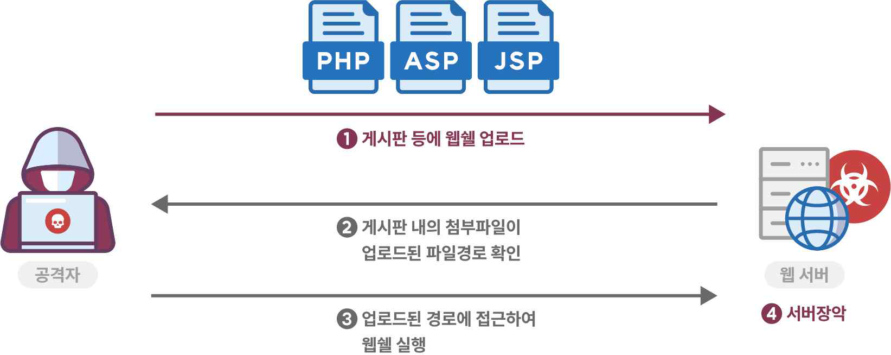

다. 코드예제
업로드 대상 파일 개수, 크기, 확장자 등의 유효성 검사를 하지 않고 파일 시스템에 그대로 저장할 경우
공격자에 의해 악성코드, 쉘코드 등 위험한 형식의 파일이 시스템에 업로드 될 수 있다.

**안전하지 않은 코드 예시**

1:
2:
3:
4:
5:
6:
7:
8:
9:
10:
11:
12:
13:
from django.shortcuts import render
from django.core.files.storage import FileSystemStorage
def file_upload(request):
if request.FILES['upload_file']:
# 사용자가 업로드하는 파일을 검증 없이 저장하고 있어
# 안전하지 않다
upload_file = request.FILES['upload_file']
fs = FileSystemStorage(location='media/screenshot', base_url='media/screenshot')
# 업로드 하는 파일에 대한 크기, 개수, 확장자 등을 검증하지 않음
filename = fs.save(upload_file.name, upload_file)
return render(request, '/success.html', {'filename':filename})
return render(request, '/error.html', {'error':'파일 업로드 실패'})
아래 코드는 업로드 하는 파일의 개수, 크기, 파일 확장자 등을 검사해 업로드를 제한하고 있다. 파일 타입
확인은 MIME 타입을 확인하는 과정으로 파일 이름에서 확장자만 검사할 경우 변조된 확장자를 통해 업로드
제한을 회피할 수 있어 파일자체의 시그니처를 확인하는 과정을 보여 준다.

**안전한 코드 예시**

1:
2:
3:
4:
5:
6:
7:
8:
9:
10:
11:
12:
13:
import os
from django.shortcuts import render
from django.core.files.storage import FileSystemStorage
# 업로드 하는 파일 개수, 크기, 확장자 제한
FILE_COUNT_LIMIT = 5
# 업로드 하는 파일의 최대 사이즈 제한 예 ) 5MB - 5*1024*1024
FILE_SIZE_LIMIT = 5242880
# 허용하는 확장자는 화이트리스트로 관리한다.
WHITE_LIST_EXT = [
'.jpg',
'.jpeg'
]

**안전한 코드 예시**

14:
15:
16:
17:
18:
19:
20:
21:
22:
23:
24:
25:
26:
27:
28:
29:
30:
31:
32:
33:
34:
35:
36:
37:
def file_upload(request):
# 파일 개수 제한
if len(request.FILES) == 0 or len(request.FILES) > FILE_COUNT_LIMIT:
return render(request, '/error.html', {'error': '파일 개수 초과'})
for filename, upload_file in request.FILES.items():
# 파일 타입 체크
if upload_file.content_type != 'image/jpeg':
return render(request, '/error.html', {'error': '파일 타입 오류'})
# 파일 크기 제한
if upload_file.size > FILE_SIZE_LIMIT:
return render(request, '/error.html', {'error': '파일사이즈 오류'})
# 파일 확장자 검사
file_name, file_ext = os.path.splitext(upload_file.name)
if file_ext.lower() not in WHITE_LIST_EXT:
return render(request, '/error.html', {'error': '파일 타입 오류'})
fs = FileSystemStorage(location='media/screenshot', base_url = 'media/screenshot')
for upload_file in request.FILES.values():
filename = fs.save(upload_file.name, upload_file)
filename_list.append(filename)
return render(request, "/success.html", {"filename_list": filename_list})
라. 참고자료
① CWE-434: Unrestricted Upload of File with Dangerous Type, MITRE,
https://cwe.mitre.org/data/definitions/434.html
② Unrestricted File Upload, OWASP,
https://owasp.org/www-community/vulnerabilities/Unrestricted_File_Upload
③ User-uploaded content, Django Software Foundation,
https://docs.djangoproject.com/en/3.2/topics/security/#user-uploaded-content-security

7. 신뢰되지 않은 URL주소로 자동접속 연결
가. 개요
사용자가 입력하는 값을 외부 사이트 주소로 사용해 해당 사이트로 자동 접속하는 서버 프로그램은 피싱
(Phishing) 공격에 노출되는 취약점을 가진다. 클라이언트에서 전송된 URL 주소로 연결하기 때문에 안전하다고
생각할 수 있으나, 공격자는 정상적인 폼 요청을 변조해 사용자가 위험한 URL로 접속할 수 있도록 공격할 수 있다.
파이썬 프레임워크의 redirect 함수를 사용할 때에도 해당 프레임워크 버전에서 알려진 취약점이 있는지
확인해야 한다. Flask 프레임워크의 Flask-Security-Too 라이브러리의 경우 get_post_logout_redirect 함수와
get_post_login_redirect 함수가 4.1.0 이전 버전에서 URL 유효성 검사를 우회하고 사용자를 임의의 URL로
리다이렉션 할 수 있는 취약점이 존재한다.
나. 안전한 코딩기법
리다이렉션을 허용하는 모든 URL을 서버 측 화이트리스트로 관리하고 사용자 입력값을 리다이렉션 할
URL이 존재하는지 검증해야 한다.
만약 사용자 입력값이 화이트리스트로 관리가 불가능하고 리다이렉션 URL의 인자 값으로 사용되어야만 하는
경우는 모든 리다이렉션에서 프로토콜과 host 정보가 들어가지 않는 상대 URL(relative)을 사용 및 검증해야
한다. 또는 절대 URL(absoute URL)을 사용할 경우 리다이렉션을 실행하기 전에 사용자 입력 URL이
https://myhompage.com/ 처럼 서비스하고 있는 URL로 시작하는지를 확인해야 한다.

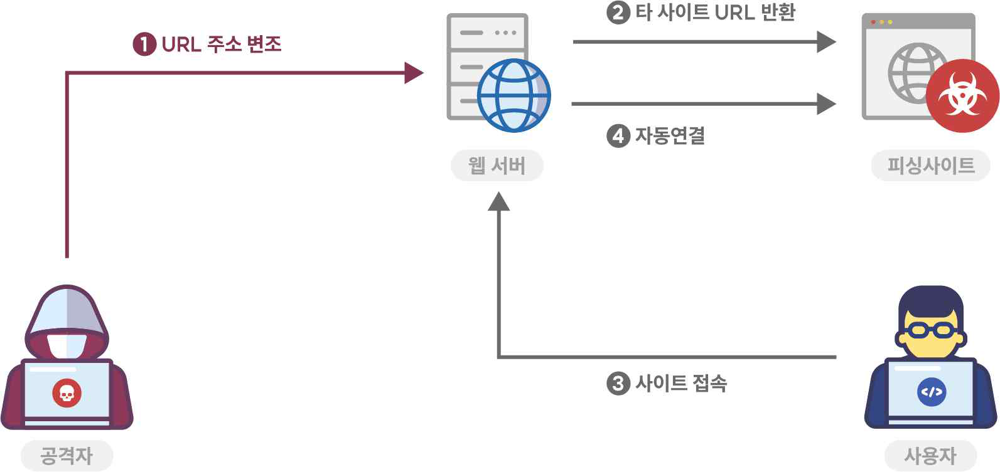

다. 코드예제
다음은 안전하지 않은 예제로 사용자로부터 입력받은 URL 주소를 검증 없이 redirect 함수의 인자로 사용
하고 있다. 이 경우 사용자가 의도하지 않은 사이트로 접근하도록 하거나 피싱(Phishing)공격에 노출될 수 있다.

**안전하지 않은 코드 예시**

1:
2:
3:
4:
5:
6:
7:
from django.shortcuts import redirect
def redirect_url(request):
url_string = request.POST.get('url', '')
# 사용자 입력에 포함된 URL 주소로 리다이렉트 하는 경우
# 피싱 사이트로 접속되는 등 사용자가 피싱 공격에 노출될 수 있다
return redirect(url_string)
다음은 안전한 코드 예제로 사용자로부터 주소를 입력받아 리다이렉트하고 있는 코드로 위험한 도메인이
포함될 수 있기 때문에 화이트리스트로 사전에 정의된 안전한 웹사이트에 한하여 리다이렉트 할 수 있도록 한다.

**안전한 코드 예시**

1:
2:
3:
4:
5:
6:
7:
8:
9:
10:
11:
12:
13:
14:
15:
16:
17:
18:
19:
from django.shortcuts import render, redirect
ALLOW_URL_LIST = [
'127.0.0.1',
'192.168.0.1',
'192.168.0.100',
'https://login.myservice.com',
'/notice',
]
def redirect_url(request):
url_string = request.POST.get('url', '')
# 이동할 수 있는 URL 범위를 제한하여
# 위험한 사이트의 접근을 차단하고 있다
if url_string not in ALLOW_URL_LIST:
return render(request, '/error.html', {'error':'허용되지 않는 주소입니다.'})
return redirect(url_string)

라. 참고자료
① CWE-601: URL Redirection to Untrusted Site ('Open Redirect'), MITRE,
https://cwe.mitre.org/data/definitions/601.html
② Unvalidated Redirects and Forwards Cheat Sheet, OWASP
https://cheatsheetseries.owasp.org/cheatsheets/Unvalidated_Redirects_and_Forwards_Cheat_Sheet.html
③ Django shortcut functions – redirect, Django Sowftware Foundation,
https://docs.djangoproject.com/en/3.2/topics/http/shortcuts/
④ Redirects and Errors, Flask,
https://flask.palletsprojects.com/en/2.0.x/quickstart/#redirects-and-errors
8. 부적절한 XML 외부 개체 참조
가. 개요
XML 문서에는 DTD(Document Type Definition)를 포함할 수 있으며 DTD는 XML 엔티티(entitiy)를
정의한다. 부적절한 XML 외부개체 참조 보안약점은 서버에서 XML 외부 엔티티를 처리할 수 있도록 설정된
경우에 발생할 수 있다.
취약한 XML parser가 외부값을 참조하는 XML을 처리할 때 공격자가 삽입한 공격 구문이 동작되어 서버
파일 접근, 불필요한 자원 사용, 인증 우회, 정보 노출 등이 발생할 수 있다.
파이썬에서는 간단한 XML 데이터 구문 분석 및 조작에 사용할 수 있는 기본 XML 파서가 제공된다. 이 파서는
유효성 검사와 같은 고급 XML 기능은 지원하지 않는다. 기본으로 제공되는 XML 파서는 외부 엔티티를 지원
하지 않지만 다른 유형의 XML 공격에 취약할 수 있다. 기본으로 제공되는 파서의 기능 외에 더 많은 기능이
필요한 경우에 lxml과 같은 라이브러리를 사용하게 되는데, 이 라이브러리에서는 기본적으로 외부 엔티티의
구문 분석이 활성화 되어 있다.
나. 안전한 코딩기법
로컬 정적 DTD를 사용하도록 설정하고 외부에서 전송된 XML 문서에 포함된 DTD를 완전하게 비활성화해야
한다. 비활성화를 할 수 없는 경우에는 외부 엔티티 및 외부 문서 유형 선언을 각 파서에 맞는 고유한 방식으로
비활성화 한다.
외부 라이브러리를 사용할 경우 기본적으로 외부 엔티티에 대한 구문 분석 기능을 제공하는지 확인하고 제공이
되는 경우 해당 기능을 비활성화 할 수 있는 방법을 확인해 외부 엔티티 구문 분석 기능을 비활성화 한다.

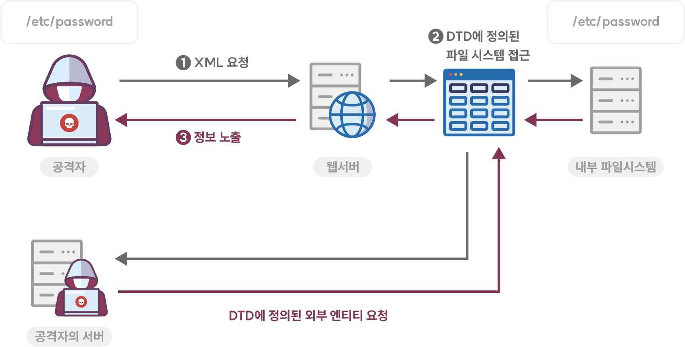

많이 사용하는 XML 파서의 한 종류인 lxml의 경우 외부 엔티티 구문 분석 옵션인 resolve_entities 옵션을
비활성화 해야 한다. 또한 외부 문서 조회 시 네트워크 액세스를 방지하는 no_network 옵션이 활성화(True)
되어 있는지도 확인해야 한다.
다. 코드예제
다음 예제는 XML 소스를 읽어와 분석하는 코드다. 공격자는 아래와 같이 XML 외부 엔티티를 참조하는
xxe.xml 데이터를 전송하고 이를 파싱할 때 /etc/passwd 파일을 참조할 수 있다.
<?xml version="1.0" encoding="ISO-8859-1"?>
<!DOCTYPE foo [
<!ELEMENT foo ANY >
<!ENTITY xxe1 SYSTEM "file:///etc/passwd" >
<!ENTITY xxe2 SYSTEM "http://attacker.com/text.txt">
]>
<foo>&xxe1;&xxe2;</foo>

**안전하지 않은 코드 예시**

1:
2:
3:
4:
5:
6:
7:
8:
9:
10:
11:
12:
13:
14:
15:
16:
17:
18:
19:
20:
21:
22:
23:
from xml.sax import make_parser
from xml.sax.handler import feature_external_ges
from xml.dom.pulldom import parseString, START_ELEMENT
from django.shortcuts import render
from .model import comments
def get_xml(request):
if request.method == “GET”:
data = comments.objects.all()
com = data[0].comment
return render(request, '/xml_view.html', {'com':com})
elif request.method == “POST”:
parser = make_parser()
# 외부 일반 엔티티를 포함하는 설정을 True로 적용할 경우 취약하다
parser.setFeature(feature_external_ges, True)
doc = parseString(request.body.decode(‘utf-8’), parser=parser)
for event, node in doc:
if event == START_ELEMENT and node.tagName == “foo”:
doc.expandNode(node)
text = node.toxml()
comments.objects.filter(id=1).update(comment=text)
return render(request, '/xml_view.html')

만약 sax 패키지를 사용해 XML을 파싱할 경우 외부 엔티티를 처리하는 방식의 옵션(feature_external_ges)을
False로 설정해야 한다.

**안전한 코드 예시**

1:
2:
3:
4:
5:
6:
7:
8:
9:
10:
11:
12:
13:
14:
15:
16:
17:
18:
19:
20:
21:
22:
from xml.sax import make_parser
from xml.sax.handler import feature_external_ges
from xml.dom.pulldom import parseString, START_ELEMENT
from django.shortcuts import render
from .model import comments
def get_xml(request):
if request.method == “GET”:
data = comments.objects.all()
com = data[0].comment
return render(request, '/xml_view.html', {'com':com})
elif request.method == “POST”:
parser = make_parser()
parser.setFeature(feature_external_ges, False)
doc = parseString(request.body.decode(‘utf-8’), parser=parser)
for event, node in doc:
if event == START_ELEMENT and node.tagName == “foo”:
doc.expandNode(node)
text = node.toxml()
comments.objects.filter(id=1).update(comment=text);
return render(request, '/xml_view.html')
라. 참고자료
① CWE-611: Improper Restriction of XML External Entity Reference, MITRE,
https://cwe.mitre.org/data/definitions/611.html
② XML External Entity (XXE) Processing, OWASP,
https://owasp.org/www-community/vulnerabilities/XML_External_Entity_(XXE)_ Processing
③ XML External Entity Prevention Cheat Sheet, OWASP,
https://cheatsheetseries.owasp.org/cheatsheets/XML_External_Entity_Prevention_Cheat_Sheet.html
④ XML vulnerabilities, Python Software Foundation,
https://docs.python.org/3/library/xml.html#xml-vulnerabilities
⑤ lxml API, lxml library,
https://lxml.de/api/lxml.etree.XMLParser-class.html
⑥ PyGoat, OWASP,
https://github.com/adeyosemanputra/pygoat

9. XML 삽입
가. 개요
검증되지 않은 외부 입력값이 XQuery 또는 XPath 쿼리문을 생성하는 문자열로 사용되어 공격자가 쿼리문의
구조를 임의로 변경하고 임의의 쿼리를 실행해 허가되지 않은 데이터를 열람하거나 인증절차를 우회할 수 있는
보안약점이다.
나. 안전한 코딩기법
XQuery 또는 XPath 쿼리에 사용되는 외부 입력 데이터에 대하여 특수문자 및 쿼리 예약어를 필터링 하고
인자화된 쿼리문을 지원하는 XQuery를 사용해야 한다.
다. 코드예제
다음 예제는 파이썬에서 XML 데이터를 처리하기 위한 기본 모듈인 xml.etree.ElementTree를 이용하여
사용자 정보를 가져오는 예제다. xml.etree.ElementTree 모듈은 제한적인 Xpath 기능을 제공하며 Xpath
표현식을 인자화해서 사용하는 방법을 제공하지 않는다.

**안전하지 않은 코드 예시**

1:
2:
3:
4:
5:
6:
7:
8:
9:
10:
11:
12:
13:
14:
15:
from django.shortcuts import render
from lxml import etree
def parse_xml(request):
user_name = request.POST.get('user_name', '')
parser = etree.XMLParser(resolve_entities=False)
tree = etree.parse('user.xml', parser)
root = tree.getroot()
# 검증되지 않은 외부 입력값 user_name을 사용한 안전하지 않은
# 질의문이 query 변수에 저장
query = "/collection/users/user[@name='" + user_name + "']/home/text()"
elmts = root.xpath(query)
return render(request, 'parse_xml.html', {'xml_element':elmts})

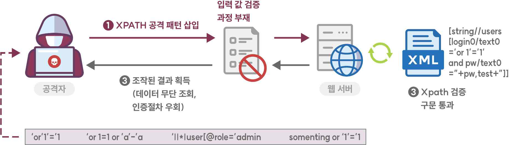

파이썬 3.3 이후 보안상의 이유로 금지된 xml.etree.ElementTree 모듈 대신 lxml 라이브러리를 사용하고
외부 입력값은 인자화해서 사용한다.

**안전한 코드 예시**

1:
2:
3:
4:
5:
6:
7:
8:
9:
10:
11:
12:
13:
14:
from django.shortcuts import render
from lxml import etree
def parse_xml(request):
user_name = request.POST.get('user_name', '')
parser = etree.XMLParser(resolve_entities=False)
tree = etree.parse('user.xml', parser)
root = tree.getroot()
# 외부 입력값을 paramname으로 인자화 해서 사용
query = '/collection/users/user[@name = $paramname]/home/text()'
elmts = root.xpath(query, paramname=user_name)
return render(request, 'parse_xml.html', {'xml_element':elmts})
라. 참고자료
① CWE-643: Improper Neutralization of Data within XPath Expressions ('XPath Injection'), MITRE,
https://cwe.mitre.org/data/definitions/643.html
② XPATH Injection, OWASP,
https://owasp.org/www-community/attacks/XPATH_Injection
③ XML vulnerabilities, Python Software Foundation,
https://docs.python.org/3/library/xml.html#xml-vulnerabilities

10. LDAP 삽입
가. 개요
외부 입력값을 적절한 처리 없이 LDAP 쿼리문이나 결과의 일부로 사용하는 경우 LDAP 쿼리문이 실행될 때
공격자는 LDAP 쿼리문의 내용을 마음대로 변경할 수 있다. 이로 인해 프로세스가 명령을 실행한 컴포넌트와
동일한 권한(Permission)을 가지고 동작하게 된다.
파이썬에는 파이썬-ldap 및 ldap3라는 두 개의 라이브러리가 있다. ldap3가 python-ldap 보다 더 현대적인
라이브러리다. ldap3 모듈은 파이썬 2.6부터 모든 파이썬 3 버전에 호환된다. ldap3에서는 좀 더 파이썬적인
방식으로 LDAP서버와 상호 작용할 수 있는 완전한 기능의 추상화 계층이 포함되어 있다. python-ldap은
OpenLDAP에서 만든 파이썬2의 패키지로 파이썬3에서는 ldap3 라이브러리를 사용하는 것이 권장된다.
나. 안전한 코딩기법
다른 삽입 공격들과 마찬가지로 LDAP 삽입에 대한 기본적인 방어 방법은 적절한 유효성 검사이다.
⦁올바른 인코딩(Encoding) 함수를 사용해 모든 변수 이스케이프(Escape) 처리
⦁화이트리스트 방식의 입력값 유효성 검사
⦁사용자 패스워드와 같은 민감한 정보가 포함된 필드 인덱싱
⦁LDAP 바인딩 계정에 할당된 권한 최소화

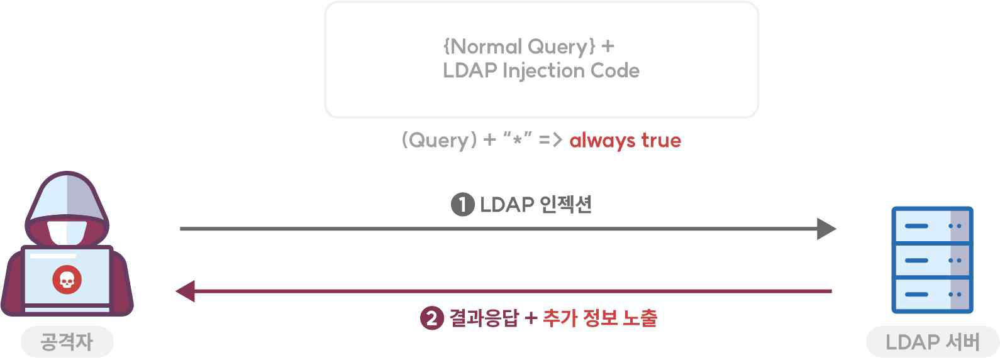

다. 코드예제
사용자의 입력을 그대로 LDAP 질의문에 사용하고 있으며 이 경우 권한 상승 등의 공격에 노출될 수 있다.

**안전하지 않은 코드 예시**

1:
2:
3:
4:
5:
6:
7:
8:
9:
10:
11:
12:
13:
14:
15:
16:
17:
18:
19:
20:
21:
22:
23:
24:
25:
26:
27:
28:
from  ldap3 import  Connection, Server, ALL
from django.shortcuts import render
config = {
"bind_dn": "cn=read-only-admin,dc=example,dc=com",
"password": "password",
}
def ldap_query(request):
search_keyword = request.POST.get('search_keyword','')
dn = config['bind_dn']
password = config['password']
address = 'ldap.badSoruce.com'
server = Server(address, get_info=ALL)
conn = Connection(server, user=dn, password, auto_bind=True )
# 사용자 입력을 필터링 하지 않는 경우 공격자의 권한 상승으로
# 이어질 수 있다
search_str = '(&(objectclass=%s))' % search_keyword
conn.search(
'dc=company,dc=com',
search_str,
attributes=['sn', 'cn', 'address', 'mail', 'mobile', 'uid'],
)
return render(request, '/ldap_query_response.html', {'ldap':conn.entries})

사용자의 입력 중 LDAP 질의문에 사용될 변수를 이스케이프 하여 질의문 실행 시 공격에 노출되는 것을
예방할 수 있다.

**안전한 코드 예시**

1:
2:
3:
4:
5:
6:
7:
8:
9:
10:
11:
12:
13:
14:
15:
16:
17:
19:
20:
21:
22:
23:
24:
25:
26:
27:
28:
29:
30:
31:
from  ldap3 import  Connection, Server, ALL
from  ldap3.utils.conv import  escape_filter_chars
from django.shortcuts import render
config = {
"bind_dn": "cn=read-only-admin,dc=example,dc=com",
"password": "password",
}
def ldap_query(request):
search_keyword = request.POST.get('search_keyword','')
dn = config['bind_dn']
password = config['password']
address = 'ldap.goodsource.com'
server = Server(address, get_info=ALL)
conn = Connection(server, dn, password, auto_bind=True )
# 사용자의 입력에 필터링을 적용하여 공격에 사용될 수 있는 문자를
# 이스케이프하고 있다
escpae_keyword = escape_filter_chars(search_keyword)
search_str = '(&(objectclass=%s))' % escpae_keyword
conn.search(
'dc=company,dc=com',
search_str,
attributes=['sn', 'cn', 'address', 'mail', 'mobile', 'uid'],
)
return render(request, '/ldap_query_response.html', {'ldap':conn.entries})

라. 참고자료
① CWE-90: Improper Neutralization of Special Elements used in an LDAP Query ('LDAP Injection'), MITRE,
https://cwe.mitre.org/data/definitions/90.html
② LDAP Injection Prevention Cheat Sheet, OWASP,
https://cheatsheetseries.owasp.org/cheatsheets/LDAP_Injection_Prevention_Cheat_ Sheet.html
③ LDAP filter handling, python-ldap project team
https://www.python-ldap.org/en/python-ldap-3.3.0/reference/ldap-filter.html
11. 크로스사이트 요청 위조(CSRF)
가. 개요
특정 웹사이트에 대해 사용자가 인지하지 못한 상황에서 사용자의 의도와는 무관하게 공격자가 의도한 행위
(수정, 삭제, 등록 등)를 요청하게 하는 공격을 말한다. 웹 응용프로그램이 사용자로부터 받은 요청이 해당 사용자가
의도한 대로 작성되고 전송된 것인지 확인하지 않는 경우 발생 가능하다. 특히 사용자가 관리자 권한을 가지는
경우 사용자 권한관리, 게시물 삭제, 사용자 등록 등 관리자 권한으로만 수행 가능한 기능을 공격자의 의도대로
실행시킬 수 있게 된다. 공격자는 사용자가 인증한 세션이 특정 동작을 수행해도 계속 유지되어 정상적인 요청과
비정상적인 요청을 구분하지 못하는 점을 악용한다.
파이썬에서 가장 많이 사용하고 있는 Django 프레임워크와 Flask 프레임워크에서는 각각 CSRF(Cross-Site
Request Forgery) 토큰 기능을 지원하고 있으며, Django는  태그를 이용해 CSRF 토큰
기능 제공하고 Flask에서는 Flask-WTF 확장 라이브러리를 통해 {{form.csrf_token}} 태그를 이용한 CSRF
토큰 기능을 제공해 태그를 사용하는 경우 CSRF 공격에 대비할 수 있다.
나. 안전한 코딩기법
해당 요청이 정상적인 사용자의 정상적인 절차에 의한 요청인지를 구분하기 위해 세션별로 CSRF 토큰을
생성하여 세션에 저장하고 사용자가 작업 페이지를 요청할 때마다 hidden 값으로 클라이언트에게 토큰을 전달한 뒤,
해당 클라이언트의 데이터 처리 요청 시 전달되는 CSRF 토큰값을 체크하여 요청의 유효성을 검사하도록 한다.

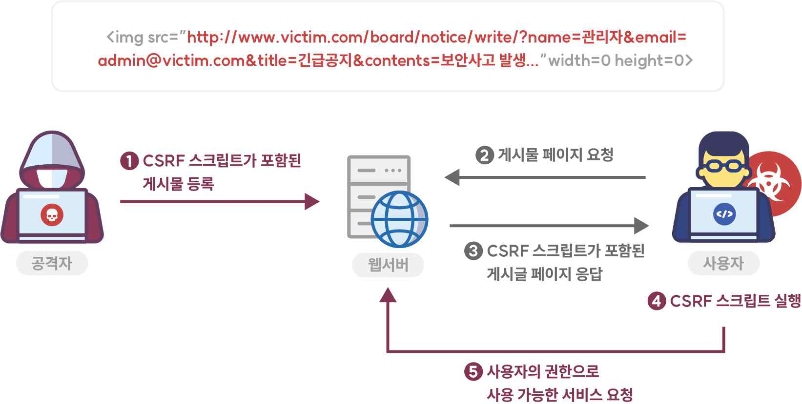

Django 프레임워크와 Flask 프레임워크는 미들웨어와 프레임워크에서 기본적으로 CSRF Token을 사용해서
CSRF 공격으로부터 보호하는 기능을 가지고 있다. 해당 기능을 사용하기 위해 form 태그 내부에 csrf_token을
사용해야 한다.
다. 코드예제
가) Django 프레임워크 사용
Django 프레임워크에서는 1.2 버전부터 CSRF 취약점을 방지 기능을 기본으로 제공하고 있다. 미들웨어의
CSRF 옵션을 비활성하거나 템플릿에서 csrf_exempt decorator를 사용하는 경우 CSRF 공격에 노출될 수 있다.
⦁Django 미들웨어 설정(settings.py) 사례

**안전하지 않은 코드 예시**

1:
2:
3:
4:
5:
6:
7:
8:
9:
10:
MIDDLEWARE = [
'django.contrib.sessions.middleware.SessionMiddleware',
# MIDDLEWARE 목록에서 CSRF 항목을 삭제 또는 주석처리 하면
# Django 앱에서 CSRF 유효성 검사가 전역적으로 제거된다
# 'django.middleware.csrf.CsrfViewMiddleware',
'django.contrib.auth.middleware.AuthenticationMiddleware',
'django.contrib.messages.middleware.MessageMiddleware',
'django.middleware.locale.LocaleMiddleware',
......
]
다음은 Django의 CSRF 기능을 활성화하기 위한 안전한 미들웨어 설정 예제를 보여 준다. 미들웨어의
CSRF 기능을 주석 또는 삭제 처리하지 않아야 한다. 템플릿 페이지에는 csrf_token을 form 태그 안에 명시
해야 미들웨어에서 정상적으로 CSRF 기능을 사용할 수 있다.

**안전한 코드 예시**

1:
2:
3:
4:
5:
6:
7:
8:
9:
MIDDLEWARE = [
'django.contrib.sessions.middleware.SessionMiddleware',
# MIDDLEWARE 목록에서 CSRF 항목을 활성화 한다
'django.middleware.csrf.CsrfViewMiddleware',
'django.contrib.auth.middleware.AuthenticationMiddleware',
'django.contrib.messages.middleware.MessageMiddleware',
'django.middleware.locale.LocaleMiddleware',
......
]
⦁Django 뷰 기능 설정(views.py) 사례
미들웨어에 CSRF 검증 기능이 활성화 되어 있어도 View에서 CSRF 기능을 해제하는 경우에는 해당 요청에
대해서 CSRF 검증 기능을 사용하지 않게 된다. 다음은 Function-Based View에서 CSRF 검증 기능을 비활성화
하는 예제를 보여 준다.

**안전하지 않은 코드 예시**

1:
2:
3:
4:
5:
6:
7:
8:
9:
10:
11:
12:
13:
from django.shortcuts import render
from django.views.decorators.csrf import csrf_exempt
# csrf.exempt 데코레이터로 미들웨어에서 보호되는 CSRF 기능을 해제한다
@csrf.exempt
def pay_to_point(request):
user_id = request.POST.get('user_id', '')
pay = request.POST.get('pay', '')
product_info = request.POST.get('product_info', '')
ret = handle_pay(user_id, pay, product_info)
return render(request, '/view_wallet.html', {'wallet':ret})

Django는 기본적으로 CSRF 기능을 강제하고 있지만, 부득이하게 CSRF 기능을 해제해야 하는 경우는 미들
웨어의 CSRF 기능을 전역적으로 비활성화 하기 보다는 미들웨어의 CSRF 기능은 활성화 하고 필요한 요청에
대해서만 csrf_exempt 데코레이터를 사용하여야 하고 이 경우에 크로스사이트 요청 위조의 위협에 노출될
수 있으므로 주의를 기울여야 한다.

**안전한 코드 예시**

1:
2:
3:
4:
5:
6:
7:
8:
9:
10:
11:
12:
13:
from django.shortcuts import render
from django.template import RequestContext
# csrf_exempt 데코레이터를 삭제하거나 주석 처리한다.
# @csrf_exempt
def pay_to_point(request):
user_id = request.POST.get('user_id', '')
pay = request.POST.get('pay', '')
product_info = request.POST.get('product_info', '')
ret = handle_pay(user_id, pay, product_info)
return render(request, '/view_wallet.html', {'wallet':ret})
⦁Django 템플릿 설정 사례
미들웨어에서 CSRF 기능을 활성화해도 템플릿 페이지에 CSRF 토큰을 명시하지 않을 경우 CSRF 검증
기능을 사용할 수 없다.

**안전하지 않은 코드 예시**

1:
2:
3:
4:
5:
6:
7:
8:
<!--html page-->
<form action="" method="POST">
<!-- form 태그 내부에 csrf_token 미적용-->
<table>
{{form.as_table}}
</table>
<input type="submit"/>
</form>

미들웨어에서 CSRF 기능을 활성화한 후에 템플릿 페이지에서는 csrf_token 값을 명시하여야만 정상적인
CSRF 검증 기능을 사용할 수 있다.

**안전한 코드 예시**

1:
2:
3:
4:
5:
6:
7:
8:
<!--html page-->
<form action="" method="POST">
  <!--csrf_token 사용->
<table>
{{form.as_table}}
</table>
<input type="submit"/>
</form>
나) Flask 프레임워크 사용
⦁Flask app 설정 사례
Flask의 WTF 패키지를 사용하면 CSRF 보호 기법을 사용할 수 있다. 아래 예제 코드는 CSRF 설정이 되지
않은 상태를 보여 준다.

**안전하지 않은 코드 예시**

1:
2:
3:
from flask import Flask
app = Flask(__name__)
Flask 프레임워크를 사용해 웹 애플리케이션을 구축하는 경우 CSRF를 방지하려면 Flask-WTF extension의
CSRFProtect를 사용해야 한다. 다음과 같이 app에 설정하고 HTML(템플릿) 페이지에는 CSRF 토큰을 추가
해야 한다.

**안전한 코드 예시**

1:
2:
3:
4:
5:
6:
7:
8:
from flask import Flask
from flask_wtf.csrf import CSRFProtect
# CSRF 설정 추가
csrf = CSRFProtect(app)
app = Flask(__name__)
app.config[‘SECRET_KEY’] = os.environ.get('SECRET_KEY')
csrf.init_app(app)
⦁Flask 템플릿 설정 사례
위 코드처럼 함수에 CSRF 기능을 활성화 해도 HTML 파일에 csrf_token을 명시하지 않을 경우 CSRF
검증 기능을 사용할 수 없다.

**안전하지 않은 코드 예시**

1:
2:
3:
4:
5:
6:
7:
<form action="" method="POST">
<!-- form 태그 내부에 csrf_token 미적용-->
<table>
{{as_table}}
</table>
<input type="submit"/>
</form>
템플릿 페이지에도 csrf_token 값을 명시해줘야 정상적인 CSRF 검증이 수행된다.
FlaskForm 사용 시에는 {{ form.csrf_token }}을 명시해야 하고 템플릿에 FlaskForm을 사용하지 않을
경우에는 form 태그 안에 hidden input 값으로 {{ csrf_token }} 값을 명시해야 한다.

**안전한 코드 예시**

1:
2:
3:
4:
5:
6:
7:
8:
<form action="" method="POST">
<!-- form 태그 내부에 csrf_token 적용-->
<input type="hidden" name="csrf_token" value="{{ csrf_token() }}" />
<table>
{{table}}
</table>
<input type="submit"/>
</form>
라. 참고자료
① CWE-352: Cross-Site Request Forgery (CSRF), MITRE,
https://cwe.mitre.org/data/definitions/352.html
② Cross Site Request Forgery (CSRF), OWASP,
https://owasp.org/www-community/attacks/csrf
③ Cross-Site Request Forgery Prevention Cheat Sheet, OWASP
https://cheatsheetseries.owasp.org/cheatsheets/Cross-Site_Request_Forgery_Prevention_Cheat_Sheet.html
④ Cross Site Request Forgery protection, Django Software Foundation
https://docs.djangoproject.com/en/3.2/ref/csrf/
⑤ CSRF Protection, WTForms
https://flask-wtf.readthedocs.io/en/0.15.x/csrf/

12. 서버사이드 요청 위조
가. 개요
적절한 검증 절차를 거치지 않은 사용자 입력값을 내부 서버간의 요청에 사용해 악의적인 행위가 발생할 수
있는 보안약점이다. 외부에 노출된 웹 서버가 취약한 애플리케이션을 포함하는 경우 공격자는 URL 또는 요청문을
위조해 접근통제를 우회하는 방식으로 비정상적인 동작을 유도하거나 신뢰된 네트워크에 있는 데이터를 획득
할 수 있다.
나. 안전한 코딩기법
식별 가능한 범위 내에서 사용자의 입력값을 다른 시스템의 서비스 호출에 사용하는 경우, 사용자의 입력값을
화이트리스트 방식으로 필터링한다.
부득이하게 사용자가 지정하는 무작위의 URL을 받아들여야 하는 경우라면 내부 URL을 블랙리스트로 지정
하여 필터링 한다. 또한 동일한 내부 네트워크에 있더라도 기기 인증, 접근권한을 확인하여 요청이 이루어질
수 있도록 한다.

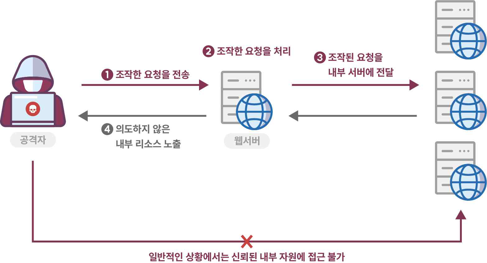

다. 코드예제

**<참고 : 삽입 코드의 예>**

설명
삽입 코드의 예
내부망 중요 정보 획득
http://sample_site.com/connect?url=http://192.168.0.45/member/list.json
외부 접근 차단된
admin 페이지 접근
http://sample_site.com/connect?url=http://192.168.0.45/admin
도메인 체크를 우회하여
중요 정보 획득
http://sample_site.com/connect?url=http://sample_site.com:x@192.168.0.45/member/
list.json
단축 URL을 이용한
Filter 우회
http://sample_site.com/connect?url=http://bit.ly/sdjk3kjhkl3
도메인을 사설IP로 설정해
중요정보 획득
http://sample_site.com/connect?url=http://192.168.0.45/member/list.json
서버내 파일 열람
http://sample_site.com/connect?url=file:///etc/passwd
다음 예제는 안전하지 않은 코드를 보여 준다. 사용자로부터 입력된 URL 주소를 검증 없이 사용하면 의도하지
않은 다른 서버의 자원에 접근할 수 있게 된다.

**안전하지 않은 코드 예시**

1:
2:
3:
4:
5:
6:
7:
8:
9:
10:
from django.shortcuts import render
import requests
def call_third_party_api(request):
addr = request.POST.get('address', '')
# 사용자가 입력한 주소를 검증하지 않고 HTTP 요청을 보낸 후
# 응답을 사용자에게 반환
result = requests.get(addr).text
return render(request, '/result.html', {'result':result})
다음과 같이 안전한 코드를 작성하면 사전에 정의된 서버 목록을 정의하고 매칭되는 URL만 사용할 수 있으므로
URL 값을 임의로 조작할 수 없다.

**안전한 코드 예시**

1:
2:
3:
4:
5:
6:
7:
8:
9:
10:
11:
12:
13:
14:
15:
16:
17:
18:
19:
20:
21:
22:
from django.shortcuts import render
import requests
# 허용하는 도메인을 화이트리스트에 정의할 경우 DNS rebinding 공격 등에
# 노출될 위험이 있어 신뢰할 수 있는 자원에 대한 IP를 사용해
# 검증하는 것이 조금 더 안전하다
ALLOW_SERVER_LIST = [
'https://127.0.0.1/latest/',
'https://192.168.0.1/user_data',
'https://192.168.0.100/v1/public',
]
def call_third_party_api(request):
addr = request.POST.get('address', '')
# 사용자가 입력한 URL을 화이트리스트로 검증한 후 그 결과를 반환하여
# 검증되지 않은 주소로 요청을 보내지 않도록 제한한다
if addr not in ALLOW_SERVER_LIST:
return render(request, '/error.html', {‘error’ = '허용되지 않은 서버입니다.'})
result = requests.get(addr).text
return render(request, '/result.html', {'result':result})
라. 참고자료
① CWE-918: Server-Side Request Forgery (SSRF), MITRE
https://cwe.mitre.org/data/definitions/918.html
② Server Side Request Forgery, OWASP
https://owasp.org/www-community/attacks/Server_Side_Request_Forgery
③ Server-Side Request Forgery Prevention Cheat Sheet, OWASP
https://cheatsheetseries.owasp.org/cheatsheets/Server_Side_Request_Forgery_Prevention_Cheat_Sheet.html

13. HTTP 응답분할
가. 개요
HTTP 요청 내의 파라미터(Parameter)가 HTTP 응답 헤더에 포함되어 사용자에게 다시 전달될 때 입력값에
CR(Carriage Return)이나 LF(Line Feed)와 같은 개행문자가 존재하면 HTTP 응답이 2개 이상으로 분리될
수 있다. 이 경우 공격자는 개행문자를 이용해 첫 번째 응답을 종료 시키고 두 번째 응답에 악의적인 코드를
주입해 XSS 및 캐시훼손(Cache Poisoning) 공격 등을 수행할 수 있다.
파이썬 3.9.5+ 버전에서의 URLValidator에서 HTTP 응답분할 취약점이 보고되기도 했고 해당 라이브러리를
사용하는 Django버전에도 영향이 있다. HTTP 응답분할 공격으로부터 어플리케이션을 안전하게 지키려면 최신
버전의 라이브러리, 프레임워크를 사용하고 외부 입력값에 대해서는 철저한 검증 작업을 수행해야 한다.
나. 안전한 코딩기법
요청 파라미터의 값을 HTTP 응답 헤더(예를 들어, Set-Cookie 등)에 포함시킬 경우 CR(\r), LF(\n)와
같은 개행문자를 제거해야 한다. 외부 입력값이 헤더, 쿠키, 로그 등에 사용될 경우에는 항상 개행문자를 검증
하고 가능하다면 헤더에 사용되는 예약어 등을 화이트리스트로 제한해야 한다.

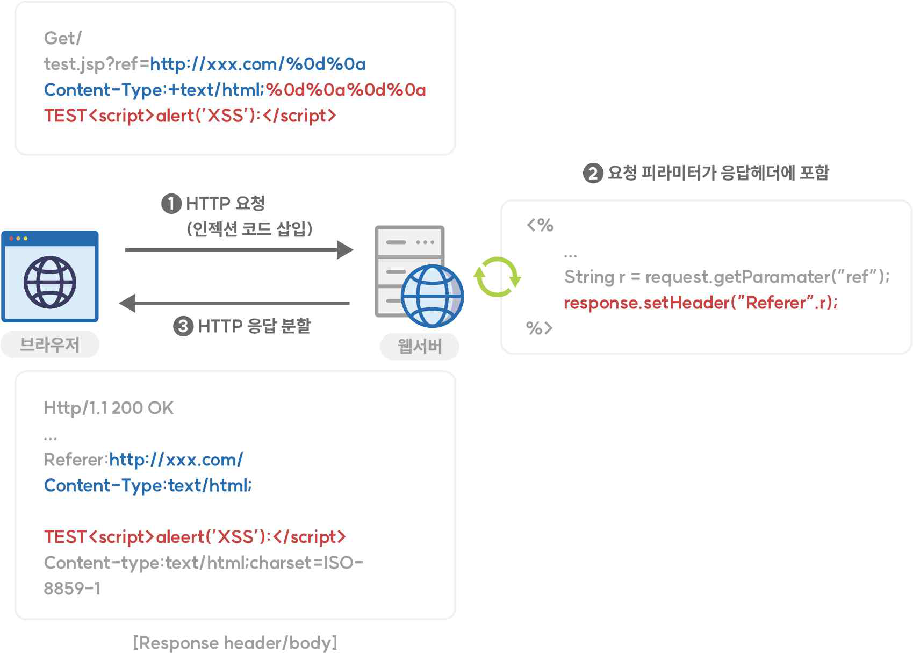

다. 코드예제
사용자 요청에 포함된 값을 필터링 및 검증 없이 응답에 사용하는 경우 개행문자로 인해 여러 개의 응답으로
분할되어 사용자에게 전달될 수 있다.

**안전하지 않은 코드 예시**

1:
2:
3:
4:
5:
6:
7:
8:
9:
10:
from django.http import HttpResponse
def route(request):
content_type = request.POST.get('content-type')
# 외부 입력값을 검증 또는 필터링 하지 않고
# 응답 헤더의 값으로 포함시켜 회신한다
......
res = HttpResponse()
res['Content-Type'] = content_type
return res
응답 분할을 예방하기 위해 \r, \n과 같은 문자에 대해 치환 또는 예외처리를 적용해 응답분할이 발생하지
않도록 예방해야 한다.

**안전한 코드 예시**

1:
2:
3:
4:
5:
6:
7:
8:
9:
10:
11:
12:
from django.http import HttpResponse
def route(request):
content_type = request.POST.get('content-type')
# 응답헤더에 포함될 수 있는 외부 입력값 내의 개행 문자를 제거한다
content_type = content_type.replace('\r', '')
content_type = content_type.replace('\n', '')
......
res = HttpResponse()
res['Content-Type'] = content_type
return res

라. 참고자료
① CWE-113: Improper Neutralization of CRLF Sequences in HTTP Headers ('HTTP Response Splitting'), MITRE,
https://cwe.mitre.org/data/definitions/113.html
② HTTP Response Splitting, OWASP,
https://owasp.org/www-community/attacks/HTTP_Response_Splitting
③ Django security releases issued, Django Software Foundation,
https://www.djangoproject.com/weblog/2021/may/06/security-releases/
14. 정수형 오버플로우
가. 개요
정수형 오버플로우는 정수형 크기가 고정된 상태에서 변수가 저장할 수 있는 범위를 넘어선 값을 저장하려
할 때 실제 저장되는 값이 의도치 않게 아주 작은 수 또는 음수가 되어 프로그램이 예기치 않게 동작하게 되는
취약점이다. 특히 반복문 제어, 메모리 할당, 메모리 복사 등을 위한 조건으로 사용자가 제공하는 입력값을
사용하고 그 과정에서 정수형 오버플로우가 발생하는 경우 보안상 문제를 유발할 수 있다.
파이썬 2.x에서는 int 타입 변수의 값이 표현 가능한 범위를 넘어서게 되면 자동으로 long으로 타입을 변경해
범위를 확장한다. 파이썬 3.x에서는 long 타입을 없애고 int 타입만 유지하되, 정수 타입의 자료형에
‘Arbitrary-precision arithmetic’ 방식을 사용해 오버플로우를 발생하지 않는다. 하지만 파이썬 3.x에서도
기존의 pydata stack을 사용하는 패키지를 사용할 때는 C언어와 동일하게 정수형 데이터가 처리되므로 오버
플로우 발생에 유의해야 한다. 이처럼 언어 자체에서는 안정성을 보장하지만 특정 취약점에 취약한 패키지 또는
라이브러리를 사용하는 것에 주의해야 한다.
나. 안전한 코딩기법
기본 파이썬 자료형을 사용하지 않고 패키지에서 제공하는 데이터 타입을 사용할 경우 해당 패키지에서 제공
하는 데이터 타입의 표현 방식과 최대 크기를 반드시 확인해야 한다. numpy에서는 기본적으로 64비트 길이의
정수형 변수를 사용하며, 변수가 표현할 수 없는 큰 크기의 숫자는 문자열 형식(object)으로 변환하는 기능을
제공한다. 하지만 64비트를 넘어서는 크기의 숫자는 제대로 처리하지 못한다. 따라서 변수에 값 할당 전에
반드시 변수의 최소 및 최대값을 확인하고 범위를 넘어서는 값을 할당하지 않는지 테스트해야 한다.

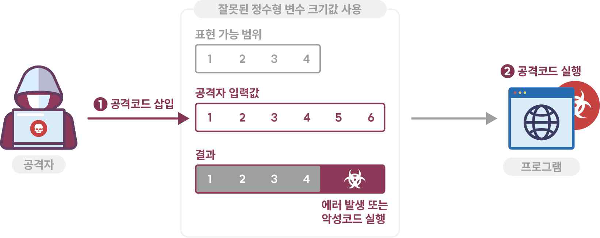

다. 코드예제
다음은 거듭제곱을 계산해 그 결과를 반환하는 함수 예시로, 계산 가능한 숫자에 대한 검증이 없어 에러는
발생하지 않지만 반환값을 처리하는 함수에서 예기치 않은 오류가 발생할 수 있다.

**안전하지 않은 코드 예시**

1:
2:
3:
4:
5:
6:
import numpy as np
def handle_data(number, pow):
res = np.power(number, pow, dtype=np.int64)
# 64비트를 넘어서는 숫자와 지수가 입력될 경우 오버플로우가 발생해 결과값이 0이 된다
return res
오버플로우 발생을 예방하려면 입력하는 값이 사용하는 데이터 타입의 최소보다 크거나 최대보다 작은지
확인해야 한다. 만약 위 코드 예시처럼 값을 계산해야 하는 경우 오버플로우가 발생하지 않는 파이썬 기본 자료형에
계산 결과값을 저장한 후 그 값을 검사해 오버플로우 여부를 확인해야 한다.

**안전한 코드 예시**

1:
2:
3:
4:
5:
6:
7:
8:
9:
10:
11:
12:
13:
14:
15:
import numpy as np
MAX_NUMBER = np.iinfo(np.int64).max
MIN_NUMBER = np.iinfo(np.int64).min
def handle_data(number, pow):
calculated = number ** pow
# 파이썬 기본 자료형으로 큰 수를 계산한 후 이를 검사해 오버플로우 탐지
if calculated > MAX_NUMBER or calculated < MIN_NUMBER:
# 오버플로우 탐지 시 비정상 종료를 나타내는 –1 값 반환
return –1
res = np.power(number, pow, dtype=np.int64)
return res

라. 참고자료
① CWE-190: Integer Overflow or Wraparound, MITRE
https://cwe.mitre.org/data/definitions/190.html
② Integer Overflow Error, ZAP,
https://www.zaproxy.org/docs/alerts/30003/
③ Arbitrary-precision arithmetic,
https://en.wikipedia.org/wiki/Arbitrary-precision_arithmetic
④ PEP 237 – Unifying Long Integers and Integers,
https://peps.python.org/pep-0237/
⑤ Numpy Types
https://numpy.org/doc/stable/user/basics.types.html?highlight=s
15. 보안기능 결정에 사용되는 부적절한 입력값
가. 개요
응용 프로그램이 외부 입력값에 대한 신뢰를 전제로 보호 메커니즘을 사용하는 경우 공격자가 입력값을 조작
할 수 있다면 보호 메커니즘을 우회할 수 있게 된다.
개발자들이 흔히 쿠키, 환경변수 또는 히든필드와 같은 입력값이 조작될 수 없다고 가정하지만 공격자는 다양한
방법을 통해 이러한 입력값들을 변경할 수 있고 조작된 내용은 탐지되지 않을 수 있다. 인증이나 인가와 같은
보안 결정이 이런 입력값(쿠키, 환경변수, 히든필드 등)에 기반을 두어 수행되는 경우 공격자는 입력값을 조작해
응용프로그램의 보안을 우회할 수 있다. 따라서 충분한 암호화, 무결성 체크를 수행하고 이와 같은 메커니즘이
없는 경우엔 외부 사용자에 의한 입력값을 신뢰해서는 안 된다.
파이썬의 Django 프레임워크에서 세션을 관리하는 기능을 제공하고 있으며, 해당 기능 사용 시에는 세션쿠키의
만료 시점을 설정해 사용할 수 있으며 DRF(Django Rest Framework)에서 제공하는 토큰 및 세션 기능을
사용해 안전하게 구성할 수 있다.

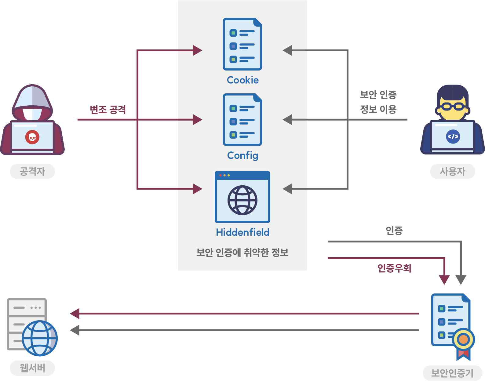

나. 안전한 코딩기법
상태 정보나 민감한 데이터 특히 사용자 세션 정보와 같은 중요 정보는 서버에 저장하고 보안확인 절차도
서버에서 실행한다. 보안설계 관점에서 신뢰할 수 없는 입력값이 응용 프로그램 내부로 들어올 수 있는 지점을
검토하고 민감한 보안 기능 실행에 사용되는 입력값을 식별해 입력값에 대한 의존성을 없애는 구조로 변경
가능한지 분석한다.
다. 코드예제
다음은 안전하지 않은 코드로 쿠키에 저장된 권한 등급을 가져와 관리자인지 확인 후에 사용자의 패스워드를
초기화 하고 메일을 보내는 예제다. 쿠키에서 등급을 가져와 관리자 여부를 확인한다.

**안전하지 않은 코드 예시**

1:
2:
3:
4:
5:
6:
7:
8:
9:
10:
11:
12:
13:
14:
from django.shortcuts import render
def init_password(request):
# 쿠키에서 권한 정보를 가져 온다
role = request.COOKIE['role']
request_id = request.POST.get('user_id', '')
request_mail = request.POST.get('user_email','')
# 쿠키에서 가져온 권한이 관리자인지 비교
if role == 'admin':
# 사용자의 패스워드 초기화 및 메일 발송 처리
password_init_and_sendmail(request_id, request_mail)
return render(request, '/success.html')
else:
return render(request, '/failed.html')

중요 기능 수행을 위한 데이터는 위변조 가능성이 높은 쿠키보다 세션에 저장하도록 한다.

**안전한 코드 예시**

1:
2:
3:
4:
5:
6:
7:
8:
9:
10:
11:
12:
13:
14:
from django.shortcuts import render
def init_password(request):
# 세션에서 권한 정보를 가져옴
role = request.session['role']
request_id = request.POST.get('user_id', '')
request_mail = request.POST.get('user_email','')
# 세션에서 가져온 권한이 관리자인지 비교
if role == ‘admin’:
# 사용자의 패스워드 초기화 및 메일 발송 처리
password_init_and_sendmail(request_id, request_mail)
return render(request, '/sucess.html')
else:
return render(request, '/failed.html')
라. 참고자료
① CWE-807: Reliance on Untrusted Inputs in a Security Decision, MITRE,
https://cwe.mitre.org/data/definitions/807.html
② How to use sessions, Django Software Foundation,
https://docs.djangoproject.com/en/3.2/topics/http/sessions/
③ Flask Sessions,
https://flask-session.readthedocs.io/en/latest/

16. 포맷 스트링 삽입
가. 개요
외부로부터 입력된 값을 검증하지 않고 입·출력 함수의 포맷 문자열로 그대로 사용하는 경우 발생할 수 있는
보안약점이다. 공격자는 포맷 문자열을 이용해 취약한 프로세스를 공격하거나 메모리 내용을 읽고 쓸 수 있다.
이를 통해 취약한 프로세스의 권한을 취득해 임의의 코드를 실행 할 수 있다.
파이썬에서는 문자열의 포맷팅 방법으로 “% formatting”, “str.format”, “f-string” 과 같이 세 가지 문자열
포맷팅 방식을 제공하고 있다(f-string 은 파이썬 3.6 버전부터 사용 가능하다). 공격자는 포맷 문자열을 이용해
내부 정보를 문자열로 만들 수 있으며, 이를 그대로 사용하는 경우 중요 정보 유출로 이어질 수 있다.
나. 안전한 코딩기법
포맷 문자열을 처리하는 함수 사용 시 사용자 입력값을 직접적으로 포맷 문자열로 사용하거나 포맷 문자열
생성에 포함시키지 않아야 한다. 사용자로부터 입력 받은 데이터를 포맷 문자열로 사용하고자 하는 경우에는
서식 지정자를 포함하지 않거나 파이썬의 내장함수 또는 내장변수 등이 포함되지 않도록 해야 한다.
다. 코드예제
아래 예시에서는 외부에서 입력받은 문자열을 바로 포맷스트링으로 사용하고 있는데, 이는 내부 정보가 외부로
노출될 수 있는 문제를 내포하고 있다.
공격자가 # {user.__init__.__globals__[AUTHENTICATE_KEY]} 형식의 문자열 입력 시 전역 변수에 접근
하여 AUTHENTICATE_KEY의 값을 탈취 할 수 있다.

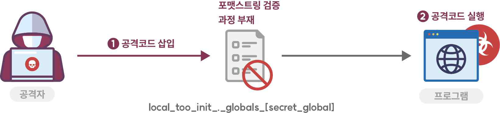

**안전하지 않은 코드 예시**

1:
2:
3:
4:
5:
6:
7:
8:
9:
10:
11:
12:
from django.shortcuts import render
AUTHENTICATE_KEY = 'Passw0rd'
def make_user_message(request):
user_info = get_user_info(request.POST.get('user_id', ''))
format_string = request.POST.get('msg_format', '')
# 내부의 민감한 정보가 외부로 노출될 수 있다.
# 사용자가 입력한 문자열을 포맷 문자열로 사용하고 있어 안전하지 않다
message = format_string.format(user=user_info)
return render(request, '/user_page.html', {'message':message})
외부에서 입력 받은 문자열은 반드시 포맷 지정자를 이용해 바인딩 후 사용해야 하며 직접적으로 포맷문자열로
사용해서는 안 된다.

**안전한 코드 예시**

1:
2:
3:
4:
5:
6:
7:
8:
9:
10:
from django.shortcuts import render
AUTHENTICATE_KEY = 'Passw0rd'
def make_user_message(request):
user_info = get_user_info(request.POST.get('user_id', ''))
# 사용자가 입력한 문자열을 포맷 문자열로 사용하지 않아 안전하다
message = 'user name is {}'.format(user_info.name)
return render(request, '/user_page.html', {'message':message})
라. 참고자료
① CWE-134: Use of Externally-Controlled Format String, MITRE,
https://cwe.mitre.org/data/definitions/134.html
② Format string attack, OWASP,
https://owasp.org/www-community/attacks/Format_string_attack
③ 파이썬 format, Python Software Foundation,
https://docs.python.org/3/library/functions.html#format
④ Format String Syntax, Python Software Foundation,
https://docs.python.org/3/library/string.html#format-string-syntax

---

**제2절 보안기능**

보안기능(인증, 접근제어, 기밀성, 암호화, 권한관리 등)을 부적절하게 구현 시 발생할 수 있는 보안약점에는
적절한 인증 없는 중요기능 허용, 부적절한 인가 등이 있다.
1. 적절한 인증 없는 중요 기능 허용
가. 개요
보안기능(인증, 접근제어, 기밀성, 암호화, 권한관리 등)을 부적절하게 구현 시 발생할 수 있는 보안약점으로
적절한 인증 없는 중요기능 허용, 부적절한 인가 등이 포함된다.
파이썬의 Django 프레임워크에서 django.contrib.auth 앱을 통해 기본적인 인증 로그인 및 로그아웃 기능을
제공하고 있으며 DRF(Django REST Framework)에서는 토큰 및 세션 인증을 제공하고 있다.
나. 안전한 코딩기법
클라이언트의 보안 검사를 우회하여 서버에 접근하지 못하도록 설계하고 중요한 정보가 있는 페이지는 재인증을
적용한다. 또한 안전하다고 검증된 라이브러리나 프레임워크(Django authentication system, Flask-Login 등)를
사용해야 한다.
다. 코드예제
다음은 패스워드 수정 시 수정을 요청한 패스워드와 DB에 저장된 사용자 패스워드 일치 여부를 확인하지
않고 처리하고 있으며 패스워드의 재확인 절차도 생략되어 취약한 코드 예시를 보여 준다.

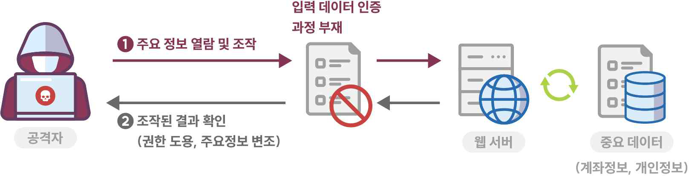

**안전하지 않은 코드 예시**

1:
2:
3:
4:
5:
6:
7:
8:
9:
10:
11:
12:
13:
14:
15:
from django.shortcuts import render
from re import escape
import hashlib
def change_password(request):
new_pwd = request.POST.get('new_password','')
# 로그인한 사용자 정보
user = '%s' % escape(request.session['userid'])
# 현재 password와 일치 여부를 확인하지 않고 수정함
sha = hashlib.sha256(new_pwd.encode())
update_password_from_db(user, sha.hexdigest())
return render(request, '/success.html')
DB에 저장된 사용자 패스워드와 변경을 요청한 패스워드의 일치 여부를 확인하고, 변경 요청한 패스워드와
재확인 패스워드가 일치하는지 확인 후 DB의 패스워드를 수정해 안전하게 코드를 적용할 수 있다.

**안전한 코드 예시**

1:
2:
3:
4:
5:
6:
7:
8:
9:
10:
11:
12:
13:
14:
15:
16:
from django.contrib.auth.decorators import login_required
from django.shortcuts import render
from re import escape
import hashlib
# login_required decorator를 사용해 login된 사용자만 접근하도록 처리
@login_required
def change_password(request):
new_pwd = request.POST.get('new_password','')
crnt_pwd = request.POST.get('current_password','')
# 로그인한 사용자 정보를 세션에서 가져온다.
user = '%s' % escape(request.session['userid'])
crnt_h = hashlib.sha256(crnt_pwd.encode())
h_pwd = crnt_h.hexdigest()

**안전한 코드 예시**

17:
18:
19:
20:
21:
22:
23:
24:
25:
26:
27:
# DB에서 기존 사용자의 Hash된 패스워드 가져오기
old_pwd = get_password_from_db(user)
# 패스워드를 변경하기 전 사용자에 대한 재인증을 수행한다.
if old_pwd == h_pwd:
new_h = hashlib.sha256(new_pwd.encode())
update_password_from_db(user, new_h.hexdigest())
return render(request, '/success.html')
else:
return render(request, ‘failed.html’, {'error': '패스워드가 일치하지 않습니다'})
라. 참고자료
① CWE-306: Missing Authentication for Critical Function, MITRE,
https://cwe.mitre.org/data/definitions/306.html
② Access Control, OWASP,
https://www.owasp.org/index.php/Access_Control_Cheat_Sheet
③ Using the Django authentication system, Django Software Foundation,
https://docs.djangoproject.com/en/3.2/topics/auth/default/
④ Flask-Security,
https://flask-login.readthedocs.io/en/latest/

2. 부적절한 인가
가. 개요
프로그램이 모든 가능한 실행 경로에 대해서 접근 제어를 검사하지 않거나 불완전하게 검사하는 경우 공격자는
접근 가능한 실행경로를 통해 정보를 유출할 수 있다.
나. 안전한 코딩기법
응용 프로그램이 제공하는 정보와 기능이 가지는 역할에 맞게 분리 개발함으로써 공격자에게 노출되는 공격
노출면(Attack Surface)3)을 최소화하고 사용자의 권한에 따른 ACL(Access Control List)을 관리한다.
다. 코드예제
사용자 입력값에 따라  삭제 작업을 수행하고 있으며 사용자의 권한 확인을 위한 별도의 통제가 적용되지
않은 예시를 보여 준다.
3) 공격자가 진입 또는 영향을 줄 수 있는 시스템 경계선 지점, 시스템 요소 또는 환경을 의미(https://csrc.nist.g
ov/glossary/term/attack_surface)

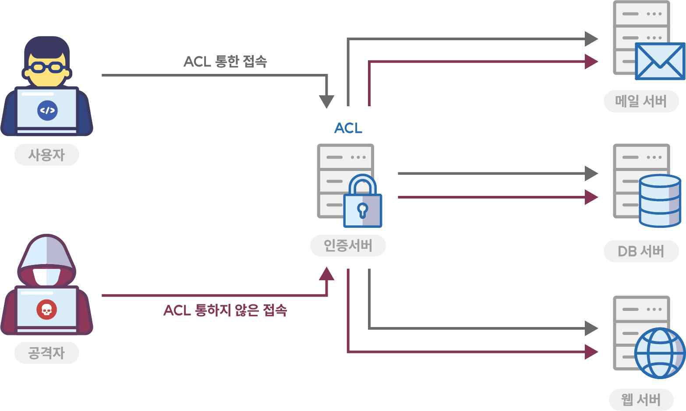

**안전하지 않은 코드 예시**

1:
2:
3:
4:
5:
6:
7:
8:
9:
10:
11:
12:
from django.shortcuts import render
from .model import Content
def delete_content(request):
action = request.POST.get('action', '')
content_id = request.POST.get('content_id', '')
# 작업 요청을 하는 사용자의 권한 확인 없이 delete를 수행
if action is not None and action == "delete":
Content.objects.filter(id=content_id).delete()
return render(request, '/success.html')
else:
return render(request, '/error.html', {'error':'접근 권한이 없습니다.'})
세션에 저장된 사용자 정보를 통해 해당 사용자가 수행할 작업에 대한 권한이 있는지 확인한 후 권한이 있는
경우에만 작업을 수행하도록 해야 한다.

**안전한 코드 예시**

1:
2:
3:
4:
5:
6:
7:
8:
9:
10:
11:
12:
13:
14:
15:
16:
from django.contrib.auth.decorators import login_required, permission_required
from django.shortcuts import render
from .model import Content
@login_required
# 해당 기능을 수행할 권한이 있는지 확인
@permission_required('content.delete', raise_exception=True)
def delete_content(request):
action = request.POST.get('action', '')
content_id = request.POST.get('content_id', '')
if action is not None and action == "delete":
Content.objects.filter(id=content_id).delete()
return render(request, '/success.html')
else:
return render(request, '/error.html', {'error':'삭제 실패'})

라. 참고자료
① CWE-285: Improper Authorization, MITRE,
https://cwe.mitre.org/data/definitions/285.html
② Access Control, OWASP,
https://www.owasp.org/index.php/Access_Control_Cheat_Sheet
③ Using the Django authentication system, Django Software Foundation,
https://docs.djangoproject.com/en/3.2/topics/auth/default/
3. 중요한 자원에 대한 잘못된 권한 설정
가. 개요
응용프로그램이 중요한 보안관련 자원에 대해 읽기 또는 수정하기 권한을 의도하지 않게 허가할 경우 권한을
갖지 않은 사용자가 해당 자원을 사용하게 된다. 파이썬에서는 os.fchmod, os.chmod 등의 함수를 통해 파일
생성, 수정 및 읽기 권한을 설정할 수 있다.
나. 안전한 코딩기법
설정 파일, 실행 파일, 라이브러리 등은 관리자에 의해서만 읽고 쓰기가 가능하도록 설정하고 설정 파일과
같이 중요한 자원을 사용하는 경우 허가 받지 않은 사용자가 중요한 자원에 접근 가능한지 검사한다.
다. 코드예제
다음 예제는 /root/system_config 파일에 대해서 모든 사용자가 읽기, 쓰기, 실행 권한을 가지는 상황을
보여 준다.

**안전하지 않은 코드 예시**

1:
2:
3:
4:
5:
6:
7:
8:
import os
def write_file():
# 모든 사용자가 읽기, 쓰기, 실행 권한을 가지게 된다.
os.chmod('/root/system_config', 0o777)
with open("/root/system_config",  'w') as f:
f.write("your config is broken")

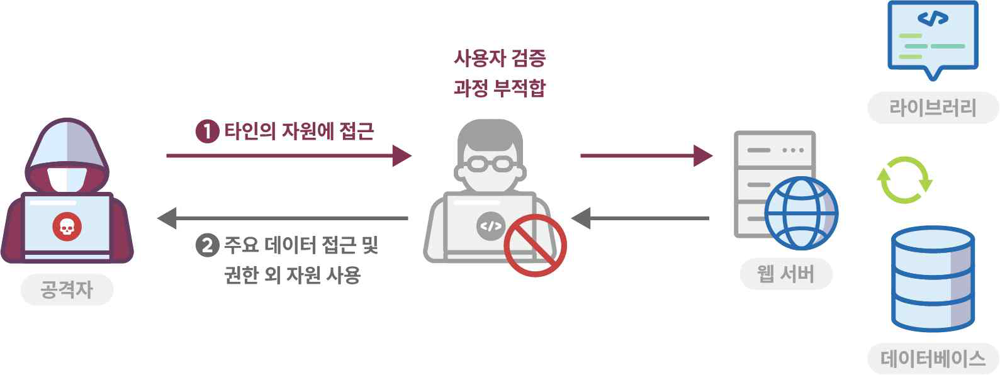

주요 파일에 대해서는 최소 권한만 할당해야 한다. 구체적으로 파일의 소유자라고 하더라도 기본적으로 읽기
권한만 부여해야 하며, 부득이하게 쓰기 권한이 필요한 경우에만 제한적으로 쓰기 권한을 부여해야 한다.

**안전한 코드 예시**

1:
2:
3:
4:
5:
6:
7:
8:
import os
def write_file():
# 소유자 외에는 아무런 권한을 주지 않음.
os.chmod('/root/system_config', 0o700)
with open("/root/system_config", ‘'w') as f:
f.write("your config is broken")
라. 참고자료
① CWE-732: Incorrect Permission Assignment for Critical Resource, MITRE,
https://cwe.mitre.org/data/definitions/732.html
② OS – Miscellaneous operating system interfaces, Python Software Foundation,
https://docs.python.org/3/library/os.html

4. 취약한 암호화 알고리즘 사용
가. 개요
개발자들은 환경설정 파일에 저장된 패스워드를 보호하기 위해 간단한 인코딩 함수를 이용해 패스워드를
감추는 방법을 사용하기도 한다. 하지만 base64와 같은 지나치게 간단한 인코딩 함수로는 패스워드를 제대로
보호할 수 없다.
정보보호 측면에서 취약하거나 위험한 암호화 알고리즘을 사용해서는 안 된다. 표준화되지 않은 암호화 알고리즘을
사용하는 것은 공격자가 알고리즘을 분석해 무력화시킬 수 있는 가능성을 높일 수도 있다. 몇몇 오래된 암호화
알고리즘의 경우는 컴퓨터의 성능이 향상됨에 따라 취약해지기도 해서, 예전에는 해독하는데 몇 십 억년이 걸릴
것이라고 예상되던 알고리즘이 며칠이나 몇 시간 내에 해독되기도 한다. RC2(ARC2), RC4(ARC4), RC5,
RC6, MD4, MD5, SHA1, DES 알고리즘이 여기에 해당된다.
나. 안전한 코딩기법
자신만의 암호화 알고리즘을 개발하는 것은 위험하며, 학계 및 업계에서 이미 검증된 표준화된 알고리즘을
사용해야 한다. 기존에 취약하다고 알려진 DES, RC5 등의 암호알고리즘을 대신하여 3TDEA, AES, SEED
등의 안전한 암호알고리즘으로 대체하여 사용한다. 또한 업무관련 내용, 개인정보 등에 대한 암호 알고리즘
적용 시 안전한 암호화 알고리즘을 사용해야 한다.

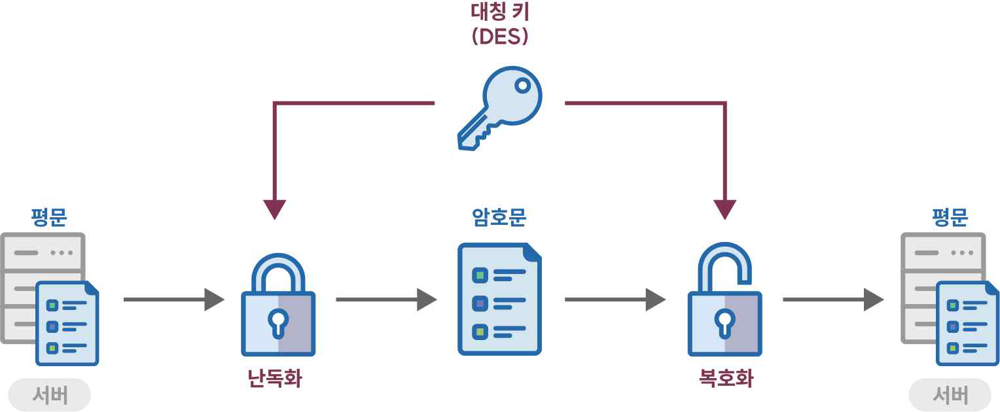

**< 암호알고리즘 검증기준 ver3.0 (암호모듈시험기관) >**

분류
암호 알고리즘
최소 안전성 수준
⦁112비트
블록암호
(운영모드)
ARIA
⦁운영모드
- 기밀성(ECB, CBC, CFB, OFB, CTR)
- 기밀성/인증(CCM, GCM)
SEED
⦁운영모드
- 기밀성(ECB, CBC, CFB, OFB, CTR)
- 기밀성/인증(CCM, GCM)
LEA
⦁운영모드
- 기밀성(ECB, CBC, CFB, OFB, CTR)
- 기밀성/인증(CCM, GCM)
HIGHT
⦁운영모드
- 기밀성(ECB, CBC, CFB, OFB, CTR)
해시함수
SHA-2
⦁SHA-224/256/384/512
LSH
⦁LSH-224/256/384/512/512-224/512-256
SHA-3
⦁SHA-3-224/256/384/512
메시지
인증
해시함수 기반
⦁HMAC
블록암호 기반
⦁CMAC, GMAC
난수발생기
해시함수 기반
⦁Hash_DRBG, HMAC_DRBG
블록암호 기반
⦁CTR_DRBG
공개키 암호
RSAES
⦁공개키 길이 : 2048, 3072
⦁해시함수 : SHA-224, SHA-256
전자서명
RSA-PSS
⦁공개키 길이 : 2048, 3072
⦁해시함수 : SHA-224, SHA-256
KCDSA
⦁(공개키 길이, 개인키 길이) : (2048, 224), (2048, 256)
⦁해시함수 : SHA-224, SHA-256
EC-KCDSA
⦁p-224, p-256, B-233, B-283, K-233, K-283
⦁해시함수 : SHA-224, SHA-256
ECDSA
⦁p-224, p-256, B-233, B-283, K-233, K-283
⦁해시함수 : SHA-224, SHA-256
키 설정
DH
⦁(공개키 길이, 개인키 길이) : (2048, 224), (2048, 256)
ECDH
⦁P-224, P-256, B-233, B-283, K-233, K-283
키 유도
KBKDF
⦁HMAC, CMAC
PBKDF
⦁HMAC
다. 코드예제
다음 예제는 취약한 DES 알고리즘으로 암호화하는 예시다. DES 이외에 2TDEA, Blowfish, ARC2,
ARC4 등의 취약한 알고리즘을 사용해선 안 된다.

**안전하지 않은 코드 예시**

1:
2:
3:
4:
5:
6:
7:
8:
9:
import base64
from Crypto.Cipher import DES
from Crypto.Util.Padding import pad
def get_enc_text(plain_text, key):
# 취약함 암호화 알고리즘인 DES를 사용하여 안전하지 않음
cipher_des = DES.new(key, DES.MODE_ECB)
encrypted_data = base64.b64encode(cipher_aes.encrypt(pad(plain_text, 32)))
return encrypted_data.decode('ASCII')
파이썬 2.x 버전에서는 PyCrypto를 사용하면 되지만 파이썬 3.x 버전 환경에서 사용 시 동작을 하지 않는
경우가 발생하며, 더 이상 유지 관리 되지 않으므로(deprecated) PyCrypto를 개선한 버전인 pycryptodome를
사용해야 한다. 또한 취약한 DES 알고리즘 대신 안전한 AES 암호화 알고리즘을 사용한다.
블록 암호화에서 운영 모드를 ECB(Electronic Code Block) 모드로 사용할 경우 한 개의 블록만 해독되면
나머지 블록도 해독이 되는 단점이 있다. CBC(Cipher Block Chaining) 모드는 평문의 각 블록이 XOR 연산을
통해 이전 암호문과 연산이 되기 때문에 같은 평문이라도 암호문이 서로 다르다. 이러한 특성으로 보안성이
ECB 모드보다 높다.

**안전한 코드 예시**

1:
2:
3:
4:
5:
6:
7:
8:
9:
10:
import base64
from Crypto.Cipher import AES
from Crypto.Util.Padding import pad
def get_enc_text(plain_text, key, iv):
# 안전한 알고리즘인 AES 를 사용하여 안전함.
cipher_aes = AES.new(key, AES.MODE_CBC, iv)
encrypted_data = base64.b64encode(cipher_aes.encrypt(pad(plain_text, 32)))
return encrypted_data.decode('ASCII')

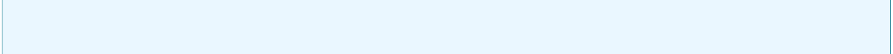

다음 예제는 취약한 MD5 해시함수를 사용하는 예시다. 암호 알고리즘과 마찬가지로 해시함수도 수학적으로
취약한 것으로 확인된 MD5와 같은 함수를 사용하면 해시값을 역계산해 평문이 유출될 수 있다.

**안전하지 않은 코드 예시**

1:
2:
3:
4:
5:
6:
7:
import hashlib
def make_md5(plain_text):
# 취약한 md5 해시함수 사용
hash_text = hashlib.md5(plain_text.encode('utf-8')).hexdigest()
return hash_text
아래 코드처럼 수학적으로 안전하다고 알려진 sha-256 해시함수 등을 적용해야 한다.

**안전한 코드 예시**

1:
2:
3:
4:
5:
6:
7:
import hashlib
def make_sha256(plain_text):
# 안전한 sha-256 해시함수 사용
hash_text = hashlib.sha256(plain_text.encode('utf-8')).hexdigest()
return hash_text
라. 참고자료
① CWE-327: Use of a Broken or Risky Cryptographic Algorithm, MITRE,
https://cwe.mitre.org/data/definitions/327.html
② Welcome to pyca/cryptography, Cryptography,
https://cryptography.io/en/latest/
③ Welcome to PyCryptodome’s documentation, PyCryptodome,
https://www.pycryptodome.org/en/latest/
④ Cryptographic Services, Python Software Foundation,
https://docs.python.org/3/library/crypto.html

5. 암호화되지 않은 중요정보
가. 개요
많은 응용 프로그램은 메모리나 디스크 상에서 중요한 정보(개인정보, 인증정보, 금융정보 등)를 처리한다.
이러한 중요 정보가 제대로 보호되지 않을 경우 보안 문제가 발생하거나 데이터의 무결성이 깨질 수 있다. 특히
사용자 또는 시스템의 중요 정보가 포함된 데이터를 평문으로 송·수신 또는 저장 시 인가되지 않은 사용자에게
민감한 정보가 노출될 수 있다.
나. 안전한 코딩기법
개인정보(주민등록번호, 여권번호 등), 금융정보(카드번호, 계좌번호 등), 패스워드 등 중요정보를 저장하거나
통신채널로 전송할 때는 반드시 암호화 과정을 거쳐야 하며 중요정보를 읽거나 쓸 경우에 권한인증 등을 통해
적합한 사용자만 중요정보에 접근하도록 해야 한다.
가능하다면 SSL 또는 HTTPS 등과 같은 보안 채널을 사용해야 한다. 보안 채널을 사용하지 않고 브라우저
쿠키에 중요 데이터를 저장하는 경우 쿠키 객체에 보안속성을 설정해(Ex. secure = True) 중요 정보의 노출을
방지할 수 있다.
다. 코드예제
⦁중요정보 평문저장
아래 예제는 사용자로부터 전달받은 패스워드 암호화를 누락한 경우이다.

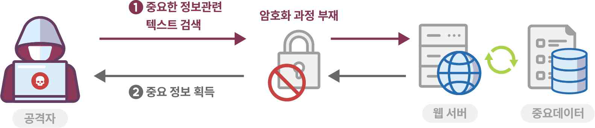

**안전하지 않은 코드 예시**

1:
2:
3:
4:
5:
6:
7:
8:
9:
def update_pass(dbconn, password, user_id):
curs = dbconn.cursor()
# 암호화되지 않은 패스워드를 DB에 저장
curs.execute(
'UPDATE USERS SET PASSWORD=%s WHERE USER_ID=%s',
password,
user_id
)
dbconn.commit()
아래는 해시 알고리즘을 이용하여 단방향 암호화 이후에 패스워드를 저장하고 있다. 이 때, 해시함수 또한
SHA256과 같이 안정성이 검증된 알고리즘을 사용해야 한다.

**안전한 코드 예시**

1:
2:
3:
4:
5:
6:
7:
8:
9:
10:
11:
12:
13:
from Crypto.Hash import SHA256
def update_pass(dbconn, password, user_id, salt):
# 단방향 암호화를 이용하여 패스워드를 암호화
hash_obj = SHA256.new()
hash_obj.update(bytes(password + salt, 'utf-8'))
hash_pwd = hash_obj.hexdigest()
curs = dbconn.cursor()
curs.execute(
'UPDATE USERS SET PASSWORD=%s WHERE USER_ID=%s',
(hash_pwd, user_id)
)
dbconn.commit()

⦁중요정보 평문전송
아래 예제는 인자값으로 전달 받은 패스워드를 검증 없이 네트워크를 통해 전송하는 예시를 포함한다. 전달
받은 패스워드가 암호화가 되어 있지 않을 경우 패킷 스니핑을 통하여 패스워드가 노출될 수 있다.

**안전하지 않은 코드 예시**

1:
2:
3:
4:
5:
6:
7:
8:
9:
10:
11:
12:
13:
import socket
HOST = '127.0.0.1'
PORT = 65434
def send_password(password):
......
with socket.socket(socket.AF_INET, socket.SOCK_STREAM) as s:
s.connect((HOST, PORT))
# 패스워드를 암호화 하지 않고 전송하여 안전하지 않다.
s.sendall(password.encode('utf-8'))
data = s.recv(1024)
.......
아래는 네트워크를 통해 전달되는 패스워드가 노출되지 않도록 암호화하여 전송하는 예시를 보여 준다.

**안전한 코드 예시**

1:
2:
3:
4:
5:
6:
7:
8:
9:
10:
11:
12:
13:
14:
15:
import socket
import os
from Crypto.Cipher import AES
HOST = '127.0.0.1'
PORT = 65434
def send_password(password):
# 문자열로 저장되어 있는 블록키를 로드
block_key = os.environ.get('BLOCK_KEY')
aes = AEScipher(block_key)
# 패스워드 등 중요 정보는 암호화하여 전송하는 것이 안전하다
enc_passowrd = aes.encrypt(passowrd)

**안전한 코드 예시**

16:
17:
18:
19:
20:
21:
22:
23:
24:
25:
26:
27:
28:
29:
30:
31:
32:
33:
34:
35:
36:
with socket.socket(socket.AF_INET, socket.SOCK_STREAM) as s:
s.connect((HOST, PORT))
s.sendall(enc_passowrd.encode('utf-8'))
data = s.recv(1024)
.......
class AEScipher:
BS = AES.block_size
def __init__(self, s_key):
self.s_key = hashlib.sha256(s_key.encode("utf-8")).digest()
def pad(self, m):
return m + bytes([self.BS - len(m) % self.BS] * (self.BS - len(m) % self.BS))
def encrypt(self, plain):
plain = self.pad(plain.encode())
iv = Random.new().read(AES.block_size)
cipher = AES.new(self.s_key, AES.MODE_CBC, iv)
return base64.b64encode(iv + cipher.encrypt(plain)).decode("utf-8")
......
라. 참고자료
① CWE-312: Cleartext Storage of Sensitive Information, MITRE,
https://cwe.mitre.org/data/definitions/312.html
② CWE-319: Cleartext Transmission of Sensitive Information, MITRE,
https://cwe.mitre.org/data/definitions/319.html
③ Password Plaintext Storage, OWASP,
https://owasp.org/www-community/vulnerabilities/Password_Plaintext_Storage

6. 하드코드된 중요정보
가. 개요
프로그램 코드 내부에 하드코드된 패스워드를 포함하고, 이를 이용해 내부 인증에 사용하거나 외부 컴포넌트와
통신을 하는 경우 관리자의 정보가 노출될 수 있어 위험하다. 또한 하드코드된 암호화 키를 사용해 암호화를
수행하면 암호화된 정보가 유출될 가능성이 높아진다. 암호키의 해시를 계산해 저장하더라도 역계산이 가능해
무차별 공격(Brute-Force)공격에는 취약할 수 있다.
나. 안전한 코딩기법
패스워드는 암호화 후 별도의 파일에 저장하여 사용한다. 또한 중요 정보 암호화 시 상수가 아닌 암호화
키를 사용하도록 하며, 암호화가 잘 되었더라도 소스코드 내부에 상수 형태의 암호화 키를 주석으로 달거나
저장하지 않도록 한다.
다. 코드예제
소스코드에 패스워드 또는 암호화 키와 같은 중요 정보를 하드코딩 하는 경우 중요 정보가 노출될 수 있어
위험하다.

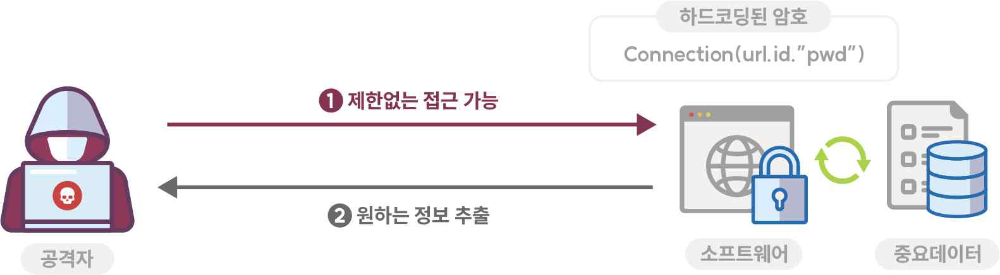

**안전하지 않은 코드 예시**

1:
2:
3:
4:
5:
6:
7:
8:
9:
10:
11:
12:
13:
14:
15:
16:
import pymysql
def query_execute(query):
# user, passwd가 소스코드에 평문으로 하드코딩되어 있음
dbconn = pymysql.connect(
host='127.0.0.1',
port='1234',
user='root',
passwd='1234',
db='mydb',
charset='utf8',
)
curs = dbconn.cursor()
curs.execute(query)
dbconn.commit()
dbconn.close()
패스워드와 같은 중요 정보는 안전한 암호화 방식으로 암호화 후 별도의 분리된 공간(파일)에 저장해야 하며,
암호화된 정보 사용 시 복호화 과정을 거친 후 사용해야 한다.

**안전한 코드 예시**

1:
2:
3:
4:
5:
6:
7:
8:
9:
10:
11:
12:
13:
14:
15:
16:
17:
18:
19:
20:
21:
22:
23:
24:
25:
26:
27:
import pymysql
import json
def query_execute(query, config_path):
with open(config_path, 'r') as config:
# 설정 파일에서 user, passwd를 가져와 사용
dbconf = json.load(fp=config)
# 암호화되어 있는 블록 암호화 키를 복호화 해서 가져오는
# 사용자 정의 함수
blockKey = get_decrypt_key(dbconf['blockKey'])
# 설정 파일에 암호화되어 있는 값을 가져와 복호화한 후에 사용
dbUser = decrypt(blockKey, dbconf['user'])
dbPasswd = decrypt(blockKey, dbconf['passwd'])
dbconn = pymysql.connect(
host=dbconf['host']
port=dbconf['port'],
user=dbUser,
passwd=dbPasswd,
db=dbconf['db_name'],
charset='utf8',
)
curs = dbconn.cursor()
curs.execute(query)
dbconn.commit()
dbconn.close()
라. 참고자료
① CWE-259: Use of Hard-coded Password, MITRE,
https://cwe.mitre.org/data/definitions/259.html
② CWE-321: Use of Hard-coded Cryptographic Key, MITRE,
https://cwe.mitre.org/data/definitions/321.html
③ Use of hard-coded password, OWASP,
https://owasp.org/www-community/vulnerabilities/Use_of_hard-coded_password
④ Password Management Hardcoded Password, OWASP,
https://owasp.org/www-community/vulnerabilities/Password_Management_Hardcoded_Password

7. 충분하지 않은 키 길이 사용
가. 개요
짧은 길이의 키를 사용하는 것은 암호화 알고리즘을 취약하게 만들 수 있다. 키는 암호화 및 복호화에 사용
되는데, 검증된 암호화 알고리즘을 사용하더라도 키 길이가 충분히 길지 않으면 짧은 시간 안에 키를 찾아낼
수 있고 이를 이용해 공격자가 암호화된 데이터나 패스워드를 복호화 할 수 있게 된다.
암호 알고리즘 및 키 길이 선택 시 암호 알고리즘의 안전성 유지기간과 보안강도별 암호 알고리즘 키 길이
비교표를 기반으로 암호 알고리즘 및 키 길이를 선택해야 한다.

**< 보안강도별 암호 알고리즘 비교표 >**

보안강도
대칭키 암호
알고리즘
(보안강도)
해시함수
(보안강도)
공개키 암호 알고리즘
암호 알고리즘
안전성 유지기간
(년도)
인수분해
(비트)
이산대수
타원곡선
암호(비트)
공개키(비트)
개인키(비트)
112 비트
2048
2048
2011년에서
2030년까지
128 비트
3072
3072
2030년 이후
192 비트
7680
7680
256비트
15360
15360

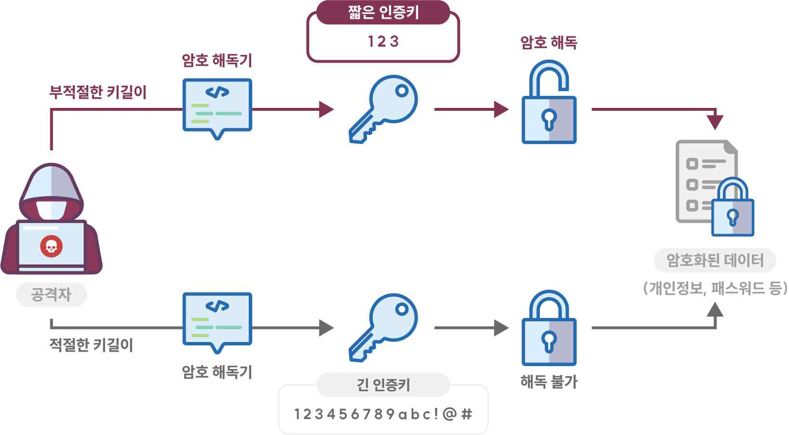

나. 안전한 코딩기법
RSA 알고리즘은 적어도 2,048 비트 이상의 길이를 가진 키와 함께 사용해야 하고, 대칭 암호화 알고리즘(Symmetric
Encryption Algorithm)의 경우에는 적어도 128비트 이상의 키를 사용해야 한다(암호 강도 112비트 이상).

**다. 코드예제**

보안성이 강한 RSA 알고리즘을 사용하는 경우에도 키 사이즈를 작게 설정하면 프로그램의 보안약점이 될 수 있다.

**안전하지 않은 코드 예시**

1:
2:
3:
4:
5:
6:
7:
8:
9:
10:
11:
12:
13:
14:
from Crypto.PublicKey import  RSA, DSA, ECC
from tinyec import registry
import secrets
def make_rsa_key_pair():
# RSA키 길이를 2048 비트 이하로 설정하는 경우 안전하지 않음
private_key = RSA.generate(1024)
public_key = private_key.publickey()
def make_ecc():
# ECC의 키 길이를 224비트 이하로 설정하는 경우 안전하지 않음
ecc_curve = registry.get_curve('secp192r1')
private_key = secrets.randbelow(ecc_curve.field.n)
public_key = private_key * ecc_curve.g
RSA, DSA의 경우 키의 길이는 적어도 2048 비트를, ECC의 경우 224 비트 이상으로 설정해야 안전하다.
다음은 tinyec 모듈을 사용하여 ECC 키를 생성한 예제다.

**안전한 코드 예시**

1:
2:
3:
4:
5:
6:
7:
8:
9:
10:
11:
12:
13:
14:
from Crypto.PublicKey import  RSA, DSA, ECC
from tinyec import registry
import secrets
def make_rsa_key_pair():
# RSA 키 길이를 2048 비트 이상으로 길게 설정
private_key = RSA.generate(2048)
public_key = private_key.publickey()
def make_ecc():
# ECC 키 길이를 224 비트 이상으로 설정
ecc_curve = registry.get_curve('secp224r1')
private_key = secrets.randbelow(ecc_curve.field.n)
public_key = private_key * ecc_curve.g
라. 참고자료
① CWE-326: Inadequate Encryption Strength, MITRE,
https://cwe.mitre.org/data/definitions/326.html
② FEDERAL INFORMATION PROCESSING STANDARDS PUBLICATION (FIPS PUB 186-4), NIST
https://nvlpubs.nist.gov/nistpubs/FIPS/NIST.FIPS.186-4.pdf
③ PyCryptodome-RSA,
https://pycryptodome.readthedocs.io/en/latest/src/public_key/rsa.html
④ 암호 알고리즘 및 키 길이 이용 안내서, KISA,
https://www.kisa.or.kr/2060305/form?postSeq=5&lang_type=KO#fnPostAttachDownload
⑤ DSA, Pycryptodome,
https://pycryptodome.readthedocs.io/en/latest/src/public_key/dsa.html
⑥ ECC, Pycryptodome,
https://pycryptodome.readthedocs.io/en/latest/src/public_key/ecc.html

8. 적절하지 않은 난수 값 사용
가. 개요
예측 불가능한 숫자가 필요한 상황에서 예측 가능한 난수를 사용한다면 공격자가 생성되는 다음 숫자를 예상해
시스템을 공격할 수 있다.
나. 안전한 코딩기법
난수 발생기에서 시드(Seed)를 사용하는 경우에는 고정된 값을 사용하지 않고 예측하기 어려운 방법으로
생성된 값을 사용한다.
python에서 random 모듈은 주로 보안 목적이 아닌 게임, 퀴즈 및 시뮬레이션을 위해 설계되었다. 세션
ID, 암호화키 등 주요 보안 기능을 위한 값을 생성하고 주요 보안 기능을 수행하는 경우에는 random 모듈보다
암호화 목적으로 설계된 secrets 모듈을 사용해야 한다.
secrets 모듈은 python 3.6 이상에서만 사용 가능하며 암호, 계정 인증, 보안 토큰과 같은 데이터를 관리
하는데 적합한 강력한 난수 생성에 사용할 수 있다. python 3.6 이하에서는 os.urandom(), random.SystemRandom
클래스를 사용하는 것이 안전하다.
다. 코드예제
random 라이브러리 사용 시에는 반드시 유추하기 어려운 seed 값을 이용하여 난수를 생성해야 하며, 이렇게
생성된 난수라 하더라도 강도가 낮기 때문에 주요 보안 기능을 위한 난수 이용 시에는 안전하지 않다. 아래는
안전하지 않은 코드 예제로 고정된 seed 값을 보안이나 암호를 목적으로 사용하는 취약한 random 라이브러리
적용 사례를 보여 준다.

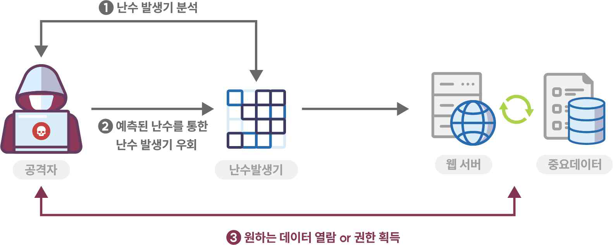

**안전하지 않은 코드 예시**

1:
2:
3:
4:
5:
6:
7:
8:
9:
10:
import random
def get_otp_number():
random_str = ''
# 시스템 현재 시간 값을 시드로 사용하고 있으며, 주요 보안 기능을 위한
# 난수로 안전하지 않다
for i in range(6):
random_str += str(random.randrange(10))
return random_str
다음 코드는 secrets 라이브러리를 사용해 6자리의 난수 값을 생성하는 안전한 예제다.

**안전한 코드 예시**

1:
2:
3:
4:
5:
6:
7:
8:
9:
10:
import secrets
def get_otp_number():
random_str = ''
# 보안기능에 적합한 난수 생성용 secrets 라이브러리 사용
for i in range(6):
random_str += str(secrets.randbelow(10))
return random_str
다음은 세션 토큰값을 생성하는 예제로 random 라이브러리를 사용해 안전하지 않다.

**안전하지 않은 코드 예시**

1:
2:
3:
4:
5:
6:
7:
import random
import string
def generate_session_key():
RANDOM_STRING_CHARS = string.ascii_letters + string.digits
# random 라이브러리를 보안 기능에 사용하면 위험하다
return “”.join(random.choice(RANDOM_STRING_CHARS) for i in range(32))

패스워드나 인증정보 및 보안토큰 생성에 사용하는 경우 안전한 secrets 라이브러리로 생성한 난수를 이용
해야 한다.

**안전한 코드 예시**

1:
2:
3:
4:
5:
6:
7:
import secrets
import string
def generate_session_key():
RANDOM_STRING_CHARS = string.ascii_letters+string.digits
# 보안 기능과 관련된 난수는 secrets 라이브러리를 사용해야 안전하다
return “”.join(secrets.choice(RANDOM_STRING_CHARS) for i in range(32))
라. 참고자료
① CWE-330: Use of Insufficiently Random Values, MITRE,
https://cwe.mitre.org/data/definitions/330.html
② Insecure Randomness, OWASP,
https://owasp.org/www-community/vulnerabilities/Insecure_Randomness
③ Generate pseudo-random numbers, Python Software Foundation,
https://docs.python.org/3/library/random.html
④ Generate secure random numbers for managing secrets, Python Software Foundation,
https://docs.python.org/3/library/secrets.html

9. 취약한 패스워드 허용
가. 개요
사용자에게 강한 패스워드 조합규칙을 요구하지 않으면 사용자 계정이 취약하게 된다. 안전한 패스워드를
생성하기 위해서는 「패스워드 선택 및 이용 안내서」에서 제시하는 패스워드 설정 규칙을 적용해야 한다.
나. 안전한 코딩기법
패스워드 생성 시 강한 조건 검증을 수행한다. 패스워드(패스워드)는 숫자와 영문자, 특수문자 등을 혼합하여
사용하고 주기적으로 변경하여 사용하도록 해야 한다.
다. 코드예제
사용자가 입력한 패스워드에 대한 복잡도 검증 없이 가입 승인 처리를 수행하고 있다.

**안전하지 않은 코드 예시**

1:
2:
3:
4:
5:
6:
7:
8:
9:
10:
11:
12:
13:
14:
15:
16:
17:
18:
19:
20:
from flask import request, redirect
from Models import User
from Models import db
@app.route('/register', methods=['POST'])
def register():
userid = request.form.get('userid')
password = request.form.get('password')
confirm_password = request.form.get('confirm_password')
if password != confirm_password:
return make_response("패스워드가 일치하지 않습니다", 400)
else:
usertable = User()
usertable.userid = userid
usertable.password = password
# 패스워드 생성 규칙을 확인하지 않고 회원 가입
db.session.add(usertable)
db.session.commit()
return make_response("회원가입 성공", 200)

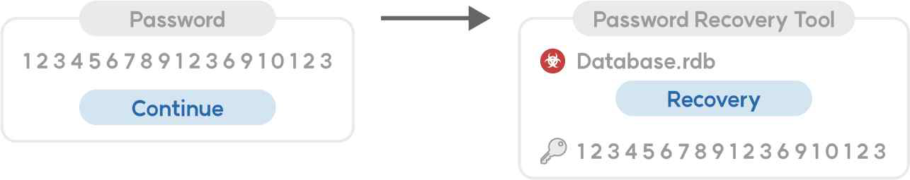

사용자 계정 보호를 위해 회원가입 시 패스워드 복잡도와 길이를 검증 후 가입 승인처리를 수행해야 한다.
코드 내의 특수문자(‘!@#$%^&*’)는 기업 내부 정책에 따라 변경하여 사용하면 되며, 패스워드를 숫자로만
10자리로 구성할 경우 취약할 수 있으니 사용자가 안전한 패스워드로 변경할 수 있도록 안내해야 한다.

**안전한 코드 예시**

1:
2:
3:
4:
5:
6:
7:
8:
9:
10:
11:
12:
13:
14:
15:
16:
17:
18:
19:
20:
21:
22:
23:
24:
25:
26:
27:
28:
29:
30:
31:
32:
33:
34:
35:
36:
37:
38:
39:
40:
41:
from flask import request, redirect
from Models import User
from Models import db
import re
@app.route('/register', methods=['POST'])
def register():
userid = request.form.get('userid')
password = request.form.get('password')
confirm_password = request.form.get('confirm_password')
if password != confirm_password:
return make_response("패스워드가 일치하지 않습니다.", 400)
if not check_password(password):
return make_response("패스워드 조합규칙에 맞지 않습니다.", 400)
else:
usertable = User()
usertable.userid = userid
usertable.password = password
db.session.add(usertable)
db.session.commit()
return make_response("회원가입 성공", 200)
def check_password(password):
# 3종 이상 문자로 구성된 8자리 이상 패스워드 검사 정규식 적용
PT1 = re.compile('^(?=.*[A-Z])(?=.*[a-z])[A-Za-z\d!@#$%^&*]{8,}$')
PT2 = re.compile('^(?=.*[A-Z])(?=.*\d)[A-Za-z\d!@#$%^&*]{8,}$')
PT3 = re.compile('^(?=.*[A-Z])(?=.*[!@#$%^&*])[A-Za-z\d!@#$%^&*]{8,}$')
PT4 = re.compile('^(?=.*[a-z])(?=.*\d)[A-Za-z\d!@#$%^&*]{8,}$')
PT5 = re.compile('^(?=.*[a-z])(?=.*[!@#$%^&*])[A-Za-z\d!@#$%^&*]{8,}$')
PT6 = re.compile('^(?=.*\d)(?=.*[!@#$%^&*])[A-Za-z\d!@#$%^&*]{8,}$')
# 문자 구성 상관없이 10자리 이상 패스워드 검사 정규식
PT7 = re.compile('^[A-Za-z\d!@#$%^&*]{10,}$')
for pattern in [PT1, PT2, PT3, PT4, PT5, PT6, PT7]:
if pattern.match(password):
return True
return False

⦁Django 프레임워크의 VALIDATORS 사용
Django에서는 미들웨어의 AUTH_PASSWORD_VALIDATORS 설정에서 패스워드에 대한 검증을 지원하며,
기본적으로 아래와 같은 검증을 수행한다.
⦁UserAttributeSimilarityValidator : 패스워드가 사용자의 다른 속성값(이름, 성, 이메일)등과의 유사도 확인
⦁MinimumLengthValidator : 패스워드 길이의 최소값 확인(default 8)
⦁CommonPasswordValidator : 사람들이 가장 많이 사용하는 패스워드 20,000개에 해당하는지 확인
⦁NumericPasswordValidator : 패스워드가 숫자로만 구성되어있는지 확인
기본 Validator 외에 필요한 추가 검증 기준이 있다면 사용자 정의 Validator를 생성한 후
AUTH_PASSWORD_VALIDATORS에 등록해 적용 가능하다. 아래는 사용자 Validator 정의 예시를 보여
준다(검증 통과 시 None 반환, 실패 시 ValidationError 발생하도록 구현 필요).

**안전한 코드 예시**

1:
2:
3:
4:
5:
6:
7:
8:
9:
10:
11:
12:
13:
14:
15:
16:
17:
18:
19:
20:
21:
22:
23:
24:
25:
26:
27:
28:
29:
import re
from django.core.exceptions import ValidationError
from django.utils.translation import ugettext as _
class CustomValidator(object):
def validate(self, password, user=None):
# 3종 이상 문자로 구성된 8자리 이상 패스워드 검사 정규식
PT1 = re.compile('^(?=.*[A-Z])(?=.*[a-z])[A-Za-z\d!@#$%^&*]{8,}$')
PT2 = re.compile('^(?=.*[A-Z])(?=.*\d)[A-Za-z\d$@$!%*?&]{8,}$')
PT3 = re.compile('^(?=.*[A-Z])(?=.*[!@#$%^&*])[A-Za-z\d!@#$%^&*]{8,}$')
PT4 = re.compile('^(?=.*[a-z])(?=.*\d)[A-Za-z\d!@#$%^&*]{8,}$')
PT5 = re.compile('^(?=.*[a-z])(?=.*[!@#$%^&*])[A-Za-z\d!@#$%^&*]{8,}$')
PT6 = re.compile('^(?=.*\d)(?=.*[!@#$%^&*])[A-Za-z\d!@#$%^&*]{8,}$')
# 문자 구성 상관없이 10자리 이상 패스워드 검사 정규식
PT7 = re.compile('^[A-Za-z\d!@#$%^&*]{10,}$')
for pattern in [PT1, PT2, PT3, PT4, PT5, PT6, PT7]:
if pattern.match(password):
return None
raise ValidationError(
_("패스워드 조합규칙에 적합하지 않습니다.."),
code='improper_password',
)
def get_help_text(self):
return _(
"패스워드는 영문 대문자, 소문자, 숫자, 특수문자 조합 중 2가지 이상 8자리이거나 문자 구성
상관없이 10자리 이상이어야 합니다."
)

라. 참고자료
① CWE-521: Weak Password Requirements, MITRE,
https://cwe.mitre.org/data/definitions/521.html
② Authentication Cheat Sheet, OWASP,
https://cheatsheetseries.owasp.org/cheatsheets/Authentication_Cheat_Sheet.html
③ Regular Expression HOWTO, Python Software Foundation,
https://docs.python.org/3/howto/regex.html
④ Password management in Django, Django Software Foundation,
https://docs.djangoproject.com/en/4.0/topics/auth/passwords/
10. 부적절한 전자서명 확인
가. 개요
프로그램, 라이브러리, 코드의 전자서명에 대한 유효성 검증이 적절하지 않아 공격자의 악의적인 코드가 실행
가능한 보안약점으로, 클라이언트와 서버 사이의 주요 데이터 전송, 파일 다운로드 시 발생할 수 있다. 데이터
전송 또는 다운로드 시 함께 전달되는 전자서명은 원문 데이터의 암호화된 해시 값으로, 수신측에서 이 서명을
검증해 데이터 변조 여부를 확인할 수 있다. 단순히 해시 기반 검증만 사용할 경우 해시 자체를 변조해 악성코드를
전달할 수 있지만 전자서명을 사용하게 되면 원문 데이터에 대한 해시 자체도 안전하게 보호할 수 있다.
나. 안전한 코딩기법
주요 데이터 전송 또는 다운로드 시 데이터에 대한 전자서명을 함께 전송하고 수신측에서는 전달 받은 전자
서명을 검증해 파일의 변조 여부를 확인해야 한다.

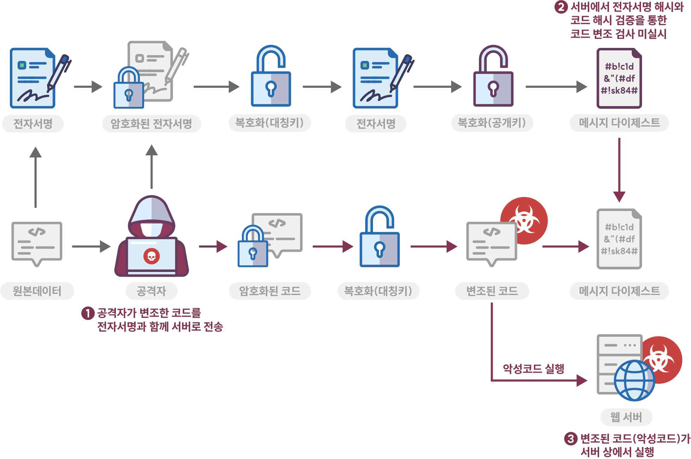

다. 코드예제
다음은 송신측이 데이터와 함께 전달한 전자서명을 수신측에서 별도로 처리하지 않고 데이터를 그대로 신뢰해
데이터 내부에 포함된 파이썬 코드가 실행되는 취약한 예시를 보여 준다.

**안전하지 않은 코드 예시**

1:
2:
3:
4:
5:
6:
7:
8:
9:
10:
11:
12:
13:
14:
15:
16:
17:
18:
19:
20:
21:
22:
23:
24:
25:
26:
27:
28:
import base64
from Crypto.PublicKey import RSA
from Crypto.Hash import SHA256
from Crypto.Signature import PKCS1_v1_5 as SIGNATURE_PKCS1_v1_5
from Crypto.Cipher import PKCS1_v1_5, AES
from Crypto.Util.Padding import unpad
...
def verify_data(request):
# 클라이언트로부터 전달받은 데이터(전자서명을 수신 처리 하지 않음)
encrypted_code = request.POST.get("encrypted_msg", "")  # 암호화된 파이썬 코드
# 서버의 대칭키 로드 (송수신측이 대칭키를 이미 공유했다고 가정)
with open(f"{PATH}/keys/secret_key.out", "rb") as f:
secret_key = f.read()
# 대칭키로 클라이언트가 전달한 파이썬 코드 복호화
# (decrypt_with_symmetric_key 함수는 임의의 함수명으로 세부적인 복호화 과정은 생략함)
origin_python_code = decrypt_with_symmetric_key(secret_key, encrypted_code)
# 클라이언트로부터 전달 받은 파이썬 코드 실행
eval(origin_python_code)
return render(
request,
"/verify_success.html",
{"result": "파이썬 코드를 실행했습니다."},
)
중요한 정보 또는 기능 실행으로 연결되는 데이터를 전달하는 경우 반드시 전자서명을 함께 전송해야 하며,
수신측에서는 전자서명을 확인해 송신측에서 보낸 데이터의 무결성을 검증해야 한다. 만약 송수신 측 언어가
다른 경우 사용한 암호 라이브러리에 따라 데이터 인코딩 방식에 차이가 있으니 반드시 코드 배포 전 서명
검증에 필요한 복호화 과정이 정상적으로 잘 처리되는지 검증해야 한다.

**안전한 코드 예시**

1:
2:
3:
4:
5:
6:
7:
8:
9:
10:
11:
12:
13:
14:
15:
16:
17:
18:
19:
20:
21:
22:
23:
24:
25:
26:
27:
28:
29:
30:
31:
32:
33:
34:
35:
36:
37:
38:
39:
# 전자서명 검증에 사용한 코드는 의존한 파이썬 패키지 및 송신측 언어에 따라
# 달라질 수 있으며, 사전에 공유한 공개키로 복호화한 전자서명과 원본 데이터 해시값의
# 일치 여부를 검사하는 코드를 포함
def verify_digit_signature (
origin_data: bytes, origin_signature: bytes, client_pub_key: str ) -> bool:
hashed_data = SHA256.new(origin_data)
signer = SIGNATURE_PKCS1_v1_5.new(RSA.importKey(client_pub_key))
return signer.verify(hashed_data, base64.b64decode(origin_signature))
def verify_data(request):
# 클라이언트로부터 전달받은 데이터
encrypted_code = request.POST.get("encrypted_msg", "")  # 암호화된 파이썬 코드
encrypted_sig = request.POST.get("encrypted_sig", "")  # 암호화된 전자서명
# 서버의 대칭(비밀)키 및 공개키 로드
with open(f"/keys/secret_key.out", "rb") as f:
secret_key = f.read()
with open(f"/keys/public_key.out", "rb") as f:
public_key = f.read()
# 대칭키로 파이썬 코드 및 전자서명 복호화
origin_python_code = decrypt_with_symmetric_key(symmetric_key, encrypted_code)
origin_signature = decrypt_with_symmetric_key(symmetric_key, encrypted_sig)
# 클라이언트의 공개키를 통해 파이썬 코드(원문)와 전자서명을 검증
verify_result = verify_digit_signature(origin_python_code, origin_signature, client_pub_key)
# 전자서명 검증을 통과했다면 파이썬 코드 실행
if verify_result:
eval(origin_python_code)
return render(request, "/verify_success.html",
{"result": "전자서명 검증 통과 및 파이썬 코드를 실행했습니다."},
)
else:
return render(request, "/verify_failed.html",
{"result": "전자서명 또는 파이썬 코드가 위/변조되었습니다."},
)

라. 참고자료
① CWE-347: Improper Verification of Cryptographic Signature, MITRE,
https://cwe.mitre.org/data/definitions/347.html
② Security Consideration for Code Signing, NIST,
https://csrc.nist.gov/CSRC/media/Publications/white-paper/2018/01/26/security-considerations-for-code
-signing/final/documents/security-considerations-for-code-signing.pdf
③ Verifying a signature, PyCryptodome.
https://www.pycryptodome.org/src/signature/signature?highlight=verify#verifying-a-signature
11. 부적절한 인증서 유효성 검증
가. 개요
인증서가 유효하지 않거나 악성인 경우 공격자가 호스트와 클라이언트 사이의 통신 구간을 가로채 신뢰하는
엔티티 인 것처럼 속일 수 있다. 이로 인해 대상 호스트가 신뢰 가능한 것으로 믿고 악성 호스트에 연결하거나
신뢰된 호스트로부터 전달받은 것처럼 보이는 스푸핑 된(또는 변조된 데이터)를 아무런 의심 없이 수신하는
상황이 발생할 수 있다.
나. 안전한 코딩기법
데이터 통신에 인증서를 사용하는 경우 송신측에서 전달한 인증서가 유효한지 검증한 후 데이터를 송수신해야
한다. 언어에서 기본으로 제공되는 검증 함수가 존재하지 않거나 일반적이지 않은 방식으로 인증서를 생성한
경우 암호화 패키지를 사용해 별도의 검증 코드를 작성해야 한다.
다. 코드예제
다음은 SSL 기반 소켓 연결 예시로, 클라이언트 측에서 통신 대상 서버를 인증하지 않고 접속하는 상황을
보여 준다. 이 경우 서버를 신뢰할 수 없으며 클라이언트 시스템에 영향을 주는 악성 데이터를 수신할 수 있다.

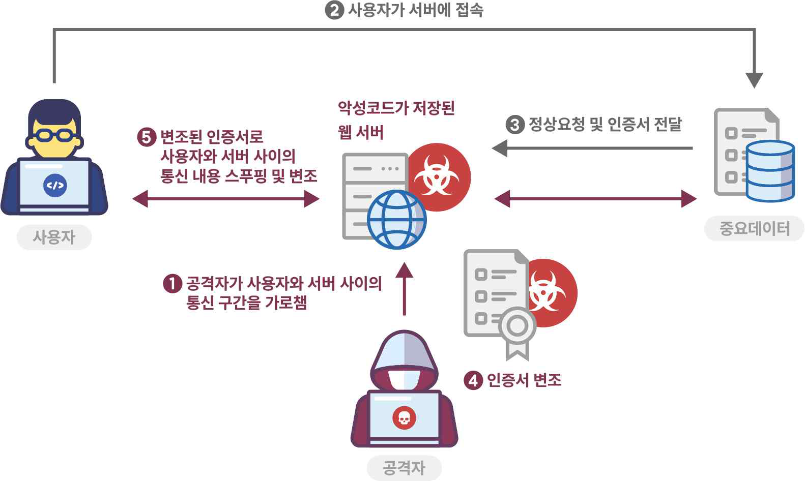

**안전하지 않은 코드 예시**

1:
2:
3:
4:
5:
6:
7:
8:
9:
10:
11:
12:
13:
14:
15:
16:
17:
18:
19:
20:
21:
22:
23:
24:
import os
import socket
import ssl
HOST, PORT = "127.0.0.1", 7917
def connect_with_server():
with socket.socket(socket.AF_INET, socket.SOCK_STREAM, 0) as sock:
# 보안 정책 수동 설정
context = ssl.SSLContext()
# SSLContext 생성자를 직접 호출할 때, CERT_NONE이 기본값
# 상대방을 인증하지 않기 때문에 통신하고자하는 서버의 신뢰성을 보장할 수 없음
context.verify_mode = ssl.CERT_NONE
with context.wrap_socket(sock) as ssock:
try:
ssock.connect((HOST, PORT))
ssock.send("Hello I'm a vulnerable client :)".encode("utf-8"))
data = ssock.recv(1024).decode("utf-8")
print(f">> server from ({HOST}, {PORT}): {data}\n")
finally:
ssock.close()
SSL 연결 시 PROTOCOL_TLS_CLIENT 프로토콜을 추가해 인증서 유효성 검사와 호스트 이름 확인을
위한 context를 구성하면 verify_mode가 CERT_REQUIRED로 설정되며 서버의 인증서 유효성을 검증할 수 있다.

**안전한 코드 예시**

1:
2:
3:
4:
5:
6:
7:
8:
9:
10:
11:
12:
13:
14:
15:
16:
17:
18:
19:
20:
21:
22:
23:
24:
25:
26:
27:
28:
29:
30:
31:
32:
33:
34:
35:
import os
import socket
import ssl
CURRENT_PATH = os.getcwd()
HOST_NAME = "test-server"
HOST, PORT = "127.0.0.1", 7917
SERVER_CA_PEM = f"{CURRENT_PATH}/rsa_server/CA.pem"  # 서버로부터 전달받은 CA 인증서
def connect_with_server():
with socket.socket(socket.AF_INET, socket.SOCK_STREAM, 0) as sock:
# PROTOCOL_TLS_CLIENT 프로토콜을 추가하여 인증서 유효성 검사와 호스트 이름 확인을 위한
# context를 구성. verify_mode가 CERT_REQUIRED로 설정됨
# check_hostname이 True로 설정됨
context = ssl.SSLContext(ssl.PROTOCOL_TLS_CLIENT)
# 서버로부터 전달받은 CA 인증서를 context에 로드
# CERT_REQUIRED로 인해 필수
context.load_verify_locations(SERVER_CA_PEM)
# 호스트 이름(HOST_NAME)이 일치하지 않으면 통신 불가
# 생성된 소켓과 context wrapping 시 server_hostname이 실제 서버에서
# 등록(server.csr)한 호스트 명과 일치해야 함
with context.wrap_socket(sock, server_hostname=HOST_NAME) as ssock:
try:
ssock.connect((HOST, PORT))
ssock.send("Hello I'm a patched client :)".encode("utf-8"))
data = ssock.recv(1024).decode("utf-8")
print(f">> server from ({HOST}, {PORT}): {data}\n")
finally:
ssock.close()

라. 참고자료
① CWE-295: Improper Certificate Validation, MITRE,
https://cwe.mitre.org/data/definitions/295.html
② Identification and Authentication Failures, OWASP,
https://owasp.org/Top10/A07_2021-Identification_and_Authentication_Failures/
③ TLS/SSL Wrapper for Socket Object, Python documentation
https://docs.python.org/ko/3/library/ssl.html
④ Improper Certificate validation, AWS.
https://docs.aws.amazon.com/codeguru/detector-library/python/improper-certificate-validation/
12. 사용자 하드디스크에 저장되는 쿠키를 통한 정보 노출
가. 개요
대부분의 웹 응용프로그램에서 쿠키는 메모리에 상주하며, 브라우저가 종료되면 사라진다. 개발자가 원하는
경우, 브라우저 세션에 관계없이 지속적으로 쿠키 값을 저장하도록 설정할 수 있다. 이 경우 정보는 디스크에
기록되고 다음 브라우저 세션 시작 시 메모리에 로드 된다. 개인정보, 인증 정보 등이 이와 같은 영속적인 쿠키
(Persistent Cookie)에 저장된다면, 공격자는 쿠키에 접근할 수 있는 보다 많은 기회를 가지게 되며, 이는
시스템을 취약하게 만든다.
나. 안전한 코딩기법
쿠키의 만료시간은 세션 지속 시간을 고려하여 최소한으로 설정하고 영속적인 쿠키에는 사용자 권한 등급,
세션 ID 등 중요 정보가 포함되지 않도록 한다.
다. 코드예제
다음은 쿠키의 만료시간을 과도하게 길게 설정해 사용자 하드 디스크에 저장된 쿠키가 도용되는 상황을 보여 준다.

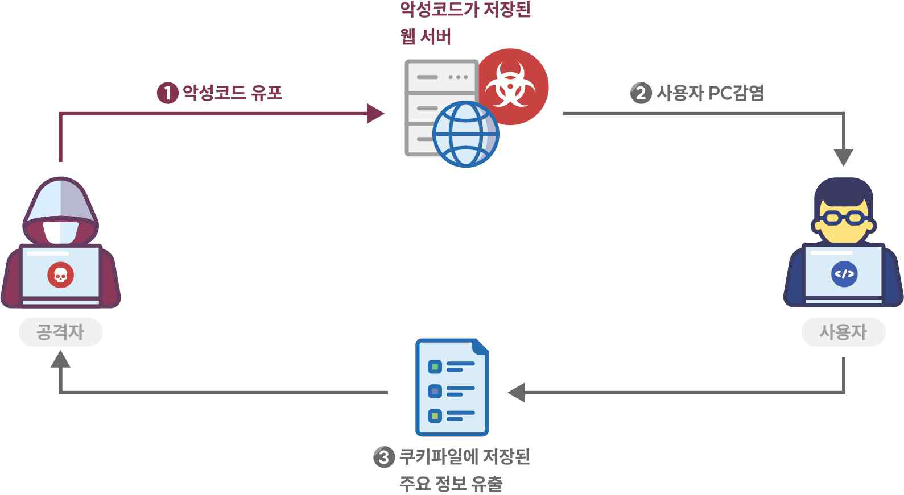

**안전하지 않은 코드 예시**

1:
2:
3:
4:
5:
6:
7:
from django.http import HttpResponse
def remind_user_state(request):
res = HttpResponse()
# 쿠키의 만료시간을 1년으로 과도하게 길게 설정하고 있어 안전하지 않다
res.set_cookie('rememberme', 1, max_age=60*60*24*365)
return res
만료 시간은 해당 기능에 맞춰 최소로 설정하고 영속적인 쿠키에는 중요 정보가 포함되지 않도록 한다. 쿠키를
HTTPS를 통해서만 전송하도록 secure 속성값을 True(기본값은 False)를 사용할 수 있다. 클라이언트 측에서
JavaScript를 통해 쿠키를 접근하지 못하도록 제한 하고자 할 경우엔 httpOnly 속성을 True(기본값은 False)로
설정한다. 다음은 쿠키 만료 시간을 1시간으로 설정한 예시다.

**안전한 코드 예시**

1:
2:
3:
4:
5:
6:
7:
from django.http import HttpResponse
def remind_user_state(request):
res = HttpResponse()
# 쿠키의 만료시간을 적절하게 부여하고 secure 및 httpOnly 옵션을 활성화 한다.
res.set_cookie('rememberme', 1, max_age=60*60, secure=True, httponly=True)
return res
Django에서는 settings.py에 아래와 같이 추가해 전역으로 설정할 수 있다.

**안전한 코드 예시**

1:
2:
3:
4:
5:
6:
7:
8:
9:
10:
11:
12:
13:
14:
15:
16:
17:
18:
19:
20:
21:
22:
23:
24:
25:
from django.http import HttpResponse
from django.conf.global_settings import (
SESSION_COOKIE_AGE,
SESSION_COOKIE_HTTPONLY,
SESSION_COOKIE_HTTPONLY,
)
"""
# settings.py
SESSION_COOKIE_AGE = 60 * 60 * 24 * 14
SESSION_COOKIE_HTTPONLY = True
SESSION_COOKIE_SECURE = True
"""
def remind_user_state(request):
res = HttpResponse()
# 서버 세팅(setting.py)에서 default로 쿠키 옵션을 설정한 상태
res.set_cookie(
"rememerme",
1,
max_age=SESSION_COOKIE_AGE,
secure=SESSION_COOKIE_HTTPONLY,
httponly=SESSION_COOKIE_HTTPONLY,
)
return res
라. 참고자료
① CWE-539: Use of Persistent Cookies Containing Sensitive Information, MITRE,
https://cwe.mitre.org/data/definitions/539.html
② Expire and Max-Age Attributes, OWASP,
https://cheatsheetseries.owasp.org/cheatsheets/Session_Management_Cheat_Sheet.html
#expire-and-max-age-attributes
③ HTTP state management, Python Software Foundation,
https://docs.python.org/ko/3/library/http.cookies.html
④ Django set_cookie, Django Software Foundation,
https://docs.djangoproject.com/en/dev/ref/request-response/#django.http.HttpResponse.set_cookie
⑤ Django Settings, Django Software Foundation,
https://docs.djangoproject.com/en/4.0/ref/settings/#sessions

13. 주석문 안에 포함된 시스템 주요정보
가. 개요
소프트웨어 개발자가 편의를 위해서 주석문에 패스워드를 적어둔 경우 소프트웨어가 완성된 후에는 그것을
제거하는 것이 매우 어렵게 된다. 만약 공격자가 소스코드에 접근할 수 있다면 시스템에 손쉽게 침입할 수 있다.
나. 안전한 코딩기법
주석에는 아이디, 패스워드 등 보안과 관련된 내용을 기입하지 않는다.
다. 코드예제
편리성을 위해 아이디, 패스워드 등 중요정보를 주석문 안에 작성 후 지우지 않는 경우 정보 노출 보안약점이
발생한다.

**안전하지 않은 코드 예시**

1:
2:
3:
4:
5:
6:
7:
def user_login(id, passwd):
# 주석문에 포함된 중요 시스템의 인증 정보
# id = admin
# passwd = passw0rd
result = login(id, passwd)
return result

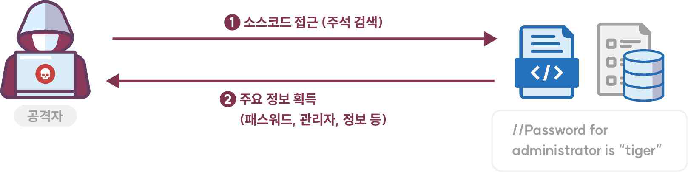

프로그램 개발 시에 주석문 등에 남겨놓은 사용자 계정이나 패스워드 등의 정보는 개발 완료 후 확실하게
삭제해야 한다.

**안전한 코드 예시**

1:
2:
3:
4:
def user_login(id, passwd):
# 주석문에 포함된 민감한 정보는 삭제
result = login(id, passwd)
return result
라. 참고자료
① CWE-615: Inclusion of Sensitive Information in Source Code Comments, MITRE,
https://cwe.mitre.org/data/definitions/615.html

14. 솔트 없이 일방향 해시 함수 사용
가. 개요
패스워드와 같이 중요정보를 저장할 경우 가변 길이 데이터를 고정된 크기의 해시값으로 변환해주는 일방향
해시함수를 이용해 저장할 수 있다. 만약 중요정보를 솔트(Salt)없이 일방향 해시함수를 사용해 저장한다면
공격자는 미리 계산된 레인보우 테이블을 이용해 해시값을 알아낼 수 있다.
나. 안전한 코딩기법
패스워드와 같은 중요 정보를 저장할 경우 임의의 길이인 데이터를 고정된 크기의 해시값으로 변환해주는
일방향 해시함수를 이용하여 저장한다. 또한 솔트값은 사용자별로 유일하게 생성해야 하며, 이를 위해 사용자별
솔트 값을 별도로 저장하는 과정이 필요하다.
파이썬에서는 hashlib 라이브러리를 사용해 해시값을 생성할 수 있으며 salt 값은 os.urandom() 등 안전한
난수 생성 라이브러리를 사용하여 생성해야 한다.
다. 코드예제
다음은 salt 없이 길이가 짧은 패스워드를 해시 함수에 전달해 원문이 공격자에 의해 쉽게 유추되는 예시를 보여 준다.

**안전하지 않은 코드 예시**

1:
2:
3:
4:
5:
6:
7:
import hashlib
def get_hash_from_pwd(pw):
# salt 없이 생성된 해시값은 강도가 약해 취약하다
h = hashlib.sha256(pw.encode())
return h.digest()

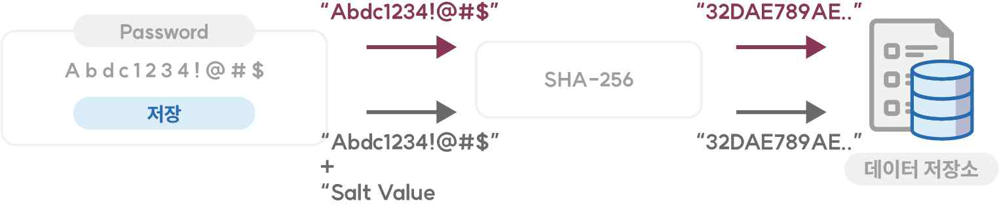

짧은 길이의 패스워드로 강도 높은 해시값을 생성하기 위해서는 반드시 솔트 값을 함께 전달해야 한다.

**안전한 코드 예시**

1:
2:
3:
4:
5:
6:
7:
8:
9:
10:
import hashlib
import secrets
def get_hash_from_pwd(pw):
# 솔트 값을 사용하면 길이가 짧은 패스워드로도 고강도의 해시를 생성할 수 있다.
# 솔트 값은 사용자별로 유일하게 생성해야 하며, 패스워드와 함께 DB에 저장해야 한다
salt = secrets.token_hex(32)
h = hashlib.sha256(salt.encode() + pw.encode())
return h.digest(), salt
라. 참고자료
① CWE-759: Use of a One-Way Hash without a Salt, MITRE,
https://cwe.mitre.org/data/definitions/759.html
② Password Storage Cheat Sheet – Salting, OWASP,
https://cheatsheetseries.owasp.org/cheatsheets/Password_Storage_Cheat_Sheet.html#salting
③ hashlib – Secure hashes and message digests, Python Software Foundation,
https://docs.python.org/3/library/hashlib.html
④ secrets, Python Software Foundation,
https://docs.python.org/ko/3/library/secrets.html#module-secrets

15. 무결성 검사없는 코드 다운로드
가. 개요
원격지에 위치한 소스코드 또는 실행 파일을 무결성 검사 없이 다운로드 후 이를 실행하는 프로그램이  존재
한다. 이러한 프로그램은 호스트 서버의 변조, DNS 스푸핑(Spoofing) 또는 전송 시의 코드 변조 등의 방법을
이용해 공격자가 악의적인 코드를 실행하는 위협에 취약하게 된다.
파일(및 해당 소프트웨어) 무결성을 확인하는 두 가지 주요 방법으로는 암호화 해시 및 디지털 서명이 있다.
무결성을 보장하기 위해 해시를 사용하고 가능하면 적절한 코드 서명 인증서를 사용하고 확인하는 것이 더
안전하다.
나. 안전한 코딩기법
DNS 스푸핑(Spoofing)을 방어할 수 있는 DNS lookup을 수행하고 코드 전송 시 신뢰할 수 있는 암호
기법을 이용해 코드를 암호화한다. 또한 다운로드한 코드는 작업 수행을 위해 필요한 최소한의 권한으로 실행
하도록 한다.
소스코드는 신뢰할 수 있는 사이트에서만 다운로드해야 하고 파일의 인증서 또는 해시값을 검사해 변조되지
않은 파일인지 확인하여야 한다.
다. 코드예제
다음 예제는 requests.get을 통해 원격에서 파일을 다운로드한 뒤 파일에 대한 무결성 검사를 수행하지 않아
파일 변조 등으로 인한 피해가 발생하는 사례를 보여 준다. 이 경우 공격자가 악의적인 코드를 실행할 수 있다.

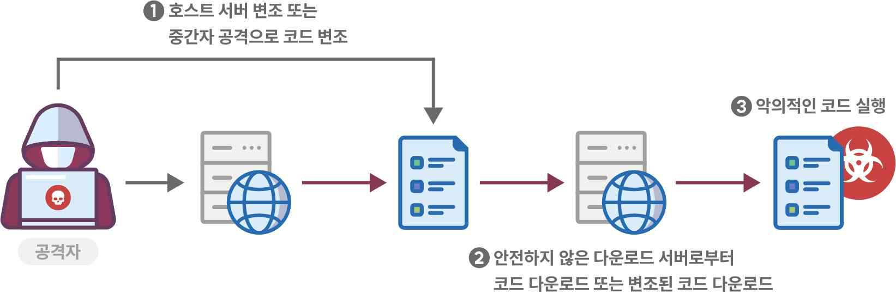

**안전하지 않은 코드 예시**

1:
2:
3:
4:
5:
6:
7:
8:
9:
10:
11:
12:
13:
14:
import requests
def execute_remote_code():
# 신뢰할 수 없는 사이트에서 코드를 다운로드
url = "https://www.somewhere.com/storage/code.py"
# 원격 코드 다운로드
file = requests.get(url)
remote_code = file.content
file_name = 'save.py'
with open(file_name, 'wb') as f:
f.write(file.content)
......
안전한 코드 실행을 위해 다운로드한 파일과 해당 파일의 해시값 비교 등을 통해 무결성 검사를 거치고 코드를
실행해야 한다.

**안전한 코드 예시**

1:
2:
3:
4:
5:
6:
7:
8:
9:
10:
11:
12:
13:
14:
15:
16:
17:
18:
19:
20:
21:
22:
23:
24:
25:
26:
import requests
import hashlib
import configparser
def execute_remote_code():
config = configparser.RawConfigParser()
config.read(‘sample_config.cfg’)
url = "https://www.somewhere.com/storage/code.py"
remote_code_hash = config.get('HASH', 'file_hash')
# 원격 코드 다운로드
file = requests.get(url)
remote_code = file.content
sha = hashlib.sha256()
sha.update(remote_code)
# 다운로드 받은 파일의 해시값 검증
if sha.hexdigest() != remote_code_hash:
raise Exception(‘파일이 손상되었습니다.’)
file_name = 'save.py'
with open(file_name, 'wb') as f
f.write(file.content)
......

라. 참고자료
① CWE-494: Download of Code Without Integrity Check, MITRE,
https://cwe.mitre.org/data/definitions/494.html
② Secure hashes and message digests, Python Software Foundation,
https://docs.python.org/3/library/hashlib.html
➂ Top 25 Series – Download of Code Without Integrity Check, SANS,
https://www.sans.org/blog/top-25-series-rank-20-download-of-code-without-integrity-check/
16. 반복된 인증시도 제한 기능 부재
가. 개요
일정 시간 내에 여러 번의 인증 시도 시 계정 잠금 또는 추가 인증 방법 등의 충분한 조치가 수행되지 않는
경우 공격자는 성공할 법한 계정과 패스워드들을 사전(Dictionary)으로 만들고 무차별 대입(brute-force)하여
로그인 성공 및 권한 획득이 가능하다.
Django는 사용자 인증 요청 횟수를 제어하지 않는다. 인증 시스템에 대한 무차별 대입 공격으로부터 보호하기
위해 Django 플러그인(django-defender) 또는 웹 서버 모듈을 사용하여 요청을 제한할 수도 있다.
나. 안전한 코딩기법
최대 인증시도 횟수를 적절한 횟수로 제한하고 설정된 인증 실패 횟수를 초과할 경우 계정을 잠금 하거나
추가적인 인증 과정을 거쳐서 시스템에 접근이 가능하도록 한다. 코드 상에서 인증시도 횟수를 제한하는 방법
외에 CAPTCHA나 Two-Factor 인증 방법도 설계 시부터 고려해야 한다.
다. 코드예제
다음 예제는 사용자 로그인 시도에 대한 횟수를 제한하지 않는 코드를 보여 준다.

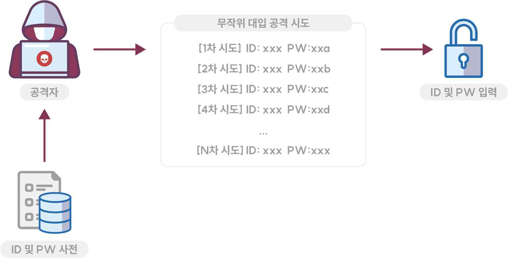

**안전하지 않은 코드 예시**

1:
2:
3:
4:
5:
6:
7:
8:
9:
10:
11:
12:
13:
14:
15:
16:
17:
import hashlib
from django.shortcuts import render
def login(request):
user_id = request.POST.get('user_id', '')
user_pw = request.POST.get('user_pw', '')
sha = hashlib.sha256()
sha.update(user_pw.encode(‘utf-8’))
hashed_passwd = get_user_pw(user_id)
# 인증 시도에 따른 제한이 없어 반복적인 인증 시도가 가능
if sha.hexdigest() == hashed_passwd:
return render(request, '/index.html', {'state':'login_success'})
else:
return render(request, '/login.html', {'state':'login_failed'})
다음은 사용자 로그인 시도에 대한 횟수를 제한하여 무차별 공격에 대응하는 방법을 보여 준다.

**안전한 코드 예시**

1:
2:
3:
4:
5:
6:
7:
8:
9:
10:
11:
12:
13:
14:
15:
16:
17:
import hashlib
from django.shortcuts import render
from .models import LoginFail
LOGIN_TRY_LIMIT = 5
def login(request):
user_id = request.POST.get('user_id', '')
user_pw = request.POST.get('user_pw', '')
sha = hashlib.sha256()
sha.update(user_pw.encode(‘utf-8’))
hashed_passwd = get_user_pw(user_id)
if sha.hexdigest() == hashed_passwd:
# 로그인 성공 시 실패 횟수 삭제
LoginFail.objects.filter(user_id=user_id).delete()
return render(request, '/index.html', {'state':'login_success'})

**안전한 코드 예시**

18:
19:
20:
21:
22:
23:
24:
25:
26:
27:
28:
29:
30:
31:
32:
33:
34:
35:
36:
37:
# 로그인 실패 기록 가져오기
if LoginFail.objects.filter(user_id=user_id).exists():
login_fail = LoginFail.objects.get(user_id=user_id)
COUNT = login_fail.count
else:
COUNT = 0
if COUNT >= LOGIN_TRY_LIMIT:
# 로그인 실패횟수 초과로 인해 잠금된 계정에 대한 인증 시도 제한
return render(request, "/account_lock.html", {"state": "account_lock"})
else:
# 로그인 실패 횟수 DB 기록
# 첫 시도라면 DB에 insert,
# 실패 기록이 존재한다면 update
LoginFail.objects.update_or_create(
user_id=user_id,
defaults={"count": COUNT + 1},
)
return render(request, "/login.html", {"state": "login_failed"})
라. 참고자료
① CWE-307: Improper Restriction of Excessive Authentication Attempts, MITRE,
https://cwe.mitre.org/data/definitions/307.html
② Blocking Brute Force Attacks, OWASP,
https://owasp.org/www-community/controls/Blocking_Brute_Force_Attacks
➂ additional security topics, Django Software Foundation,
https://docs.djangoproject.com/en/3.2/topics/security/#additional-security-topics
➃ Django-defender,
https://github.com/jazzband/django-defender

---

**제3절 시간 및 상태**

동시 또는 거의 동시에 여러 코드 수행을 지원하는 병렬 시스템이나 하나 이상의 프로세스가 동작되는 환경에서
시간 및 상태를 부적절하게 관리하여 발생할 수 있는 보안약점이다.
1. 경쟁조건: 검사시점과 사용시점(TOCTOU)
가. 개요
병렬시스템(멀티프로세스로 구현한 응용프로그램)에서는 자원(파일, 소켓 등)을 사용하기에 앞서 자원의 상태를
검사한다. 하지만 자원을 사용하는 시점과 검사하는 시점이 다르기 때문에 검사하는 시점(Time Of Check)에
존재하던 자원이 사용하던 시점(Time Of Use)에 사라지는 등 자원의 상태가 변하는 경우가 발생한다.
예를 들어 프로세스 A와 B가 존재하는 병렬시스템 환경에서 프로세스 A는 자원사용(파일 읽기)에 앞서 해당
자원(파일)의 존재 여부를 검사(TOC) 한다. 이때는 프로세스 B가 해당 자원(파일)을 아직 사용(삭제)하지 않았기
때문에 프로세스 A는 해당 자원(파일)이 존재한다고 판단한다. 그러나 프로세스 A가 자원 사용(파일읽기)을
시도하는 시점(TOU)에 해당 자원(파일)은 사용불가능 상태이기 때문에 오류 등이 발생할 수 있다.

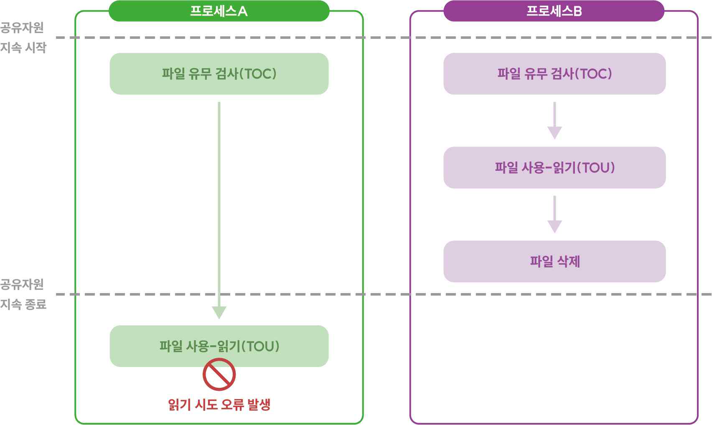

이와 같이 하나의 자원에 대해 동시에 검사시점과 사용시점이 달라 생기는 보안약점으로 인해 동기화 오류뿐만
아니라 교착상태 등과 같은 문제점이 발생할 수 있다.
파이썬에서는 멀티스레드 환경에서 공유 자원에 여러 쓰레드가 접근하는 것을 막기 위해 Lock 객체를 제공
한다(자원의 상태를 잠금으로 변경하는 acquire() 메서드와 사용 중인 자원을 해제하는 release() 메서드).
나. 안전한 코딩기법
변수, 파일과 같은 공유자원을 여러 프로세스가 접근하여 사용할 경우 동기화 구문을 사용하여 한 번에 하나의
프로세스만 접근 가능하도록 해야 하며 성능에 미치는 영향을 최소화하기 위해 임계영역(critical section) 주변만
동기화 구문을 사용한다.
파이썬의 Lock 객체 사용 시 lock.acquire()로 자원을 잠그고 lock.release()로 자원을 해제해야 하며 이
부분을 with 문을 사용해 간단하게 표현할 수 있다.
다. 코드예제
다음 예제는 공유된 파일을 사용할 때 파일을 불러온 후 실제로 파일을 사용하는 부분이 실행되기 전 짧은
시간에도 다른 사용자 또는 프로그램에 의해 파일이 사라져 원하는 기능을 실행할 수 없는 경우를 보여 준다.

**안전하지 않은 코드 예시**

1:
2:
3:
4:
5:
6:
7:
8:
9:
10:
11:
12:
13:
14:
15:
16:
17:
18:
19:
import os
import io
import datetime
import threading
def write_shared_file(filename, content):
# 멀티스레드 환경에서는 다른 사용자들의 작업에 따라 파일이 사라질 수
# 있기 때문에 공유 자원에 대해서는 검사와 사용을 동시에 해야 한다.
if os.path.isfile(filename) is True:
f = open(filename, 'w')
f.seek(0, io.SEEK_END)
f.write(content)
f.close()
def start():
filename = ‘./temp.txt’
content = f“start time is {datetime.datetime.now()}”
my_thread = threading.Thread(target=write_shared_file, args=(filename, content))
my_thread.start()

다음은 파일 검사 후 파일이 삭제되거나 변동되는 것을 예방하기 위해 lock을 사용하여 각 쓰레드에서 공유
자원에 접근하는 것을 통제 하는 예제 코드를 보여 준다. lock을 acquire하면 해당 쓰레드만 공유 데이터에
접근 할 수 있고 lock을 release 해야만 다른 쓰레드에서 공유 데이터에 접근 할 수 있다.

**안전한 코드 예시**

1:
2:
3:
4:
5:
6:
7:
8:
9:
10:
11:
12:
13:
14:
15:
16:
17:
18:
19:
20:
import os
import io
import datetime
import threading
lock = threading.Lock()
def write_shared_file(filename, content):
# lock을 이용하여 여러 사용자가 동시에 파일에 접근하지 못하도록 제한
with lock:
if os.path.isfile(filename) is True:
f = open(filename, 'w')
f.seek(0, io.SEEK_END)
f.write(content)
f.close()
def start():
filename = ‘./temp.txt’
content = f“start time is {datetime.datetime.now()}”
my_thread = threading.Thread(target=write_shared_file, args=(filename, content))
my_thread.start()
라. 참고자료
① CWE-367: Time-of-check Time-of-use (TOCTOU) Race Condition, MITRE,
https://cwe.mitre.org/data/definitions/367.html
② Thread-based parallelism, Python Software Foundation,
https://docs.python.org/3/library/threading.html

2. 종료되지 않는 반복문 또는 재귀 함수
가. 개요
재귀 함수의 순환 횟수를 제어하지 못해 할당된 메모리나 프로그램 스택 등의 자원을 개발자가 의도한 범위를
과도하게 초과해 사용하면 위험하다. 대부분의 경우 기본 케이스(Base Case4))가 정의되어 있지 않은 재귀
함수는 무한 루프에 빠져들게 되고 자원고갈을 유발함으로써 시스템의 정상적인 서비스를 제공할 수 없게 한다.
파이썬에서는 재귀 함수의 재귀 반복 제한(Recursion Depth Limit)이 적용되어 있어 무한루프가 발생하지
않으나, setrecursionlimit() 함수를 사용해 임의로 최대 깊이를 변경해 사용하는 경우 재귀 함수 호출 횟수가
과도하게 많아지지 않도록 주의해야 한다.
나. 안전한 코딩기법
모든 재귀 호출 시 호출 횟수를 제한하거나 재귀 함수 종료 조건을 명확히 정의해 호출을 제어해야 한다.
파이썬의 recursionlimit 제한은 스택 오버플로우 발생을 막기 위한 방법으로, recursionlimit 값을 과도하게
큰 값으로 설정하지 않아야 한다.
다. 코드예제
다음 코드 예시의 factorial 함수는 함수 내부에서 자신을 호출하는 함수로 재귀문을 빠져 나오는 조건을
정의하고 있지 않아 시스템 장애를 유발할 수 있다.
4) 기본 케이스(Base Case)는 재귀 호출을 하지 않고 반환하는 방법을 의미한다.

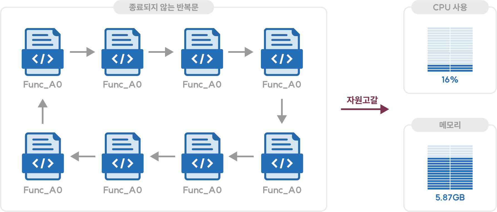

**안전하지 않은 코드 예시**

1:
2:
3:
4:
5:
6:
7:
8:
def factorial(num):
# 재귀함수 탈출조건을 설정하지 않아 동작 중 에러 발생
return num * factorial(num – 1)
if __name__ == '__main__':
itr = 5
result = factorial(itr)
print(str(itr) + ' 팩토리얼 값은 : ' + str(result))
특정 조건 또는 횟수에 따라 재귀 코드 실행을 중단해 프로그램이 무한 반복에 빠지지 않도록 한다.

**안전한 코드 예시**

1:
2:
3:
4:
5:
6:
7:
8:
9:
10:
11:
def factorial(num):
# 재귀함수 사용 시에는 탈출 조건을 명시해야 한다.
if (num == 0):
return 1
else:
return num * factorial(num - 1)
if __name__ == '__main__':
itr = 5
result = factorial(itr)
print(str(itr) + ' 팩토리얼 값은 : ' + str(result))
파이썬의 재귀 반복 제한은 기본이 1000으로 설정되어 있다. Anaconda의 경우는 기본 값이 2000이다.
이 값을 과도하게 변경하지 않아야 한다.

**안전한 코드 예시**

1:
2:
3:
import sys
sys.setrecursionlimit(1000)

라. 참고자료
① CWE-674: Uncontrolled Recursion, MITRE,
https://cwe.mitre.org/data/definitions/674.html
② CWE-835: Loop with Unreachable Exit Condition ('Infinite Loop'), MITRE,
https://cwe.mitre.org/data/definitions/835.html
③ sys.setrecursionlimit, Python Software Foundation,
https://docs.python.org/3/library/sys.html#sys.setrecursionlimit

---

**제4절 에러처리**

에러를 처리하지 않거나 불충분하게 처리하여 에러 정보에 중요정보(시스템 내부정보 등)가 포함될 때 발생
할 수 있는 보안약점이다.
1. 오류 메시지 정보노출
가. 개요
응용 프로그램이 실행환경, 사용자 등 관련 데이터에 대한 민감한 정보를 포함하는 오류 메시지를 생성해
외부에 제공하는 경우 공격자의 악성 행위로 이어질 수 있다. 예외발생 시 예외 이름이나 추적 메시지
(traceback)를 출력하는 경우 프로그램 내부 구조를 쉽게 파악할 수 있기 때문이다.
Django 프레임워크와 Flask 프레임워크는 HTTP 오류 코드가 있는 요청을 처리하기 위한 사용자 에러 페이지
핸들러를 제공한다.
나. 안전한 코딩기법
오류 메시지는 정해진 사용자에게 유용한 최소한의 정보만 포함하도록 한다. 소스코드에서 예외 상황은 내부적
으로 처리하고 사용자에게 시스템 내부 정보 등 민감한 정보를 포함하는 오류를 출력하지 않고 미리 정의된
메시지를 제공하도록 설정한다.
Django 프레임워크에서는 urls.py에 사용자 정의 에러 페이지 핸들러를 정의할 수 있다.

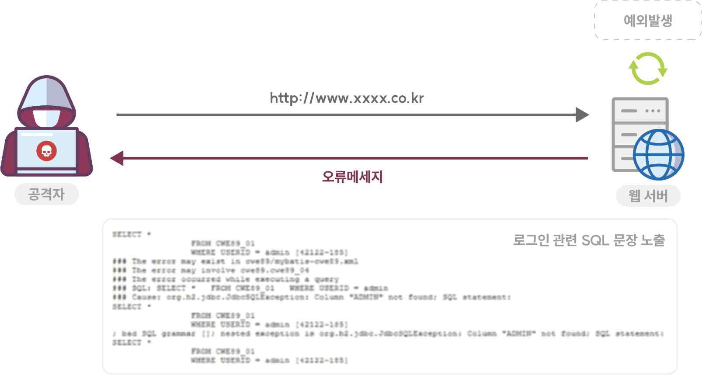

다. 코드예제
사용자 요청을 정상적으로 처리할 수 없는 경우 에러 페이지에 디버그 정보 또는 서버의 정보가 노출될 수
있다. 어플리케이션 배포 시 DEBUG 모드를 True로 설정하고 배포할 경우에 아래와 같이 시스템의 주요 정보가
노출될 수도 있다. Django는 DEBUG 모드를 False로 배포했을 경우 아래와 같이 사용자 에러 페이지를 설정
하지 않으면 Django 기본 에러 페이지가 출력된다.

**안전하지 않은 코드 예시**

1:
2:
# config/urls.py
# 별도의 에러 페이지를 선언하지 않아 django의 기본 에러 페이지를 출력한다
제공되는 에러 페이지 핸들러를 이용해 별도의 에러 페이지를 생성하여 사용자에게 표현하고 서버의 정보노출을
최소화해야 한다.

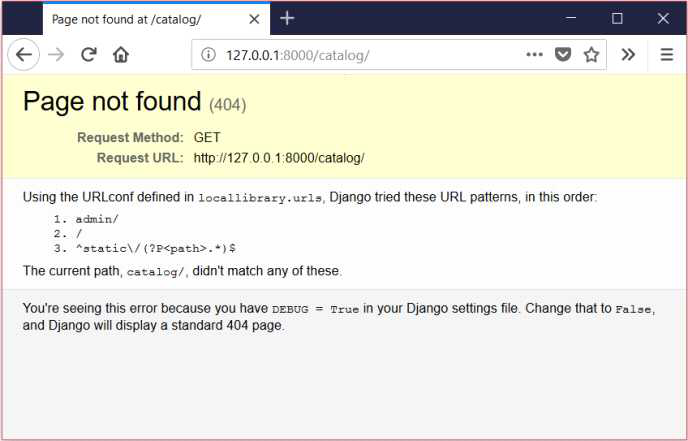

**안전한 코드 예시**

1:
2:
3:
4:
5:
6:
7:
8:
9:
# config/urls.py
from django.conf.urls import handler400, handler403, handler404, handler500
# 사용자 정의 에러 페이지를 지정하고
# views.py에 사용자 정의 에러 페이지에 대한 코드를 구현하여 사용한다
handler400 = "blog.views.error400"
handler403 = "blog.views.error403"
handler404 = "blog.views.error404"
handler500 = "blog.views.error500“
아래는 traceback을 사용하여 에러 스택을 표준 출력으로 표시해 정보가 노출되는 예제를 보여 준다.

**안전하지 않은 코드 예시**

1:
2:
3:
4:
5:
6:
7:
8:
9:
10:
11:
12:
13:
14:
15:
import traceback
def fetch_url(url, useragent, referer=None, retries=1, dimension=False):
......
try:
response = requests.get(
url,
stream=True,
timeout=5,
headers={ 'User-Agent': useragent, 'Referer': referer },
)
......
except IOError:
# 에러메시지를 통해 스택 정보가 노출.
traceback.print_exc()

오류 처리 시 아래와 같이 에러 이름이나 에러 추적 정보가 노출되지 않도록 한다.

**안전한 코드 예시**

1:
2:
3:
4:
5:
6:
7:
8:
9:
10:
11:
12:
13:
import logging
def fetch_url(url, useragent, referer=None, retries=1, dimension=False):
......
try:
response = requests.get(url, stream=True, timeout=5, headers={
'User-Agent': useragent,
'Referer': referer,
})
  ......
except IOError:
# 에러 코드와 정보를 별도로 정의하고 최소 정보만 로깅
logger.error('ERROR-01:통신에러')
라. 참고자료
① CWE-209: Generation of Error Message Containing Sensitive Information, MITRE
https://cwe.mitre.org/data/definitions/209.html
② Improper Error Handling, OWASP,
https://owasp.org/www-community/Improper_Error_Handling
③ Errors and Exceptions, Python Software Foundation,
https://docs.python.org/3/tutorial/errors.html
➃ Django Error views, Django Software Foundation,
https://docs.djangoproject.com/en/3.2/ref/views/#error-views
➄ Flask Error Handlers, Flask
https://flask.palletsprojects.com/en/2.0.x/errorhandling/#error-handlers

2. 오류상황 대응 부재
가. 개요
오류가 발생할 수 있는 부분을 확인하였으나 이러한 오류에 대해 예외 처리를 하지 않을 경우 공격자는 오류
상황을 악용해 개발자가 의도하지 않은 방향으로 프로그램이 동작하도록 할 수 있다.
예외처리는 코드를 견고하게 만들고 프로그램 제어 실패로 인해 의도치 않은 중단으로 이어지는 잠재적인
오류를 방지하는데 도움이 된다.
나. 안전한 코딩기법
오류가 발생할 수 있는 부분에 대하여 제어문(try-except)을 사용해 적절하게 예외 처리한다.
다. 코드예제
다음 예제는 try 블록에서 발생하는 오류를 포착(except)하고 있지만 그 오류에 대해서 아무 조치를 하지
않는 상황을 보여준다. 아무 조치가 없으므로 프로그램이 계속 실행되기 때문에 개발자가 의도하지 않은 방향
으로 프로그램이 동작할 수 있다.

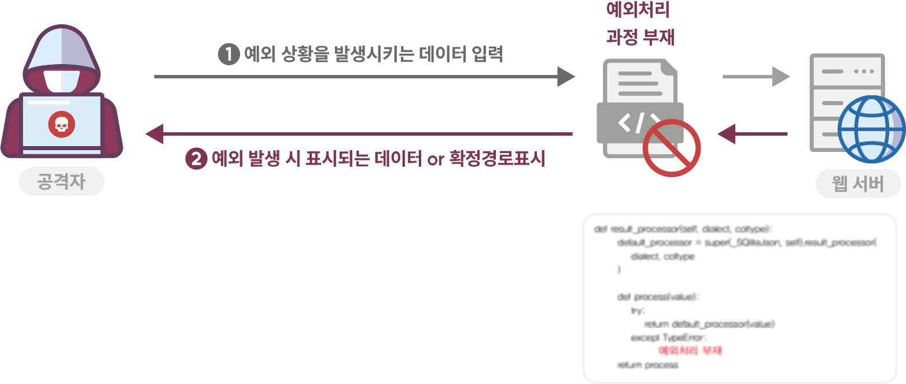

**안전하지 않은 코드 예시**

1:
2:
3:
4:
5:
6:
7:
8:
9:
10:
11:
12:
13:
14:
15:
16:
17:
18:
19:
20:
21:
22:
23:
24:
import base64
from Crypto.Cipher import AES
from Crypto.Util.Padding import pad
static_keys=[
{'key' : b'\xb9J\xfd\xa9\xd2\xefD\x0b\x7f\xb2\xbcy\x9c\xf7\x9c',
‘iv'  : b'\xf1BZ\x06\x03TP\xd1\x8a\xad"\xdc\xc3\x08\x88\xda'},
{'key' : b'Z\x01$.:\xd4u3~\xb6TS(\x08\xcc\xfc',
'iv'  : b'\xa1a=:\xba\xfczv]\xca\x83\x9485\x14\x17'},
]
def encryption(key_id, plain_text):
static_key = {'key':b'0000000000000000', 'iv':b'0000000000000000'}
try:
static_key = static_keys[key_id]
except IndexError:
# key 선택 중 오류 발생 시 기본으로 설정된 암호화 키인
# ‘0000000000000000’ 으로 암호화가 수행된다.
pass
cipher_aes = AES.new(static_key['key'],AES.MODE_CBC,static_key['iv'])
encrypted_data = base64.b64encode(cipher_aes.encrypt(pad(plain_text.encode(), 32)))
return encrypted_data.decode('ASCII')
예외상황 발생 시에 프로그램이 개발자의 의도와 다르게 동작하지 않도록 반드시 예외 처리 구문을 추가해야 한다.

**안전한 코드 예시**

1:
2:
3:
4:
5:
6:
7:
8:
9:
10:
11:
12:
13:
14:
15:
16:
17:
18:
19:
20:
21:
22:
23:
24:
import base64
from Crypto.Cipher import AES
from Crypto.Util.Padding import pad
static_keys=[
{'key' : b'\xb9J\xfd\xa9\xd2\xefD\x0b\x7f\xb2\xbcy\x9c\xf7\x9c',
‘iv'  : b'\xf1BZ\x06\x03TP\xd1\x8a\xad"\xdc\xc3\x08\x88\xda'},
{'key' : b'Z\x01$.:\xd4u3~\xb6TS(\x08\xcc\xfc',
'iv'  : b'\xa1a=:\xba\xfczv]\xca\x83\x9485\x14\x17'},
]
def encryption(key_id, plain_text):
static_key = {'key':b'0000000000000000', 'iv':b'0000000000000000'}
try:
static_key = static_keys[key_id]
except IndexError:
# key 선택 중 오류 발생 시 랜덤으로 암호화 키를 생성하도록 설정
static_key = {'key': secrets.token_bytes(16), 'iv': secrets.token_bytes(16)}
static_keys.append(static_key)
cipher_aes = AES.new(static_key['key'],AES.MODE_CBC,static_key['iv'])
encrypted_data = base64.b64encode(cipher_aes.encrypt(pad(plain_text.encode(), 32)))
return encrypted_data.decode('ASCII')
라. 참고자료
① CWE-390: Detection of Error Condition Without Action, MITRE,
https://cwe.mitre.org/data/definitions/390.html
② Errors and Exceptions, Python Software Foundation,
https://docs.python.org/3/tutorial/errors.html
➂ Built-in Exceptions, Python Software Foundation,
https://docs.python.org/3/library/exceptions.html

3. 부적절한 예외 처리
가. 개요
프로그램 수행 중에 함수의 결과 값에 대한 적절한 처리 또는 예외 상황에 대한 조건을 적절하게 검사 하지
않을 경우 예기치 않은 문제를 야기할 수 있다.
나. 안전한 코딩기법
값을 반환하는 모든 함수의 결과값을 검사해야 한다. 결과값이 개발자가 의도했던 값인지 검사하고 예외 처리를
사용하는 경우에 광범위한 예외 처리 대신 구체적인 예외 처리를 수행한다.
다. 코드예제
다음 예제는 다양한 예외가 발생할 수 있음에도 불구하고 광범위한 예외 처리로 예외상황에 따른 적절한
조치가 부적절한 사례를 보여 준다.

**안전하지 않은 코드 예시**

1:
2:
3:
4:
5:
6:
7:
8:
9:
10:
11:
import sys
def get_content():
try:
f = open('myfile.txt')
s = f.readline()
i = int(s.strip())
# 예외처리를 세분화 할 수 있음에도 광범위하게 사용하여 예기치 않은
# 문제가 발생할 수 있다
except:
print("Unexpected error ")
다음은 발생 가능한 예외를 세분화한 후 예외상황에 따라 적합한 처리한 예시를 보여 준다.

**안전한 코드 예시**

1:
2:
3:
4:
5:
6:
7:
8:
9:
10:
11:
12:
13:
def get_content():
try:
f = open('myfile.txt')
s = f.readline()
i = int(s.strip())
# 발생할 수 있는 오류의 종류와 순서에 맞춰서 예외 처리 한다.
except FileNotFoundError:
print("file is not found")
except OSError:
print("cannot open file")
except ValueError:
print("Could not convert data to an integer.")
라. 참고자료
① CWE-754: Improper Check for Unusual or Exceptional Conditions, MITRE,
https://cwe.mitre.org/data/definitions/754.html
② Errors and Exceptions, Python Software Foundation,
https://docs.python.org/3/tutorial/errors.html
➂ Built-in Exceptions, Python Software Foundation,
https://docs.python.org/3/library/exceptions.html

---

**제5절 코드오류**

타입 변환 오류, 자원(메모리 등)의 부적절한 반환 등과 같이 개발자가 범할 수 있는 코딩 오류로 인해 유발
되는 보안약점이다.
1. Null Pointer 역참조
가. 개요
널 포인터(Null Pointer) 역참조는 '일반적으로 그 객체가 널(Null)이 될 수 없다'라고 하는 가정을 위반했을
때 발생한다. 공격자가 의도적으로 널 포인터 역참조를 발생시키는 경우 공격자는 그 결과로 발생하는 예외
상황을 이용해 추후 공격 계획에 활용할 수 있다.
파이썬에서는 Null pointer dereference가 발생하지 않는다. 파이썬에서는 Null 객체가 사용되지 않으며
대신 None 키워드를 사용해 null 개체와 변수를 정의 한다. None은 다른 언어의 null과 동일한 기능을 수행
하지 않으며 None이 0 또는 다른 값을 정의 하진 않는다.
나. 안전한 코딩기법
None을 반환하는 함수를 사용하면 None과 다른 값(예: 0이나 빈 문자열)이 조건문에서 False로 평가될
수 있기 때문에 실수하기 쉽다. None이 될 수 있는 데이터를 참조하기 전에 해당 데이터의 값이 None 인지
검사하여 시스템 오류를 줄일 수 있다.

다. 코드예제
파이썬에서는 포인터를 사용하지는 않지만 데이터에 대한 적절한 검사를 수행하지 않을 경우 Null pointer와
유사한 None 값 참조 오류를 범할 수 있다.

**안전하지 않은 코드 예시**

1:
2:
3:
4:
5:
6:
7:
8:
9:
10:
11:
12:
13:
14:
15:
16:
17:
18:
19:
20:
21:
22:
import os
from django.shortcuts import render
from xml.sax import make_parser
from xml.sax.handler import feature_namespaces
def parse_xml(request):
filename = request.POST.get('filename')
# filename의 None 체크를 하지 않아 에러 발생 가능
if (filename.count('.') > 0):
name, ext = os.path.splitext(filename)
else:
ext = ''
if ext == ".xml":
parser = make_parser()
parser.setFeature(feature_namespaces, True)
handler = Handler()
parser.setContentHandler(handler)
parser.parse(filename)
result = handler.root
return render(request, "/success.html", {"result": result})
참조하고자 하는 자원을 호출 시에는 반드시 개체가 None이 아닌지 검증해야 한다.

**안전한 코드 예시**

1:
2:
3:
4:
5:
6:
7:
8:
9:
10:
11:
12:
13:
14:
15:
16:
17:
18:
19:
20:
21:
22:
23:
24:
25:
import os
from django.shortcuts import render
from xml.sax import make_parser
from xml.sax.handler import feature_namespaces
def parse_xml(request):
filename = request.POST.get('filename')
# filename이 None 인지 체크
if filename is None or filename.strip() == "":
return render(request, "/error.html", {"error": "파일 이름이 없습니다."})
if (filename.count('.') > 0):
name, ext = os.path.splitext(filename)
else:
ext = ''
if ext == ".xml":
parser = make_parser()
parser.setFeature(feature_namespaces, True)
handler = Handler()
parser.setContentHandler(handler)
parser.parse(filename)
result = handler.root
return render(request, "/success.html", {"result": result})
라. 참고자료
① CWE-476: NULL Pointer Dereference, MITRE,
https://cwe.mitre.org/data/definitions/476.html
② Null Dereference, OWASP,
https://owasp.org/www-community/vulnerabilities/Null_Dereference
➂ Built-in Constants, Python Software Foundation,
https://docs.python.org/3/library/constants.html?#None

2. 부적절한 자원 해제
가. 개요
프로그램의 자원, 예를 들면 열려 있는 파일 식별자(Open File Descriptor), 힙 메모리(Heap Memory),
소켓(Socket) 등은 유한한 자원이다. 이러한 자원을 할당 받아 사용을 마치고 더 이상 사용하지 않는 경우에는
적절히 반환해야 하는데, 프로그램 오류 또는 에러로 사용이 끝난 자원을 반환하지 못하는 경우에 문제가 발생
할 수 있다.
나. 안전한 코딩기법
자원을 획득하여 사용한 다음에는 반드시 자원을 해제 후 반환한다.
다. 코드예제
다음은 try 구문 내의 코드 실행 중 오류가 발생할 경우 close() 메소드가 실행되지 않아 사용한 자원이
반환되지 않는 경우를 보여 준다.

**안전하지 않은 코드 예시**

1:
2:
3:
4:
5:
6:
7:
8:
9:
10:
11:
12:
13:
14:
def get_config():
lines = None
try:
f = open('config.cfg')
lines = f.readlines()
# 예외 발생 상황 가정
raise Exception("Throwing the exception!")
# try 절에서 할당한 자원이 반환(close)되기 전에
# 예외가 발생하면 할당된 자원이 시스템에 반환되지 않음
f.close()
return lines
except Exception as e:
...
return ''
예외 상황이 발생하여 함수가 종료될 때 예외의 발생 여부와 상관없이 항상 실행되는 finally 블록에서 할당
받은 모든 자원을 반환해야 한다.

**안전한 코드 예시**

1:
2:
3:
4:
5:
6:
7:
8:
9:
10:
11:
12:
13:
14:
def get_config():
lines = None
try:
f = open('config.cfg')
lines = f.readlines()
# 예외 발생 상황 가정
raise Exception("Throwing the exception!")
except Exception as e:
...
finally:
# try 절에서 할당한 자원은
# finally 절에서 시스템에 반환을 해야 한다
f.close()
return lines
다른 방법은 with 문을 사용해 파일을 처리하는 방법으로 with 문의 블록이 끝날 때 자동으로 파일 자원을
반환하는 예시다. 이렇게 작성하면 with문 내의 코드에 예외가 발생하더라도 항상 파일 닫기가 보장된다.

**안전한 코드 예시**

1:
2:
3:
# with 절을 빠져나갈 때 f를 시스템에 반환
with open('config.cfg') as f:
print(f.read())
라. 참고자료
① CWE-404: Improper Resource Shutdown or Release, MITRE,
https://cwe.mitre.org/data/definitions/404.html
② Unreleased Resource, OWASP,
https://owasp.org/www-community/vulnerabilities/Unreleased_Resource
➂ The With statement, Python Software Foundation,
https://docs.python.org/3/reference/compound_stmts.html#grammar-token-python-grammar-with_stmt

3. 신뢰할 수 없는 데이터의 역직렬화
가. 개요
직렬화(Serialization)는 프로그램에서 특정 클래스의 현재 인스턴스 상태를 다른 서버로 전달하기 위해 클래스의
인스턴스 정보를 바이트 스트림으로 복사하는 작업으로, 메모리상에서 실행되고 있는 객체의 상태를 그대로
복제해 파일로 저장하거나 수신 측에 전달하게 된다.
역직렬화(Deserialization)는 반대 연산으로 바이너리 파일(Binary File) 이나 바이트 스트림(Byte Stream)
으로부터 객체 구조로 복원하는 과정이다. 이 때 송신자가 네트워크를 이용해 직렬화된 정보를 수신자에게 전달
하는 과정에서 공격자가 전송한 데이터 또는 저장된 스트림을 조작할 수 있는 경우 신뢰할 수 없는 역직렬화로
인한 무결성 침해, 원격 코드 실행, 서비스 거부 공격 등이 발생 할 수 있는 보안약점이다.
파이썬에서는 pickle 모듈을 통해 직렬화(pickle) 및 역직렬화(unpickle)를 수행할 수 있다. pickle 모듈은
데이터 변조에 대한 검증 과정이 없기 때문에 임의의 코드를 실행하는 악의적인 pickle 데이터를 구성할 수 있어
pickle을 사용해 역직렬화 하는 경우 hmac으로 데이터에 서명하거나 json 모듈을 사용하는 것을 고려해야 한다.
나. 안전한 코딩기법
초기화되지 않은 스택 메모리 영역의 변수는 임의값이라고 생각해서 대수롭지 않게 생각할 수 있으나 사실은
이전 함수에서 사용되었던 내용을 포함하고 있다. 공격자는 이러한 약점을 사용하여 메모리에 저장되어 있는
값을 읽거나 특정 코드를 실행할 수 있다. 모든 변수를 사용 전에 반드시 올바른 초기 값을 할당함으로서 이러한
문제를 예방할 수 있다.

신뢰할 수 없는 데이터를 역직렬화 하지 않도록 응용 프로그램을 구성한다. 민감 정보 또는 중요 정보 전송 시
암호화 통신을 적용할 수 없는 경우 최소한 송신 측에서 서명을 추가하고 수신 측에서 서명을 확인하여 데이터의
무결성을 검증해야 한다. 또는 신뢰할 수 있는 데이터의 식별을 위해 역직렬화 대상의 데이터가 사전에 검증된
클래스(Class)만을 포함하는지 검증하거나 제한된 실행 권한만으로 역직렬화 코드를 실행해야 한다.
다. 코드예제
다음 예제는 신뢰할 수 없는 사용자로부터 입력 받은 코드를 역직렬화 하고 있는데, 이와 같은 코드는 개발자가
의도하지 않은 임의 코드 실행으로 이어질 수 있다.

**안전하지 않은 코드 예시**

1:
2:
3:
4:
5:
6:
7:
8:
9:
import pickle
from django.shortcuts import render
def load_user_object(request):
# 사용자로부터 입력받은 알 수 없는 데이터를 역직렬화
pickled_userinfo = pickle.dump(request.POST.get('userinfo', ''))
# 역직렬화(unpickle)
user_obj = pickle.loads(pickled_userinfo)
return render(request, '/load_user_obj.html', {'obj':user_obj})
아래 예제는 사용자로부터 전달받은 데이터를 HMAC을 이용하여 안전한 사용자로부터 온 것인지 검증한 후
역직렬화 하고 있다.
이 밖에도 역직렬화된 데이터의 특정 부분만 필요로 하는 경우 JSON과 같은 텍스트 형태의 안전한 직렬화
형식을 사용하는 것이 좋다.

**안전한 코드 예시**

1:
2:
3:
4:
5:
6:
7:
8:
9:
10:
11:
12:
13:
14:
15:
16:
17:
18:
19:
20:
21:
22:
23:
24:
import hmac
import hashlib
import pickle
from django.shortcuts import render
def load_user_object(request):
# 데이터 변조를 확인하기 위한 해시값
hashed_pickle = request.POST.get("hashed_pickle", "")
# 사용자로부터 입력받은 데이터를 직렬화(pickle)
pickled_userinfo = pickle.dumps(request.POST.get("userinfo", ""))
# HMAC 검증을 위한 비밀키는 생성
m = hmac.new(key="secret_key".encode("utf-8"), digestmod=hashlib.sha512)
# 직렬화된 사용자 입력값을 해싱
m.update(pickled_userinfo)
# 전달받은 해시값(hashed_pickle)과 직렬화 데이터(userinfo)의 해시값을 비교하여 검증
if hmac.compare_digest(str(m.digest()), hashed_pickle):
user_obj = pickle.loads(pickled_userinfo)
return render(request, "/load_user_obj.html", {"obj": user_obj})
else:
return render(request, "/error.html", {"error": "신뢰할 수 없는 데이터입니다."}
라. 참고자료
① CWE-502: Deserialization of Untrusted Data, MITRE,
https://cwe.mitre.org/data/definitions/502.html
② Deserialization Cheat Sheet, OWASP,
https://cheatsheetseries.owasp.org/cheatsheets/Deserialization_Cheat_Sheet.html
③ Python object serialization, Python Software Foundation,
https://docs.python.org/3/library/pickle.html

---

**제6절 캡슐화**

중요한 데이터 또는 기능성을 불충분하게 캡슐화하거나 잘못 사용함으로써 발생하는 보안약점으로 정보노출,
권한 문제 등이 발생할 수 있다.
1. 잘못된 세션에 의한 데이터 정보 노출
가. 개요
다중 스레드 환경에서는 싱글톤(Singleton) 객체 필드에 경쟁조건(Race Condition)이 발생할 수 있다. 따라서
다중 스레드 환경에서는 정보를 저장하는 전역 변수가 포함되지 않도록 코드를 작성해 서로 다른 세션에서
데이터를 공유하지 않도록 해야 한다.
나. 안전한 코딩기법
싱글톤 패턴을 사용하는 경우 변수 범위(Scope)에 주의를 기울여야 한다. 특히 다중 스레드 환경에서 클래스
변수의 값은 하위 메소드와 공유되므로 필요한 경우 인스턴스 변수로 선언하여 사용한다.

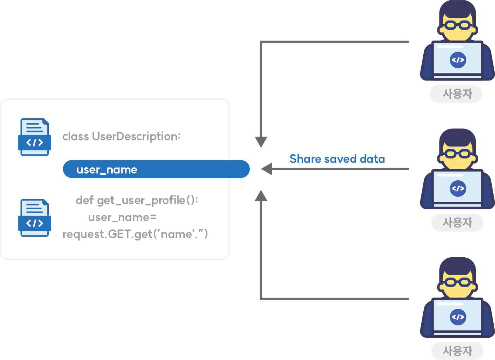

다. 코드예제
다중 스레드 환경에서 파이썬의 클래스 변수는 스레드 간 서로 공유하게 된다. 클래스 변수에 값을 할당할
경우 서로 다른 세션 간에 데이터가 공유되어 의도하지 않은 데이터가 전달될 수 있다.

**안전하지 않은 코드 예시**

1:
2:
3:
4:
5:
6:
7:
8:
9:
10:
11:
12:
13:
14:
15:
16:
17:
18:
from django.shortcuts import render
class UserDescription:
user_name = ''
def get_user_profile(self):
result = self.get_user_discription(UserDescription.user_name)
......
return result
def show_user_profile(self, request):
# 클래스변수는 다른 세션과 공유되는 값이기 때문에 멀티스레드
# 환경에서 공유되지 않아야 할 자원을 사용하는 경우
# 다른 스레드 세션에 의해 데이터가 노출될 수 있다
UserDescription.user_name = request.POST.get(‘name’, ‘’)
self.user_profile = self.get_user_profile()
return render(request, 'profile.html', {'profile':self.user_profile})
공유가 금지된 변수는 인스턴스 변수로 선언하여 세션 간에 공유되지 않도록 한다.

**안전한 코드 예시**

1:
2:
3:
4:
5:
6:
7:
8:
9:
10:
11:
12:
13:
14:
from django.shortcuts import render
class UserDescription:
def get_user_profile(self):
result = self.get_user_discription(self.user_name)
......
return result
def show_user_profile(self, name):
# 인스턴스 변수로 사용해 스레드 간 공유되지 않도록 한다
self.user_name = request.POST.get(‘name’, ‘’)
self.user_profile = self.get_user_profile()
return render(request, 'profile.html', {'profile':self.user_profile})
라. 참고자료
① CWE-488: Exposure of Data Element to Wrong Session, MITRE,
https://cwe.mitre.org/data/definitions/488.html
② CWE-543: Use of Singleton Pattern Without Synchronization in a Multithreaded Context, MITRE,
https://cwe.mitre.org/data/definitions/543.html
➂ The global statement, Python Software Foundation,
https://docs.python.org/3/reference/simple_stmts.html#global

2. 제거되지 않고 남은 디버그 코드
가. 개요
디버깅 목적으로 삽입된 코드는 개발이 완료되면 제거해야 한다. 디버그 코드는 설정 등의 민감한 정보 또는
의도하지 않은 시스템 제어로 이어질 수 있는 정보를 담고 있을 수 있다. 만일 디버그 코드가 남겨진 채로
배포될 경우 공격자가 식별 과정을 우회하거나 의도하지 않은 정보 노출로 이어질 수 있다.
Django 프레임워크, Flask 프레임워크는 전역 수준에서 DEBUG 모드를 설정할 수 있다. DEBUG 모드를
사용하면 브라우저에서 임의의 파이썬 코드를 실행할 수도 있고 파이썬에서 발생한 모든 오류가 출력되어 정보
노출의 위험이 있다. 어플리케이션을 배포 전에 반드시 DEBUG 모드를 비활성화 해야 한다.
나. 안전한 코딩기법
소프트웨어 배포 전 반드시 디버그 코드를 확인 및 삭제한다. Django 프레임워크의 경우 전역 수준에서
DEBUG 모드를 비활성화 하려면 settings.py 파일에 설정을 하고 Flask 프레임워크는 app_run() 전에
debug = False로 설정하면 된다.

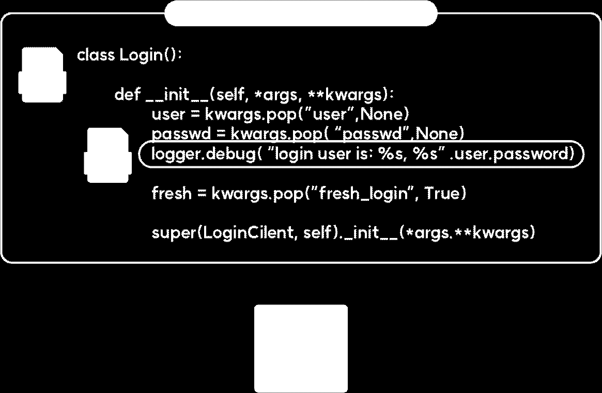

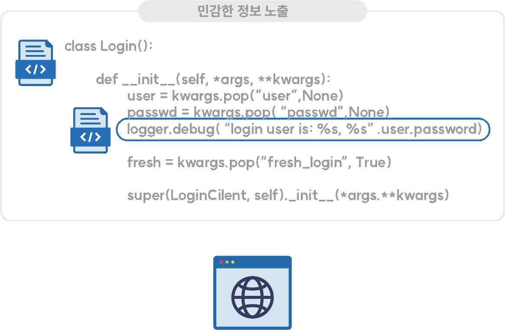

다. 코드예제
다음은 Django의 미들웨어 세팅 파일인 settings.py 파일 예시로, 개발 시 사용된 DEBUG 옵션이 True로
설정되어 있어 정보 노출의 위험이 있다.
가) Django 예제

**안전하지 않은 코드 예시**

1:
2:
3:
4:
5:
6:
7:
8:
9:
10:
11:
12:
13:
14:
from django.urls import reverse_lazy
from django.utils.text import format_lazy
DEBUG = True
ROOT_URLCONF = 'test.urls'
SITE_ID = 1
DATABASES = {
'default': {
'ENGINE': 'django.db.backends.sqlite3',
'NAME': ':memory:',
}
}
개발이 끝난 소스코드를 배포 및 운영할 경우에는 반드시 DEBUG 옵션을 False로 변경해야 한다.

**안전한 코드 예시**

1:
2:
3:
4:
5:
6:
7:
8:
9:
10:
11:
12:
13:
14:
from django.urls import reverse_lazy
from django.utils.text import format_lazy
DEBUG = False
ROOT_URLCONF = 'test.urls'
SITE_ID = 1
DATABASES = {
'default': {
'ENGINE': 'django.db.backends.sqlite3',
'NAME': ':memory:',
}
}

나) Flask 예제
다음은 Flask의 예제로, debug 모드가 True로 설정되어 정보 노출의 위험이 있다.

**안전하지 않은 코드 예시**

1:
2:
3:
4:
5:
6:
7:
8:
9:
10:
11:
12:
13:
14:
from flask import Flask
app = Flask(__name__)
# 디버그 모드 설정 방법1
app.debug = True
@app.route('/')
def hello_world():
return 'Hello World!'
if __name__ == '__main__':
app.run()
# 디버그 모드 설정 방법2
app.run(debug=True)
마찬가지로 개발이 끝난 소스코드를 배포 및 운영 시 반드시 debug 옵션을 False로 변경해야 한다.

**안전한 코드 예시**

1:
2:
3:
4:
5:
6:
7:
8:
9:
10:
11:
12:
13:
from flask import Flask
app = Flask(__name__)
app.debug = False
@app.route('/')
def hello_world():
return 'Hello World!'
if __name__ == '__main__':
app.run()
app.run(debug=False)

라. 참고자료
① CWE-489: Active Debug Code, MITRE,
https://cwe.mitre.org/data/definitions/489.html
② Settings, Django Software Foundation,
https://docs.djangoproject.com/en/3.2/ref/settings/#debug
➂ Debug Mode, Flask,
https://flask.palletsprojects.com/en/2.0.x/quickstart/#debug-mode
3. Public 메소드로부터 반환된 Private 배열
가. 개요
파이썬은 명시적인 private 선언이 없다. 하지만 대부분의 파이썬 코드가 따르는 규칙으로 이름 앞에 밑줄
(예:__spam)로 시작하면 private 로 처리된다. public으로 선언된 메소드에서 배열을 반환하면 해당 배열의
참조 객체가 외부에 공개되어 외부에서 배열 수정과 객체 속성 변경이 가능해진다. 이러한 속성은 배열 뿐만
아니라 변경 가능한(mutable) 모든 객체에 해당된다.
구분
표시 방법
public
attribute, method는 기본적으로 public
protect
attribute, method 앞에 _(single underscore)를 붙여서 표시 함.
실제 제약 보다는 관례적임.
private
attribute, method 앞에 __(double underscore)를 붙여서 표시 함.
파이썬은 네임 맹글링(name mangling)으로 private 멤버에 _class__member로 접근은 가능하지만
바람직하지 않음.
나. 안전한 코딩기법
private로 선언된 배열을 public으로 선언된 메소드로 반환하지 않도록 한다. private 배열에 대한 복사본을
반환하도록 하고 배열의 원소에 대해서는 clone() 메소드를 통해 복사된 원소를 저장하도록 해서 private 선언된
배열과 객체 속성에 대한 의도치 않은 수정을 방지한다. 만약 배열의 원소가 String 타입 등과 같이 변경이
되지 않는 경우(immutable)에는 private 배열의 복사본을 만들고 이를 반환하도록 작성한다.
다. 코드예제
다음 예제는 private 변수를 생성하고 이를 반환하는 public 메소드를 사용하는 예시를 보여 준다. 이 경우
외부에서 클래스 내에 숨겨져 있는 private 배열 값에 접근할 수 있는 문제점이 발생한다.

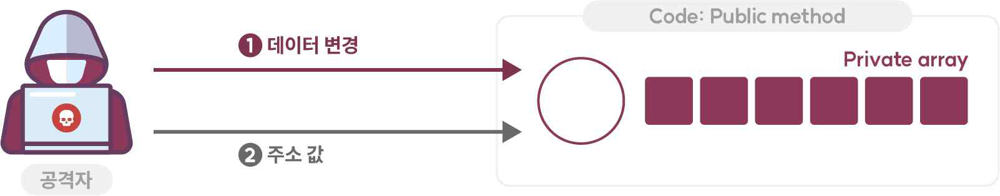

**안전하지 않은 코드 예시**

1:
2:
3:
4:
5:
6:
7:
8:
class UserObj:
__private_variable = []
def __init__(self):
pass
# private 배열을 리턴하는 public 메소드를 사용하는 경우 취약함
def get_private_member(self):
return self.__private_variable
아래 예제는 내부와 외부의 배열이 서로 참조되는 것을 예방하기 위해 [:]로 새로운 객체를 생성하여 값을
반환하고 있다.

**안전한 코드 예시**

1:
2:
3:
4:
5:
6:
7:
8:
9:
class UserObj:
__private_variable = []
def __init__(self):
pass
# private 배열을 반환하는 경우 [:]를 사용하여 외부와 내부의
# 배열이 서로 참조되지 않도록 해야 한다
def get_private_member(self):
return self.__private_variable[:]
라. 참고자료
① CWE-495: Private Data Structure Returned From A Public Method, MITRE,
https://cwe.mitre.org/data/definitions/495.html
② Do not return references to private mutable class members, CERT,
https://wiki.sei.cmu.edu/confluence/display/java/OBJ05-J.+Do+not+return+references+to+private+mutable
+class+members
③ Shallow and deep copy operations, Python Software Foundation,
https://docs.python.org/3/library/copy.html

4. Private 배열에 Public 데이터 할당
가. 개요
public으로 선언된 메소드의 인자가 private로 선언된 배열에 저장되면 private 배열을 외부에서 접근하여
배열 수정과 객체 속성 변경이 가능해진다.
나. 안전한 코딩기법
public으로 선언된 메소드의 인자를 private 로 선언된 배열에 저장하지 않도록 한다. 사용자가 전달한 값으로
클래스 외부에서 private 값을 변경해서는 안 되며, 필요한 경우 별도의 인스턴스 변수로 정의하거나 의도한
기능이라면 전달된 값의 정상 여부를 검증한 후 적용해야 한다.
다. 코드예제
다음 예제는 __를 이용해서 파이썬의 내부 배열을 생성하고 외부 값을 대입하는 public 메소드를 사용하는
예시를 보여 준다. 이 경우 특정 배열 타입에 따라 외부에서 private 배열을 변조할 수 있는 문제를 내포하고 있다.

**안전하지 않은 코드 예시**

1:
2:
3:
4:
5:
6:
7:
8:
9:
class UserObj:
__private_variable = []
def __init__(self):
pass
# private 배열에 외부 값을 바로 대입하는 public 메소드를 사용하는
# 경우 취약하다
def set_private_member(self, input_list):
self.__private_variable = input_list

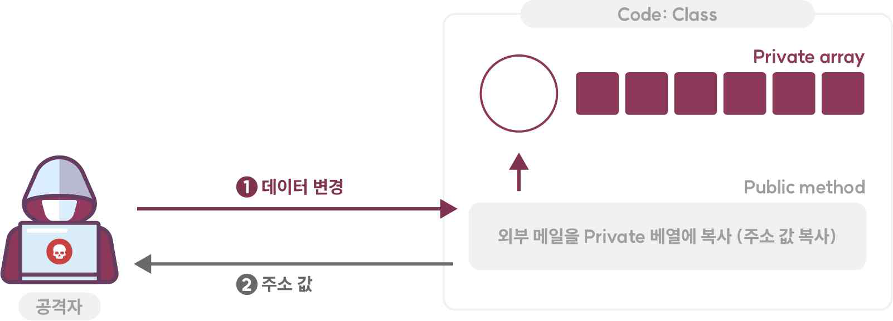

아래 예제는 내부와 외부의 배열이 서로 참조되는 것을 예방하기 위해 [:]로 새로운 객체를 생성하여 값을
대입하고 있다.

**안전한 코드 예시**

1:
2:
3:
4:
5:
6:
7:
8:
class UserObj:
def __init__(self):
self.__privateVariable = []
# private 배열에 외부 값을 바로 대입하는 경우 [:]를 사용하여
# 외부와 내부의 배열이 서로 참조되지 않도록 해야 한다
def set_private_member(self, input_list):
self.__privateVariable = input_list[:]
라. 참고자료
① CWE-496: Public Data Assigned to Private Array-Typed Field, MITRE,
https://cwe.mitre.org/data/definitions/496.html
② Shallow and deep copy operations, Python Software Foundation,
https://docs.python.org/3/library/copy.html
➂ Private Variables, Python Software Foundation,
https://docs.python.org/3/tutorial/classes.html#private-variables

---

**제7절 API 오용**

의도된 사용에 반하는 방법으로 API를 사용하거나 보안에 취약한 API를 사용하여 발생할 수 있는 보안약점이다.
1. DNS lookup에 의존한 보안결정
가. 개요
공격자가 DNS 엔트리를 속일 수 있으므로 도메인명에 의존에서 보안결정(인증 및 접근 통제 등)을 하지
않아야 한다. 만약 로컬 DNS 서버의 캐시가 공격자에 의해 오염된 상황이라면 사용자와 특정 서버 간의 네트워크
트래픽이 공격자를 경유하도록 할 수도 있다. 또한 공격자가 마치 동일 도메인에 속한 서버인 것처럼 위장 할
수도 있다.
나. 안전한 코딩기법
보안결정에서 도메인명을 이용한 DNS lookup을 하지 않도록 한다.

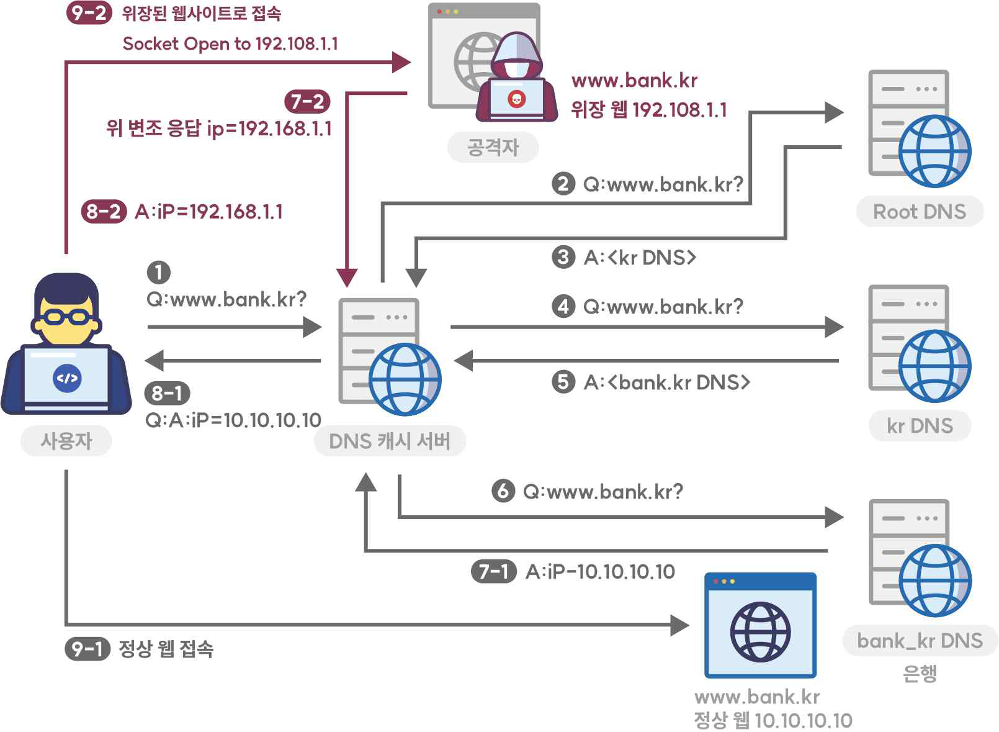

다. 코드예제
다음의 예제는 도메인명을 통해 해당 요청을 신뢰할 수 있는지를 검사하는 예시로, 공격자는 DNS 캐쉬 등을
조작해서 쉽게 이러한 보안 설정을 우회할 수 있다.

**안전하지 않은 코드 예시**

1:
2:
3:
4:
5:
6:
7:
8:
def is_trust(host_domain_name):
trusted = False
trusted_host = "trust.example.com"
# 공격자에 의해 실행되는 서버의 DNS가 변경될 수 있으므로
# 안전하지 않다
if trusted_host == host_name:
trusted = True
return trusted
도메인명을 이용한 비교를 하지 말고 IP 주소를 직접 비교하도록 수정해 코드를 안전하게 만들 수 있다.

**안전한 코드 예시**

1:
2:
3:
4:
5:
6:
7:
8:
9:
10:
11:
import socket
def is_trust(host_domain_name):
trusted = False
trusted_ip = "192.168.10.7“
# 실제 서버의 IP 주소를 비교하여 DNS 변조에 대응
dns_resolved_ip = socket.gethostbyname(host_domain_name)
if trusted_ip == dns_resolved_ip:
trusted = True
return trusted
라. 참고자료
① CWE-350: Reliance on Reverse DNS Resolution for a Security-Critical Action, MITRE,
https://cwe.mitre.org/data/definitions/350.html
➁ Socket, Python Software Foundation,
https://docs.python.org/3/library/socket.htm

2. 취약한 API 사용
가. 개요
취약한 API는 보안상 금지된 함수이거나 부주의하게 사용될 가능성이 많은 API를 의미한다. 별도의 외부
의존성 없이 언어 엔진에서 제공하는 기능만으로 큰 규모의 프로그램 제작이 용이한 C/C++과 같은 언어와
달리, 파이썬은 외부 의존성을 기본으로 하는 생태계를 토대로 한다. 패키지(package)라고 부르는 모듈 집합을
통해 서로 다른 제작자의 작업 결과물을 손쉽게 프로그램에 탑재하고 활용할 수 있다. 이러한 파이썬의 생태계는
언어 활용성과 확장성 측면에서 굉장히 큰 이점을 가지고 있으며, 소프트웨어 개발의 접근성을 크게 높여주는데
기여했다(파이썬 기본 설치 시 제공되는 엔진 코드도 패키지 형태로 코드에서 사용할 수 있다).
하지만 이러한 파이썬 언어의 특성은 잠재적인 보안 위협을 내포하고 있으며 주의하지 않을 경우 소프트웨어에
심각한 문제를 가져다 줄 수 있다. 파이썬 패키지는 기본적으로 다른 개발자가 작성한 코드로, 의도적인 악성코드를
포함할 수 있을뿐만 아니라 의도하지 않은 오류 또는 약점으로 인해 또 다른 보안 문제를 야기할 수 있다.
파이썬 패키지 설치에 사용되는 pip 도구는 파이썬 패키지 인덱스(PyPI)에 등록된 파이썬 패키지를 검색
및 설치하는 도구로, 누구나 여기에 패키지를 등록해 배포할 수 있다. 물론 대부분의 경우 많은 오픈소스 개발자
들의 피드백과 평점, 그리고 레퍼런스가 쌓인 패키지를 사용하겠지만, 이와는 별개로 그 누구도 패키지 내부에
취약점이 없다는 보장을 할 수 없다. 안전하지 않은 것으로 알려진 패키지에 대해서는 PyPI에서 따로 그 목록을
관리하지만, 잘 알려지지 않은 패키지로 인한 위험은 여전히 존재한다.
프로그램 코드에서 외부 패키지 사용 시 보안 문제가 발생하게 되는 원인을 크게 두 가지로 분류할 수 있다.
첫 번째, 사용자 배포 패키지 내의 결함으로 인한 취약점
두 번째, 언어 엔진 자체의 결함으로 인한 취약점(기본 제공 패키지)

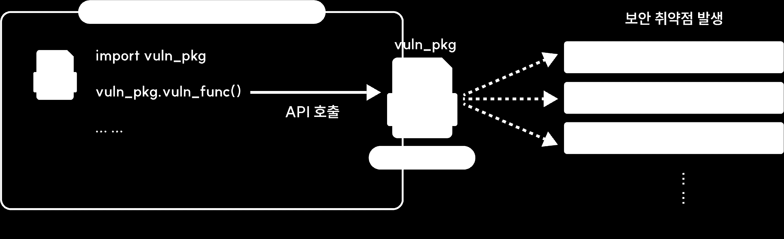

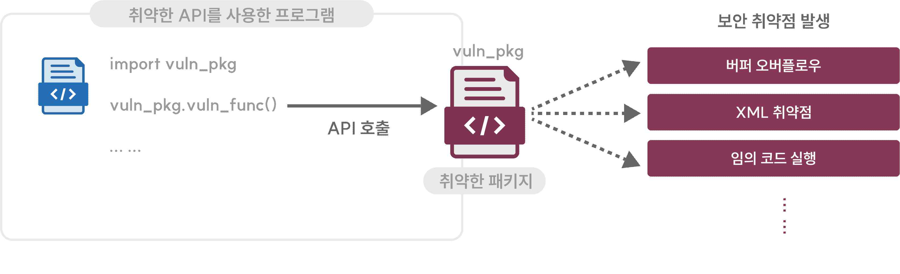

사용자 배포 패키지 내의 결함은 말 그대로 패키지 코드 내에 보안 약점이 존재하는 경우를 의미한다. 많은
경우 특정 함수의 데이터 처리 로직 문제로 의도된 조작값을 함수에 전달할 경우 보안취약점이 발생하는 방식
으로 동작하며, 이는 개발자의 개발 방식에도 영향을 주게 된다. 완화 방안으로는 취약한 패키지를 사용하지
않거나 취약한 버전을 사용하지 않거나, 함수 실행 전후 보호 루틴을 적용해 코드를 보호하는 방법이 있다.
언어 엔진 내부에서도 보안 결함이 지속적으로 발견되고 있다. 엔진 내부 결함은 대부분 개발자의 개발 방식에
영향을 주지 않으며 취약점과 관련된 로직이 포함된 경우에만 문제가 될 수 있다. 엔진 결함은 해당 취약점이
개선된 버전으로 Node.js 버전을 업데이트 해서 완화할 수 있다.
나. 안전한 API 선택
근본적인 대응 방법은 취약한 API를 코드에 사용하지 않는 것이다. 하지만 이는 파이썬 생태계에서는 적용이
어려운 방법이며, 설령 안전한 것으로 판단된 API라고 하더라도 취약점이 발견되지 않으리라는 보장도 없다.
그렇다고 매번 새로운 패키지를 사용할 때마다 패키지 내에 보안 결함이 있는지 일일이 분석하는 것도 불가능한
작업이다. 가장 현실적인 방법은 최초 패키지 사용 시 다음과 같은 내용을 검토해 패키지 사용 여부를 결정하는
것이다.
- 사용 통계 : 얼마나 많은 사람들이 해당 패키지를 다운로드 했고, 선호하고 있는지
- 이슈 관리 : 지속적으로 발견되는 버그 또는 이슈를 어떻게 처리하고 있는지
- 마지막 버전 : 코드 유지관리가 잘 되고 있는지
- 발견된 취약점 : 특정 버전에서 취약점이 발견 되었는지, 그리고 결함이 제거된 버전이 공개되어 있는지
(프로그램 개발 완료 시점에 한 번 더 체크해 주어야 함)
많은 사람들이 사용하고 지속적인 이슈 관리 및 업데이트를 지원하는 패키지의 경우 상대적으로 보안 문제가
발생할 확률이 낮으며, 설령 문제가 생겨도 빠르게 처리가 될 것이라고 생각할 수 있다. 이렇듯 가장 중요한
부분은 패키지 관리 수준으로, 오픈소스의 특성 상 정식 벤더사들의 제품처럼 빠른 패치를 항상 기대할 수 없으며
사용자 입장에서 이를 한 눈에 판단하기도 어려운 일이다. 참고를 위해 사용하고자 하는 패키지에 취약점이
존재하는지 검색해 볼 수 있는 사이트를 몇 가지 제시해 본다.
이름
주소
설명
NIST(National Vulnerability
Database)
https://nvd.nist.gov/vuln/search
미국국립표준기술연구소에서 제공하는 취약점
검색 서비스
CVEdetails
https://www.cvedetails.com
CVE 정보 검색, 통계 확인 등을 제공하는 온라인
서비스
예를 들어 urllib 패키지를 사용하고 싶을 때 우선 NIST 데이터베이스에 urllib를 검색해 본다. 해당 키워드가
포함된 취약점 코드 및 설명이 화면에 출력되고 사용하고자 하는 패키지와 일치하는 버전을 찾으면 된다. 만약
현재 사용 중이거나 사용 예정인 패키지 버전에 영향을 주는 취약점이 발견될 경우 취약점이 패치된 버전을
프로그램에 적용해야 한다. 만약 아직 보안 패치가 적용된 버전이 공개되지 않은 경우라면 다음 섹션인 ‘사후
관리’에서 제시하는 방법과 절차에 따라 취약점 악용을 예방해야 한다.
앞서 제시한 방법을 통해 안전한 패키지를 선택할 수는 있지만, 이 과정이 취약점 발생 위협을 완전히 차단해
주지는 못한다. 오픈소스 생태계는 지속적인 변화와 확장을 태생으로 하고 있으며 지속적인 관심과 체계적인
관리를 통해 발생 가능한 취약점에 대비하고 대응해야 한다.

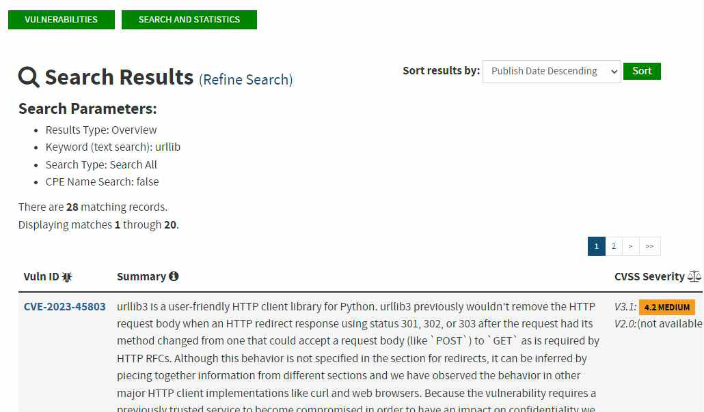

다. 사후 관리
모든 API는 보안 취약점에서 완전히 자유로울 수 없다. 안전한 API를 선택했더라도 지속적인 모니터링 및
관리가 이루어지지 않으면 취약점 공격에 노출될 수 있다. 개발 제품에 오픈소스를 사용하는 경우 SBOM
(Software Bill of Material)을 적용해야 한다. SBOM은 소프트웨어 자제 명세서, 즉 모든 소프트웨어 정보를
담고 있는 명세서를 의미한다. 물리적인 실체가 있는 제조 상품과 달리, 소프트웨어 공급자가 소프트웨어 전체
를 모두 직접 개발하지 않으므로 문제 발생 시 이를 신속하게 찾아 해결하는 것이 매우 어렵다. SBOM은 코드
에 포함된 모든 오픈소스 및 써드 파티 컴포넌트 목록이자 각 항목의 라이선스, 버전, 패치 상태 등을 제공해
빠른 보안 이슈 및 라이선스 위험에 대응할 수 있게 해 주는 중요한 도구다.
미국 정부 주도 하에 진행된 연구를 토대로 NTIA(미국 전기통신 및 정보청)에서 SBOM 가이드 및 FAQ를
공개했으며, 해당 가이드에서는 SBOM의 필수 구성요소로 다음과 같은 항목을 제시했다.
- 공급자 이름, 컴포넌트 이름, 컴포넌트 버전, 컴포넌트 해시, 고유 특성자(UID), 의존 관계, 작성자
쉽게 말해서, 파이썬으로 개발한 소프트웨어에서 의존하는 모든 패키지에 대해 상기 내용을 별도의 자료로
작성해서 관리해야 한다는 의미와 같다. SBOM 목록 내의 의존 패키지들에 대한 최신 보안 이슈 및 업데이트
정보를 제공하는 서비스를 이용하거나 주기적인 목록 최신화를 통해 관련 내용을 지속적으로 업데이트 하는
방법이 있다. 다음은 SBOM이 적용된 취약점 대응 프로세스 예시를 보여 준다.
1) 신규 취약점 발생 인지 : 신규 취약점 모니터링 과정에서 발견된 신규 취약점 위협 정보 입수
2) SBOM 목록 탐색 : 조직에서 운용 중인 제품의 SBOM 목록에 신규 취약점 관련 컴포넌트가 있는지 탐색

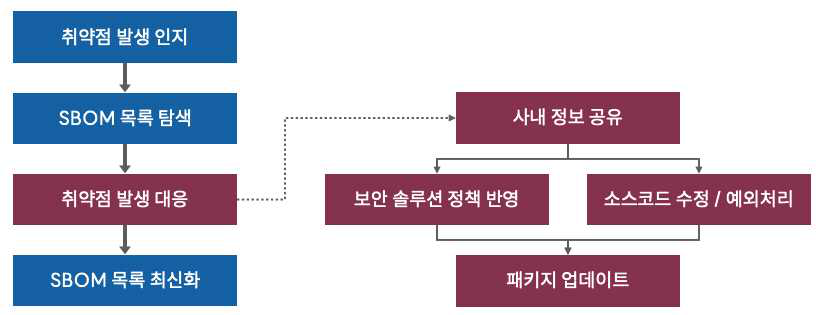

3) 취약점 발생 대응: SBOM 목록 내에 관련 컴포넌트가 존재하는 경우
(1) 사내 정보 공유 : 취약점이 발생한 (또는 발생할 수 있는) 소프트웨어 관련 담당자에게 취약점 정보
제공을 통해 상황을 인지시키고 발생 가능한 위험에 대비할 수 있도록 준비
(2-1) 보안 솔루션 정책 반영 : (침입 탐지 제품을 이용 중인 경우) 제품단에서 취약점 악용 시도 및 공격을
차단할 수 있도록 패턴 개발 및 반영
(2-2) 소스코드 수정 / 예외처리 : 취약점이 존재하는 소프트웨어의 소스코드 관리 책임이 조직 내에 있는
경우 해당 컴포넌트에서 취약점이 발생하지 않도록 또는 취약점 발생을 방지할 수 있는 임시 예외
코드를 추가하고, 소스코드 관리 책임이 외부 업체 또는 기관에 있는 경우 상황 전파 및 대응 결과 회신
(3) 패키지 업데이트 : 취약점이 존재하는 컴포넌트를 개발한 개발사 또는 조직에서 공개한 취약점 개선
버전을 소프트웨어 패키지에 적용(업데이트)
4) SBOM 목록 최신화 : 취약점 개선 버전이 반영된 패키지의 세부 정보를 SBOM 목록에 반영
소프트웨어 취약점을 완벽히 차단하는 방법은 없다. 특히 오픈소스의 경우 소스코드 내부에 대한 검토가 현실
적으로 거의 불가능하므로 오픈소스 내의 취약점으로 인한 보안 위협은 특히 추적 및 관리가 어렵다. 따라서
지속적인 모니터링 및 관리를 통해 소프트웨어를 보호하고 개선해야 한다.
라. 참고자료
① NTIA - SBOM,
https://www.ntia.gov/page/software-bill-materials
② CISA - SBOM,
https://www.cisa.gov/sbom

---

### PART 제3장

# 부 록

### 제1절 구현단계 보안약점 제거 기준

### 제2절 용어정리

# 3 부록

**제1절 구현단계 보안약점 제거 기준**

1. 입력데이터 검증 및 표현
번호
보안약점
설명
SQL 삽입
SQL 질의문을 생성할 때 검증되지 않은 외부 입력값을 허용하여 악의적인 질의문이 실행가능한
보안약점
코드 삽입
프로세스가 외부 입력값을 코드(명령어)로 해석·실행할 수 있고 프로세스에 검증되지 않은 외부
입력값을 허용한 경우 악의적인 코드가 실행 가능한 보안약점
경로 조작 및 자원 삽입시스템 자원 접근경로 또는 자원제어 명령어에 검증되지 않은 외부 입력값을 허용하여 시스템
자원에 무단 접근 및 악의적인 행위가 가능한 보안약점
크로스사이트 스크립트사용자 브라우저에 검증되지 않은 외부 입력값을 허용하여 악의적인 스크립트가 실행 가능한
보안약점
운영체제 명령어 삽입
운영체제 명령어를 생성할 때 검증되지 않은 외부 입력값을 허용하여 악의적인 명령어가 실행
가능한 보안약점
위험한 형식 파일 업로드파일의 확장자 등 파일형식에 대한 검증없이 파일 업로드를 허용하여 공격이 가능한 보안약점
신뢰되지 않는 URL
주소로 자동접속 연결
URL 링크 생성에 검증되지 않은 외부 입력값을 허용하여 악의적인 사이트로 자동 접속 가능한
보안약점
부적절한 XML
외부 개체 참조
임의로 조작된 XML 외부개체에 대한 적절한 검증 없이 참조를 허용하여 공격이 가능한 보안약점
XML 삽입
XQuery, XPath 질의문을 생성할 때 검증되지 않은 외부 입력값을 허용하여 악의적인 질의문이
실행 가능한 보안약점
LDAP 삽입
LDAP 명령문을 생성할 때 검증되지 않은 외부 입력값을 허용하여 악의적인 명령어가 실행
가능한 보안약점
크로스사이트 요청 위조사용자 브라우저에 검증되지 않은 외부 입력값을 허용하여 사용자 본인의 의지와는 무관하게
공격자가 의도한 행위가 실행 가능한 보안약점
서버사이드 요청 위조
서버 간 처리되는 요청에 검증되지 않은 외부 입력값을 허용하여 공격자가 의도한 서버로 전송
하거나 변조하는 보안약점
HTTP 응답분할
HTTP 응답헤더에 개행문자(CR이나 LF)가 포함된 검증되지 않은 외부 입력값을 허용하여 악의
적인 코드가 실행 가능한 보안약점
정수형 오버플로우
정수형 변수에 저장된 값이 허용된 정수 값 범위를 벗어나 프로그램이 예기치 않게 동작 가능한
보안약점

번호
보안약점
설명
보안기능 결정에 사용
되는 부적절한 입력값
보안기능(인증, 권한부여 등) 결정에 검증되지 않은 외부 입력값을 허용하여 보안기능을 우회하는
보안약점
메모리 버퍼 오버플로우메모리 버퍼의 경계값을 넘어서 메모리값을 읽거나 저장하여 예기치 않은 결과가 발생하는 보안약점
포맷 스트링 삽입
str.format등 포맷 스트링 제어함수에 검증되지 않은 외부 입력값을 허용하여 발생하는 보안약점
* 포맷 스트링: 입·출력에서 형식이나 형태를 지정해주는 문자열
2. 보안기능
번호
보안약점
설명
적절한 인증 없는
중요 기능 허용
중요정보(금융정보, 개인정보, 인증정보 등)를 적절한 인증없이 열람(또는 변경) 가능한
보안약점
부적절한 인가
중요자원에 접근할 때 적절한 제어가 없어 비인가자의 접근이 가능한 보안약점
중요한 자원에 대한
잘못된 권한 설정
중요자원에 적절한 접근 권한을 부여하지 않아 중요정보가 노출·수정 가능한 보안약점
취약한 암호화
알고리즘 사용
중요정보 (금융정보, 개인정보, 인증정보 등)의 기밀성을 보장할 수 없는 취약한 암호화 알
고리즘을 사용하여 정보가 노출 가능한 보안약점
암호화되지 않은 중요정보
중요정보(패스워드, 개인정보 등) 전송 시 암호화 또는 안전한 통신채널을 이용하지 않거나,
저장 시 암호화 하지 않아 정보가 노출 가능한 보안약점
하드코드된 중요정보
소스코드에 중요정보(패스워드, 암호화키 등)를 직접 코딩하여 소스코드 유출 시 중요정보가
노출되고 주기적 변경이 어려운 보안약점
충분하지 않은 키
길이 사용
암호화 등에 사용되는 키의 길이가 충분하지 않아 데이터의 기밀성·무결성을 보장할 수 없는
보안약점
적절하지 않은
난수 값 사용
사용한 난수가 예측 가능하여, 공격자가 다음 난수를 예상해서 시스템을 공격 가능한 보안
약점
취약한 패스워드 허용
패스워드 조합규칙(영문, 숫자, 특수문자 등) 미흡 및 길이가 충분하지 않아 패스워드가
노출 가능한 보안약점
부적절한 전자서명 확인
프로그램, 라이브러리, 코드의 전자서명에 대한 유효성 검증이 적절하지 않아 공격자의
악의적인 코드가 실행 가능한 보안약점
부적절한 인증서
유효성 검증
인증서에 대한 유효성 검증이 적절하지 않아 발생하는 보안약점
사용자 하드디스크에 저장되는
쿠키를 통한 정보노출
쿠키(세션 ID, 사용자 권한정보 등 중요정보)를 사용자 하드디스크에 저장하여 중요정보가
노출 가능한 보안약점
주석문 안에 포함된
시스템 주요정보
소스코드 주석문에 인증정보 등 시스템 주요정보가 포함되어 소스코드 노출 시 주요정보도
노출 가능한 보안약점
솔트 없이 일방향
해시 함수 사용
솔트를 사용하지 않고 생성된 해시 값으로부터 공격자가 미리 계산된 레인보우 테이블을
이용하여 해시 적용 이전 원본 정보를 복원가능한 보안약점
*솔트: 해시 적용하기 전 평문인 전송정보에 덧붙인 무의미한 데이터
무결성 검사 없는 코드
다운로드
소스코드 또는 실행파일을 무결성 검사 없이 다운로드 받아 실행하는 경우, 공격자의 악의
적인 코드가 실행 가능한 보안약점
반복된 인증시도
제한 기능 부재
인증 시도 수를 제한하지 않아 공격자가 반복적으로 임의 값을 입력하여 계정 권한을 획득
가능한 보안약점
3. 시간 및 상태
번호
보안약점
설명
경쟁조건 : 검사 시점과
사용 시점
멀티 프로세스 상에서 자원을 검사하는 시점과 사용하는 시점이 달라서 발생하는 보안약점
종료되지 않는 반복문
또는 재귀함수
종료조건 없는 제어문 사용으로 반복문 또는 재귀함수가 무한히 반복되어 발생할 수 있는 보안약점
4. 에러처리
번호
보안약점
설명
오류 메시지 정보노출
오류메시지나 스택정보에 시스템 내부구조가 포함되어 민감한 정보, 디버깅 정보가 노출 가능한 보안약점
오류상황 대응 부재
시스템 오류상황을 처리하지 않아 프로그램 실행정지 등 의도하지 않은 상황이 발생 가능한 보안약점
부적절한 예외처리
예외사항을 부적절하게 처리하여 의도하지 않은 상황이 발생 가능한 보안약점
5. 코드오류
번호
보안약점
설명
Null Pointer 역참조
변수의 주소 값이 Null인 객체를 참조하는 보안약점
부적절한 자원 해제
사용 완료된 자원을 해제하지 않아 자원이 고갈되어 새로운 입력을 처리할 수 없는 보안약점
해제된 자원 사용
메모리 등 해제된 자원을 참조하여 예기치 않은 오류가 발생하는 보안약점
초기화되지 않은
변수 사용
변수를 초기화하지 않고 사용하여 예기치 않은 오류가 발생하는 보안약점
신뢰할 수 없는
데이터의 역직렬화
악의적인 코드가 삽입·수정된 직렬화 데이터를 적절한 검증 없이 역직렬화하여 발생하는 보안약점
* 직렬화: 객체를 전송 가능한 데이터형식으로 변환
* 역직렬화: 직렬화된 데이터를 원래 객체로 복원
6. 캡슐화
번호
보안약점
설명
잘못된 세션에 의한
데이터 정보노출
잘못된 세션에 의해 인가되지 않은 사용자에게 중요정보가 노출 가능한 보안약점
제거되지 않고 남은
디버그 코드
디버깅을 위한 코드를 제거하지 않아 인가되지 않은 사용자에게 중요정보가 노출 가능한 보안약점
Public 메서드로부터
반환된 Private 배열
Public으로 선언된 메소드에서 Private로 선언된 배열을 반환(return)하면 Private 배열의 주소
값이 외부에 노출되어 해당 Private 배열값을 외부에서 수정 가능한 보안약점
Private 배열에 Public
데이터 할당
Public으로 선언된 데이터 또는 메소드의 인자가 Private로 선언된 배열에 저장되면 Private 배
열을 외부에서 접근하여 수정 가능한 보안약점
7. API 오용
번호
보안약점
설명
DNS lookup에 의존한
보안결정
도메인명 확인(DNS lookup)으로 보안결정을 수행할 때 악의적으로 변조된 DNS 정보로 예기치
않은 보안위협에 노출되는 보안약점
취약한 API 사용
취약한 함수를 사용해서 예기치 않은 보안위협에 노출되는 보안약점

**제2절 용어정리**

●Developer Economics State of the Developer Nation, 20th Edition
developernation.net에서 매년 165개국 30,000명 이상의 개발자들을 대상으로 설문조사를 하여 제공하고 있다. 웹, 모바일,
데스크톱, 클라우드, 산업용 IoT, 소비자 전자 제품, 임베디드소프트웨어, AR 및 VR등 다양한 분야의 설문을 실시하고 있다.
●AES(Advanced Encryption Standard)
미국 정부 표준으로 지정된 블록 암호 형식으로 이전의 DES를 대체하며, 미국 표준 기술 연구소 (NIST)가 5년의 표준화
과정을 거쳐 2001년 11월 26일에 연방 정보처리표준(FIPS 197)으로 발표하였다.
●DES 알고리즘
DES(Data Encryption Standard)암호는 암호화 키와 복호화키가 같은 대칭키 암호로 64비트의 암호화키를 사용한다.
전수공격(Brute Force)공격에 취약하다.
●HMAC(Hash-based Message Authentication Code)
해시 기반 메시지 인증 코드, MD5, SHA-1 등 반복적인 암호화 해시 기능을 비밀 공용키와 함께 사용하며, 체크섬을
변경하는 것이 불가능하도록 한 키 기반의 메시지 인증 알고리즘이다.
●HTTPS(Hypertext Transfer Protocol over Secure Socket Layer)
WWW(월드 와이드 웹) 통신 프로토콜인 HTTP의 보안이 강화된 버전이다.
●LDAP(Lightweight Directory Access Protocol)
TCP/IP 위에서 디렉토리 서비스를 조회하고 수정하는 응용 프로토콜이다.
●SHA(Secure Hash Algorithm)
해시알고리즘의 일종으로 MD5의 취약성을 대신하여 사용한다. SHA, SHA‐1, SHA‐2(SHA‐224, SHA‐256, SHA‐384,
SHA‐512) 등의 다양한 버전이 있으며, 암호 프로토콜인 TLS, SSL, PGP, SSH, IPSec 등에 사용된다.
●umask
파일 또는 디렉토리의 권한을 설정하기 위한 명령어이다.
●개인키(Private Key)
공개키 기반구조에서 개인키란 암·복호화를 위해 비밀 메시지를 교환하는 당사자만이 알고 있는 키이다.
●공개키(Public Key)
공개키는 지정된 인증기관에 의해 제공되는 키값으로서, 이 공개키로부터 생성된 개인키와 함께 결합되어, 메시지 및 전자
서명의 암·복호화에 효과적으로 사용될 수 있다. 공개키를 사용하는 시스템을 공개키 기반구조(Public Key Infrastructure,
PKI)라 한다.
●경로순회(directory traversal)
상대경로 참조 방식(“./”,“../”등)을 이용해 다른 디렉토리의 중요파일에 접근하는 공격방법으로 경로 추적이라고도 한다.
●동적 SQL(Dynamic SQL)
프로그램의 조건에 따라 SQL문이 다르게 생성되는 경우, 프로그램 실행 시에 전체 쿼리문이 완성되어 DB에 요청하는
SQL문을 말한다.
●동적 쿼리(Dynamic Query)
컬럼이나 테이블명을 바꿔 SQL 쿼리를 실시간 생성해 DB에 전달하여 처리하는 방식이다.
●소프트웨어 개발보안
소프트웨어 개발과정에서 개발자 실수, 논리적 오류 등으로 인해 소프트웨어에 내재된 보안취약점을 최소화하는 한편,
해킹 등 보안위협에 대응할 수 있는 안전한 소프트웨어를 개발하기 위한 일련 의 과정을 의미한다. 넓은 의미에서 소프트
웨어 개발보안은 소프트웨어 생명주기의 각 단계별로 요구되는 보안활동을 모두 포함하며, 좁은 의미로는 SW개발과정에서
소스코드를 작성하는 구현 단계에서 보안약점을 배제하기 위한 ‘시큐어코딩(Secure Coding)’을 의미한다.
●소프트웨어 보안약점
소프트웨어 결함, 오류 등으로 해킹 등 사이버공격을 유발할 가능성이 있는 잠재적인 보안취약점을 말한다.
●싱글톤 패턴(Singleton Pattern)
하나의 프로그램 내에서 하나의 인스턴스만을 생성해야만 하는 패턴이다. Connection Pool, Thread Pool과 같이 Pool
형태로 관리되는 클래스의 경우 프로그램 내에서 단 하나의 인스턴트로 관리해야 하는 경우를 말함. 파이썬에서는 객체로
제공된다.
●정적 쿼리(Static Query)
동적 쿼리와 달리 프로그램 소스코드에 이미 쿼리문이 완성된 형태로 고정되어 있다.
●해시함수
주어진 원문에서 고정된 길이의 의사난수를 생성하는 연산기법이며, 생성된 값은 ‘해시값’이라고 한다. MD5, SHA, SHA‐1,
SHA‐256 등의 알고리즘이 있다.
●화이트 리스트(White List)
블랙리스트(Black List)의 반대개념으로 신뢰할 수 있는 사이트나 IP주소 목록을 말한다.
●장고 웹 프레임워크(Django Web Framework)
파이썬으로 작성된 오픈 소스 웹 프레임워크로, 모델(Model)-뷰(View)-컨트롤러(Controller)의 MVC패턴을 따르고 있다.
전통적인 MVC 디자인 패턴에서 이야기하는 컨트롤러의 기능을 프레임워크 자체에서 처리하기에 모델(Model), 템플릿
(Template), 뷰(View)로 분류해 MTV 프레임워크라고 하기도 한다. 컴포넌트 재사용성과 플러그인화 가능성, 빠른 개발
등을 강조하고 있다.
●플라스크 웹 프레임워크(Flask Web Framework)
파이썬으로 작성된 마이크로 웹 프레임워크의 하나이며, 특별한 도구나 라이브러리가 필요 없기 때문에 마이크로 프레임
워크라고 부른다.
●파싱(Parsing)
일련의 문자열을 의미 있는 token(어휘 분석의 단위)으로 분해하고 그것들로 이루어진 Parse tree를 만드는 과정이다. 어떤
문장을 분석하거나 문법적 관계를 해석하는 행위를 말한다.
●파서(Parser)
컴파일러(compiler)의 일부로 컴파일러나 인터프리터(Interpreter)에서 원시 프로그램을 읽어 들여 그 문장의 구조를 알아
내는 parsing(구문 분석)을 행하는 프로그램을 말한다.
●XML(eXtensible Markup Language)
W3C에서 개발되었으며, 다른 특수한 목적을 갖는 마크업 언어를 만드는데 사용된다. 인터넷에 연결된 시스템끼리 데이터를
쉽게 주고받을 수 있어 HTML의 한계를 극복할 목적으로 만들어졌다.
●DTD(Document Type Definition)
문서 타입 정의(DTD)는 XML 문서의 구조 및 해당 문서에서 사용할 수 있는 적법한 요소와 속성을 정의한다.
●Decorator
함수를 받아 명령을 추가한 뒤 이를 다시 함수의 형태로 반환하는 함수이다. 반복을 줄이고 메소드나 함수의 책임을 확장
할 수 있으며 재사용이 가능하게 해준다. 파이썬에서 @로 시작하는 구문으로 표시한다.
●공개 키 인증서(Public Key Certificate)
공개키의 소유권을 증명하는데 사용되는 전자 문서이다. 키에대한 정보, 소유자의 신원에 대한 정보, 발급자의 디지털
서명이 포함되어 있다.
●솔트(salt)
솔트는 해싱 처리 과정 중 각 패스워드에 추가되는 랜덤으로 생성된 유일한 문자열을 의미한다.

---

