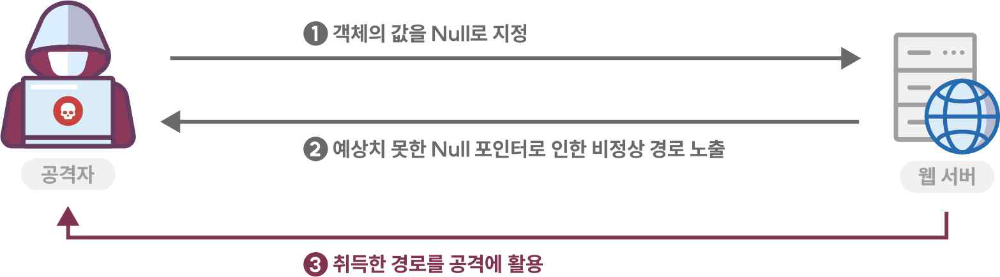
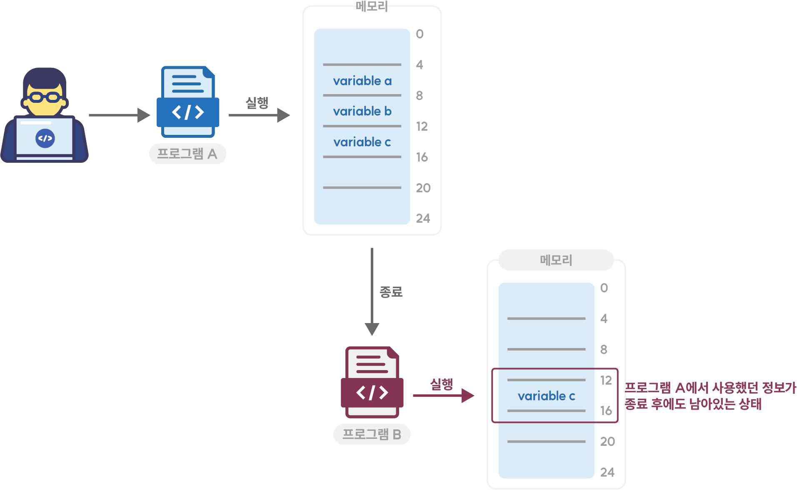
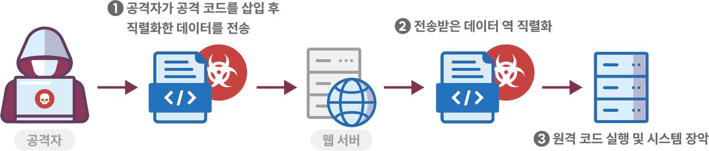

**제5절 코드오류**

타입 변환 오류, 자원(메모리 등)의 부적절한 반환 등과 같이 개발자가 범할 수 있는 코딩 오류로 인해 유발
되는 보안약점이다.
1. Null Pointer 역참조
가. 개요
널 포인터(Null Pointer) 역참조는 '일반적으로 그 객체가 널(Null)이 될 수 없다'라고 하는 가정을 위반했을
때 발생한다. 공격자가 의도적으로 널 포인터 역참조를 발생시키는 경우 공격자는 그 결과로 발생하는 예외
상황을 이용해 추후 공격 계획에 활용할 수 있다.
파이썬에서는 Null pointer dereference가 발생하지 않는다. 파이썬에서는 Null 객체가 사용되지 않으며
대신 None 키워드를 사용해 null 개체와 변수를 정의 한다. None은 다른 언어의 null과 동일한 기능을 수행
하지 않으며 None이 0 또는 다른 값을 정의 하진 않는다.
나. 안전한 코딩기법
None을 반환하는 함수를 사용하면 None과 다른 값(예: 0이나 빈 문자열)이 조건문에서 False로 평가될
수 있기 때문에 실수하기 쉽다. None이 될 수 있는 데이터를 참조하기 전에 해당 데이터의 값이 None 인지
검사하여 시스템 오류를 줄일 수 있다.

다. 코드예제
파이썬에서는 포인터를 사용하지는 않지만 데이터에 대한 적절한 검사를 수행하지 않을 경우 Null pointer와
유사한 None 값 참조 오류를 범할 수 있다.

**안전하지 않은 코드 예시**

1:
2:
3:
4:
5:
6:
7:
8:
9:
10:
11:
12:
13:
14:
15:
16:
17:
18:
19:
20:
21:
22:
import os
from django.shortcuts import render
from xml.sax import make_parser
from xml.sax.handler import feature_namespaces
def parse_xml(request):
filename = request.POST.get('filename')
# filename의 None 체크를 하지 않아 에러 발생 가능
if (filename.count('.') > 0):
name, ext = os.path.splitext(filename)
else:
ext = ''
if ext == ".xml":
parser = make_parser()
parser.setFeature(feature_namespaces, True)
handler = Handler()
parser.setContentHandler(handler)
parser.parse(filename)
result = handler.root
return render(request, "/success.html", {"result": result})
참조하고자 하는 자원을 호출 시에는 반드시 개체가 None이 아닌지 검증해야 한다.

**안전한 코드 예시**

1:
2:
3:
4:
5:
6:
7:
8:
9:
10:
11:
12:
13:
14:
15:
16:
17:
18:
19:
20:
21:
22:
23:
24:
25:
import os
from django.shortcuts import render
from xml.sax import make_parser
from xml.sax.handler import feature_namespaces
def parse_xml(request):
filename = request.POST.get('filename')
# filename이 None 인지 체크
if filename is None or filename.strip() == "":
return render(request, "/error.html", {"error": "파일 이름이 없습니다."})
if (filename.count('.') > 0):
name, ext = os.path.splitext(filename)
else:
ext = ''
if ext == ".xml":
parser = make_parser()
parser.setFeature(feature_namespaces, True)
handler = Handler()
parser.setContentHandler(handler)
parser.parse(filename)
result = handler.root
return render(request, "/success.html", {"result": result})
라. 참고자료
① CWE-476: NULL Pointer Dereference, MITRE,
https://cwe.mitre.org/data/definitions/476.html
② Null Dereference, OWASP,
https://owasp.org/www-community/vulnerabilities/Null_Dereference
➂ Built-in Constants, Python Software Foundation,
https://docs.python.org/3/library/constants.html?#None

2. 부적절한 자원 해제
가. 개요
프로그램의 자원, 예를 들면 열려 있는 파일 식별자(Open File Descriptor), 힙 메모리(Heap Memory),
소켓(Socket) 등은 유한한 자원이다. 이러한 자원을 할당 받아 사용을 마치고 더 이상 사용하지 않는 경우에는
적절히 반환해야 하는데, 프로그램 오류 또는 에러로 사용이 끝난 자원을 반환하지 못하는 경우에 문제가 발생
할 수 있다.
나. 안전한 코딩기법
자원을 획득하여 사용한 다음에는 반드시 자원을 해제 후 반환한다.
다. 코드예제
다음은 try 구문 내의 코드 실행 중 오류가 발생할 경우 close() 메소드가 실행되지 않아 사용한 자원이
반환되지 않는 경우를 보여 준다.

**안전하지 않은 코드 예시**

1:
2:
3:
4:
5:
6:
7:
8:
9:
10:
11:
12:
13:
14:
def get_config():
lines = None
try:
f = open('config.cfg')
lines = f.readlines()
# 예외 발생 상황 가정
raise Exception("Throwing the exception!")
# try 절에서 할당한 자원이 반환(close)되기 전에
# 예외가 발생하면 할당된 자원이 시스템에 반환되지 않음
f.close()
return lines
except Exception as e:
...
return ''
예외 상황이 발생하여 함수가 종료될 때 예외의 발생 여부와 상관없이 항상 실행되는 finally 블록에서 할당
받은 모든 자원을 반환해야 한다.

**안전한 코드 예시**

1:
2:
3:
4:
5:
6:
7:
8:
9:
10:
11:
12:
13:
14:
def get_config():
lines = None
try:
f = open('config.cfg')
lines = f.readlines()
# 예외 발생 상황 가정
raise Exception("Throwing the exception!")
except Exception as e:
...
finally:
# try 절에서 할당한 자원은
# finally 절에서 시스템에 반환을 해야 한다
f.close()
return lines
다른 방법은 with 문을 사용해 파일을 처리하는 방법으로 with 문의 블록이 끝날 때 자동으로 파일 자원을
반환하는 예시다. 이렇게 작성하면 with문 내의 코드에 예외가 발생하더라도 항상 파일 닫기가 보장된다.

**안전한 코드 예시**

1:
2:
3:
# with 절을 빠져나갈 때 f를 시스템에 반환
with open('config.cfg') as f:
print(f.read())
라. 참고자료
① CWE-404: Improper Resource Shutdown or Release, MITRE,
https://cwe.mitre.org/data/definitions/404.html
② Unreleased Resource, OWASP,
https://owasp.org/www-community/vulnerabilities/Unreleased_Resource
➂ The With statement, Python Software Foundation,
https://docs.python.org/3/reference/compound_stmts.html#grammar-token-python-grammar-with_stmt

3. 신뢰할 수 없는 데이터의 역직렬화
가. 개요
직렬화(Serialization)는 프로그램에서 특정 클래스의 현재 인스턴스 상태를 다른 서버로 전달하기 위해 클래스의
인스턴스 정보를 바이트 스트림으로 복사하는 작업으로, 메모리상에서 실행되고 있는 객체의 상태를 그대로
복제해 파일로 저장하거나 수신 측에 전달하게 된다.
역직렬화(Deserialization)는 반대 연산으로 바이너리 파일(Binary File) 이나 바이트 스트림(Byte Stream)
으로부터 객체 구조로 복원하는 과정이다. 이 때 송신자가 네트워크를 이용해 직렬화된 정보를 수신자에게 전달
하는 과정에서 공격자가 전송한 데이터 또는 저장된 스트림을 조작할 수 있는 경우 신뢰할 수 없는 역직렬화로
인한 무결성 침해, 원격 코드 실행, 서비스 거부 공격 등이 발생 할 수 있는 보안약점이다.
파이썬에서는 pickle 모듈을 통해 직렬화(pickle) 및 역직렬화(unpickle)를 수행할 수 있다. pickle 모듈은
데이터 변조에 대한 검증 과정이 없기 때문에 임의의 코드를 실행하는 악의적인 pickle 데이터를 구성할 수 있어
pickle을 사용해 역직렬화 하는 경우 hmac으로 데이터에 서명하거나 json 모듈을 사용하는 것을 고려해야 한다.
나. 안전한 코딩기법
초기화되지 않은 스택 메모리 영역의 변수는 임의값이라고 생각해서 대수롭지 않게 생각할 수 있으나 사실은
이전 함수에서 사용되었던 내용을 포함하고 있다. 공격자는 이러한 약점을 사용하여 메모리에 저장되어 있는
값을 읽거나 특정 코드를 실행할 수 있다. 모든 변수를 사용 전에 반드시 올바른 초기 값을 할당함으로서 이러한
문제를 예방할 수 있다.

신뢰할 수 없는 데이터를 역직렬화 하지 않도록 응용 프로그램을 구성한다. 민감 정보 또는 중요 정보 전송 시
암호화 통신을 적용할 수 없는 경우 최소한 송신 측에서 서명을 추가하고 수신 측에서 서명을 확인하여 데이터의
무결성을 검증해야 한다. 또는 신뢰할 수 있는 데이터의 식별을 위해 역직렬화 대상의 데이터가 사전에 검증된
클래스(Class)만을 포함하는지 검증하거나 제한된 실행 권한만으로 역직렬화 코드를 실행해야 한다.
다. 코드예제
다음 예제는 신뢰할 수 없는 사용자로부터 입력 받은 코드를 역직렬화 하고 있는데, 이와 같은 코드는 개발자가
의도하지 않은 임의 코드 실행으로 이어질 수 있다.

**안전하지 않은 코드 예시**

1:
2:
3:
4:
5:
6:
7:
8:
9:
import pickle
from django.shortcuts import render
def load_user_object(request):
# 사용자로부터 입력받은 알 수 없는 데이터를 역직렬화
pickled_userinfo = pickle.dump(request.POST.get('userinfo', ''))
# 역직렬화(unpickle)
user_obj = pickle.loads(pickled_userinfo)
return render(request, '/load_user_obj.html', {'obj':user_obj})
아래 예제는 사용자로부터 전달받은 데이터를 HMAC을 이용하여 안전한 사용자로부터 온 것인지 검증한 후
역직렬화 하고 있다.
이 밖에도 역직렬화된 데이터의 특정 부분만 필요로 하는 경우 JSON과 같은 텍스트 형태의 안전한 직렬화
형식을 사용하는 것이 좋다.

**안전한 코드 예시**

1:
2:
3:
4:
5:
6:
7:
8:
9:
10:
11:
12:
13:
14:
15:
16:
17:
18:
19:
20:
21:
22:
23:
24:
import hmac
import hashlib
import pickle
from django.shortcuts import render
def load_user_object(request):
# 데이터 변조를 확인하기 위한 해시값
hashed_pickle = request.POST.get("hashed_pickle", "")
# 사용자로부터 입력받은 데이터를 직렬화(pickle)
pickled_userinfo = pickle.dumps(request.POST.get("userinfo", ""))
# HMAC 검증을 위한 비밀키는 생성
m = hmac.new(key="secret_key".encode("utf-8"), digestmod=hashlib.sha512)
# 직렬화된 사용자 입력값을 해싱
m.update(pickled_userinfo)
# 전달받은 해시값(hashed_pickle)과 직렬화 데이터(userinfo)의 해시값을 비교하여 검증
if hmac.compare_digest(str(m.digest()), hashed_pickle):
user_obj = pickle.loads(pickled_userinfo)
return render(request, "/load_user_obj.html", {"obj": user_obj})
else:
return render(request, "/error.html", {"error": "신뢰할 수 없는 데이터입니다."}
라. 참고자료
① CWE-502: Deserialization of Untrusted Data, MITRE,
https://cwe.mitre.org/data/definitions/502.html
② Deserialization Cheat Sheet, OWASP,
https://cheatsheetseries.owasp.org/cheatsheets/Deserialization_Cheat_Sheet.html
③ Python object serialization, Python Software Foundation,
https://docs.python.org/3/library/pickle.html

